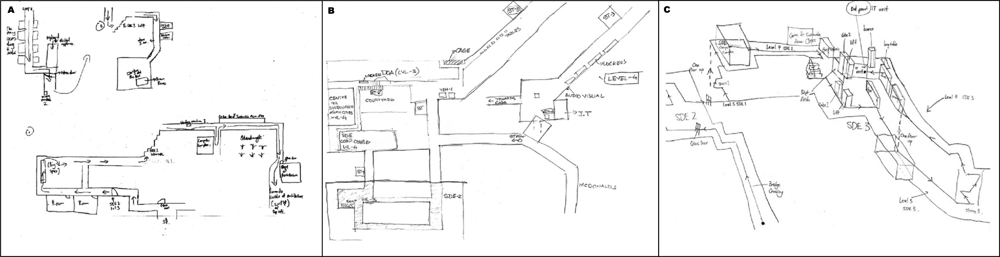
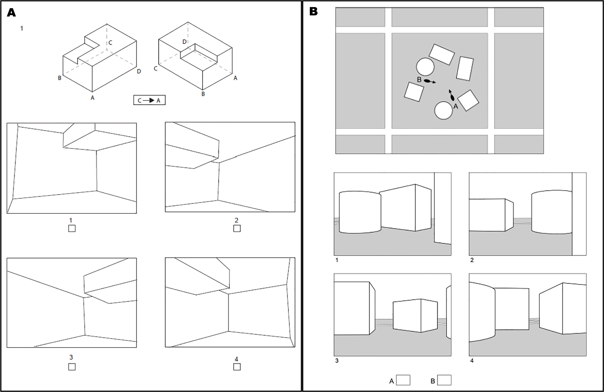
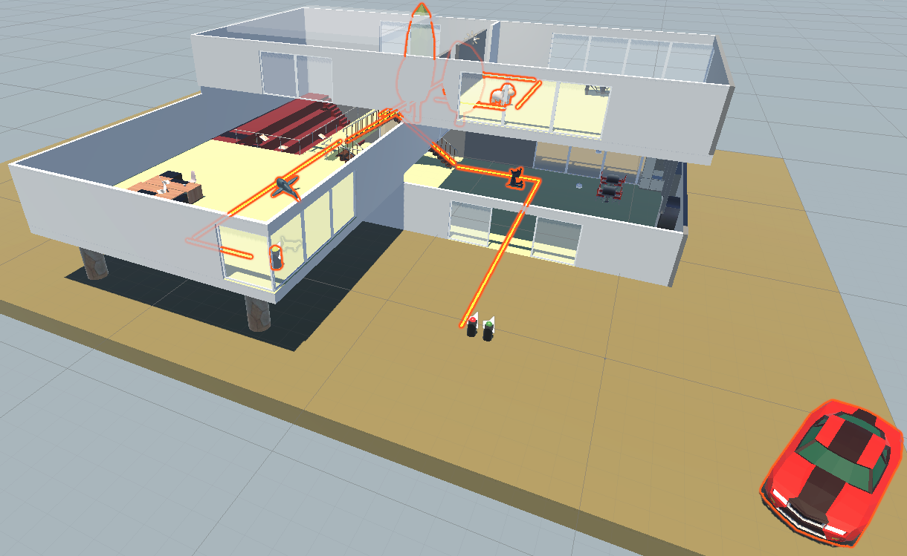
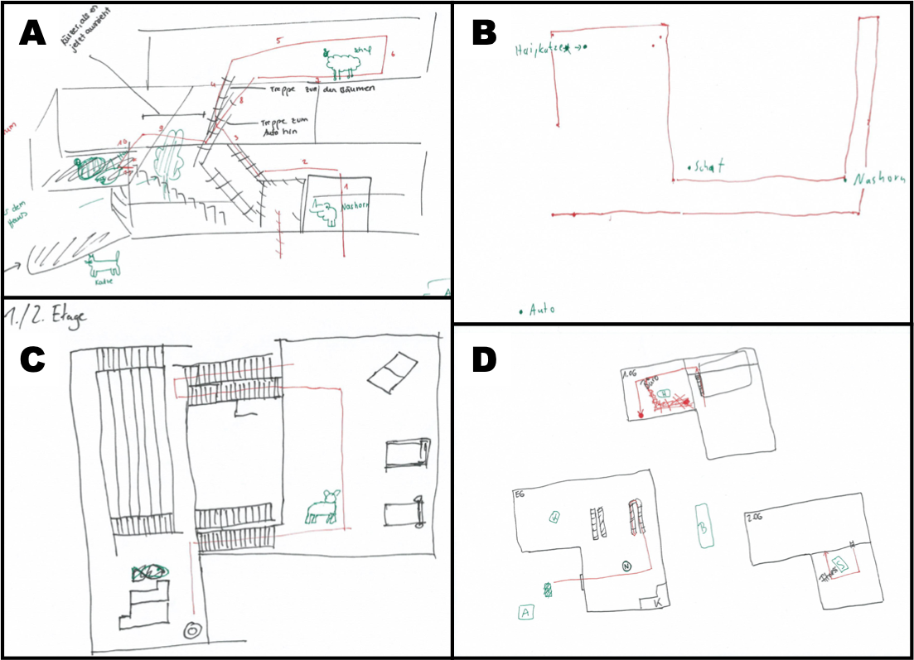
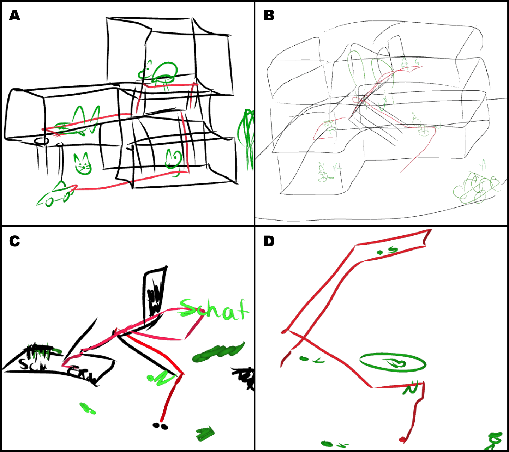
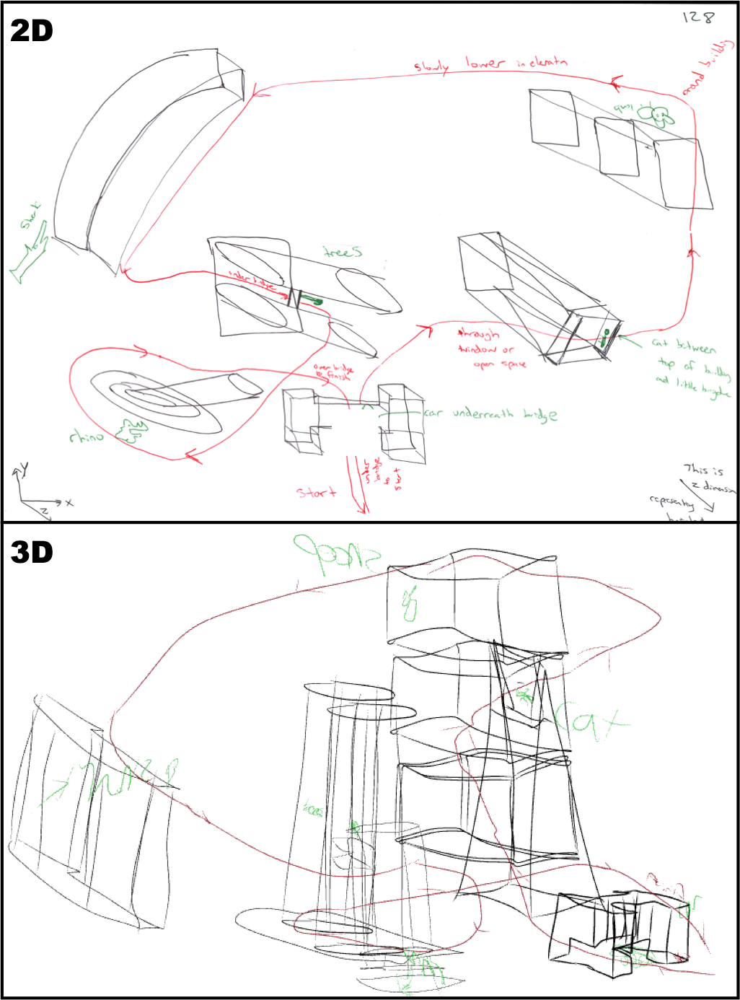

```{r setup, include = FALSE}
library(papaja)
library(tidyverse)
library(readxl)
library(kableExtra)
library(brms)
library(here)
library(hms)
library(ggplot2)
library(easystats)
library(gtsummary)
library(irr)
library(patchwork)
library(gridExtra)
r_refs("r-references.bib")

options(scipen=999)
theme_set(theme_classic(base_size = 20))
```

```{r analysis-preferences}
# Seed for random number generation
set.seed(42)
knitr::opts_chunk$set(cache.extra = knitr::rand_seed, fig.width = 15, echo=FALSE, warning=FALSE, message=FALSE, cache=TRUE)
```

# Introduction

A fundamental challenge in geographic information science is understanding how humans mentally represent spatial environments and how these cognitive representations can be accurately externalised and formalised [@mark.1996]. While much progress has been made in understanding how people encode and communicate spatial relations in the horizontal dimension, the vertical dimension remains comparatively understudied [@jeffery.2011]. This is particularly problematic given that the spaces humans navigate are inherently three-dimensional, yet the methods we use to assess spatial knowledge, remain predominantly two-dimensional. The current study investigates whether this methodological reliance on 2D representations creates a bottleneck in capturing human spatial knowledge of vertically-complex environments.

Understanding survey knowledge--how people mentally represent the spatial configuration of objects, including distances and angles between landmarks [@siegel.1975; @montello.1998]--is fundamental to the integration of spatial cognition research and geographic information science. This knowledge type is particularly critical for environmental-scale spaces like buildings and urban districts , where individuals must integrate spatial information from distributed locations into coherent mental representations [@montello.1993]. From a GIS perspective, the challenge is twofold: theoretically, we need to understand how humans encode vertical spatial relations in vertically-complex environments. Methodologically, we require tools that can capture and formalise these cognitive representations in ways that preserve their inherent three-dimensionality.

Sketch maps--simplified drawings of environmental configurations [@lynch.1960]--have emerged as a valuable method for externalising survey knowledge, particularly because they permit relatively unrestricted visualisation of thought [@tversky2002sketches], even when memory is generalised [@manivannan.2022a] or incomplete [@schwering.2022]. This flexibility makes them suitable for capturing imperfect spatial knowledge and has led to their widespread adoption in realistic, real-world research contexts [@simonet.2025]. From a GIS methodological standpoint, sketch maps represent an analytical challenge because they must contain metric information (distances, angles) even though the underlying cognitive representation of space may store it incorrectly [@wang.2017], or in approximation [@ishikawa.2006]. In order to tackle this, researchers have developed systematic approaches to extract and analyse qualitative spatial relations from sketch maps--such as topological (e.g., "inside/outside"), directional (e.g., "right of"), and sequential relations (e.g., "before/after")--enabling the translation of hand-drawn cognitive maps into formal spatial representations that can be computationally processed and compared against ground truth [@schwering.2014].

However, a critical methodological limitation has received insufficient attention: sketch maps are predominantly drawn and analysed in two-dimensional form, despite the three-dimensional nature of the environments they represent [@kim.2022]. Whilst this simplification may be justified for navigation scenarios where vertical dimensions are irrelevant to path choices, it becomes problematic in vertically-complex environments where elevation changes significantly affect wayfinding and spatial understanding. For example, navigational studies of multi-level buildings show that vertical misrepresentations can lead to systematic wayfinding errors, such as underestimating detours between floors or failing to integrate staircases and elevators into a coherent route plan [@holscher.2006]. Understanding the vertical structure of buildings, e.g., whether separate floors have the same layout, and how they are aligned with regard to each other, is a known human factor issue of modern architecture [@dalton.2016]. These examples show that our understanding of how vertical information is perceived and understood might be yet insufficient and potentially lag behind the horizontal dimensions. The current study addresses this limitation by investigating whether extending established qualitative spatial reasoning methods from 2D sketch map analysis into three dimensions can better capture human spatial knowledge of vertically-complex spaces. This represents both a theoretical contribution--examining how humans mentally encode vertical relations in buildings and urban environments--and a methodological advancement in GIS, by demonstrating how qualitative spatial relations can be applied to 3D sketch maps created in virtual reality environments.

The question investigated in this manuscript is whether sketch maps, traditionally limited to 2D representation, can be realised in 3D. Consumer-grade VR devices now enable sketching directly in three dimensions, allowing participants--even without drawing expertise--to externalise complex 3D spatial information without relying on symbolic conventions [@kim.2022]. This manuscript investigates the limitations of 2D sketch maps in scenarios where vertical information is crucial and explores the potential of 3D sketch maps created using a VR-based drawing interface. We tasked participants with drawing 2D and 3D sketch maps representing two environmental-scale spaces. We evaluated sketch maps with regard to the visibility and correctness of spatial information conveyed in them. Our analysis method is inspired by the major contribution of geographical information science--the formal analysis of qualitative spatial relations [@frank.1996]--and the subsequently developed method of aligning sketch maps with metric maps based on qualitative spatial relations between landmarks [@chipofya.2016]. We evaluated sketch maps with regard to the *visibility* and *correctness* of spatial information conveyed in them. We define *visibility* as the proportion of spatial relations interpretable from the sketch and *correctness* as the qualitative accuracy of these relations when compared to the ground-truth environment. The assumption motivating this work is that 2D pen-and-paper sketch maps create a bottleneck for extracting human spatial knowledge of three-dimensional environments, whilst VR-based 3D sketching enables participants to externalise knowledge they possess but struggle to fully communicate in 2D.

## Spatial relations in sketch maps

Drawing a sketch map requires participants to place all queried
environmental features on a single representation of that environment,
forcing them to explicitly define spatial relations between all objects
in the sketch. These spatial relations can be analysed in multiple ways;
the two dominant analyses are quantitative and qualitative. We focus on
analysing qualitative relations between two types of
features depicted in sketch maps: landmarks in the surrounding
environment and the shape of the travelled path.

Unlike quantitative metrics such as bidimensional regression [@friedman.2003; @tobler.2010], qualitative relations emphasize relative order and topology, aligning with how humans encode spatial knowledge and often remaining valid even when metric accuracy is distorted [@wang.2015; @warren.2017]. Thus, analysing sketch maps with regard to qualitative
relations carries relevance to how humans mentally
represent spatial knowledge.

In the current work we distinguish between spatial relations in all three dimensions, and analyse them separately. The reason for this is
twofold. First, 2D sketch maps might be particularly well-suited for
communicating information in a single plane (e.g. only horizontal plane
in top-down drawings) and thus their evaluation should not be based
solely on joint analyses of all dimensions. Second, there is a
well-established horizontal-vertical anisotropy in how people perceive [@krukar.2021a],
store, and communicate spatial information [@du.2022]. This may affect the quality
of 3D sketch maps but would not be captured in analyses that combine all
dimensions.

## Conveying vertical information in sketch maps

There are multiple ways in which one may attempt to convey vertical information in
a 2D sketch. Architects are trained in the technique of multiview
projection - using a set of drawings to depict a single 3-dimensional
object from different views aligned with distinct axes. Most common
views are a *plan* (a drawing from the top-down perspective along the
vertical axis) and a *section* (a drawing from the side along the
horizontal axis). @brandt.2015 showed that non-architects are able to produce these two
conventions.

Other possibilities for 2D sketch maps include: 
(a) drawing multiple plans depicting space at
different levels of the vertical axis (e.g., separate floors), 
(b) producing a single drawing and coding the 3rd dimension with textual or symbolic annotations, or 
(c) producing a perspective drawing, i.e., a sketch that represents all three spatial dimensions within a single view by simulating how objects appear from a given vantage point; this can convey depth and height more intuitively, but necessarily distorts angles and distances (Figure \@ref(fig:lit-3drawings)).

Yet, studies show that few participants spontaneously depict vertical relations: only 11 of 38 maps in @blajenkova.2005 and 16 of 62 in @zhong.2016 included floor alignment. Yet performance on other tasks remained good, suggesting that constraints of 2D sketching, not memory, hinder expression of vertical information.

```{r lit-3drawings, out.width = "100%", fig.cap = "Examples of 3 sketch maps obtained by Zhong and Kozhevnikov (2016). (A) Different floors drawn as separate drawings cannot be vertically aligned. (B) A single layout drawing with annotations for different vertical levels. (C) A perspective drawing distorting angles and distances in an inconsistent way across different parts of the drawing. Figure obtained with permission and modified from original Figure 2."}


```

Our experiments re-create the procedures used by @blajenkova.2005 and @zhong.2016 in the sense of giving participants a task that requires memorising and communicating information in all three dimensions, but relying on participants' *spontaneous* choice of sketch mapping convention. This reflects the way in which sketch maps are used in research and in everyday settings: their advantage is that they are intuitive and can be produced spontaneously; i.e., participants can perform the task with minimal instructions and no feedback on their progress. The motivation behind this paper is that the affordances and learned conventions of intuitive 2D sketch mapping restrict participants in expressing their spatial knowledge to its full extent, and that newly available technological possibility of 3D sketch mapping does not.

## Individual differences in 3D spatial information processing

Individual spatial abilities might play a role in one's ability to encode, store, and retrieve complex three-dimensional spatial information, and thus the effect the 2D vs 3D drawing interface has on their output. However, it is unclear which spatial abilities are predictive of this task, and how to measure them. @hegarty.2006 demonstrated that different spatial abilities measured by relatively abstract pen-and-paper questionnaires are partially dissociated from participants' environmental learning. In order to control for that we use highly-specific battery of tests originally developed by @berkowitz.2021 to test spatial abilities of
architecture students  (Figure \@ref(fig:berkowitztests)). The tests were validated by showing that advanced architecture students
outperformed beginners. 

We chose this battery because it captures cognitive processes that are central for representing survey knowledge of buildings and urban configurations, such as switching between perspectives, composing 3D volumes, and performing 2D-to-3D transformations. Prior work shows that such domain-specific tests better distinguish expertise and predict design-related performance than general measures like visuospatial working memory [@cho.2019; @cho.2022]. As the focus of our study is on sketch map construction, a test battery capturing design-related processes related to visualising 3D shapes is likely to isolate and capture individual differences more specific to this task. A possible downside of this choice is that such tests may be less comparable across disciplines and may share variance with prior design or drawing training.

The Indoor Perspective Test consists of ten questions, each of which shows a 3D object from the
outside, with four corners marked as positions A, B, C, and D. The participant has
to imagine taking the perspective from one of the four points looking at another as if they were inside the object. Four
indoor views are provided as potential answers. The participant's task is to select the one that would be visible from the queried perspective. Urban Layout Test follows a similar idea, however instead of a single object participants see multiple objects arranged on a flat plane and their task is to select the correct first person view as if they were located at a queried location between these object [@berkowitz.2021].


```{r berkowitztests, out.width = "100%", fig.cap = "An excerpt from the battery of tests by Berkowitz et al. (2021). (A) Indoor Perspective Test. (B) Urban Layout Test. Reproduced with permission."}


```

## Vertical information in different types of spaces

The differences between 2D and 3D sketch maps might depend on the type
of space that is being depicted. The type of movement a space allows for affects how it is cognitively processed [@jeffery.2011; @holscher.2013]. With
respect to this, we focus on two types of space: *volumetric environmental spaces* and *multi-layered environmental spaces*
[@jeffery.2013]. The former makes it possible to explore the vertical
dimension freely (e.g., through flying), while the latter consists of
vertically-layered discrete spaces that cannot always be freely changed
(e.g., floors of a building can only be changed by using elevators,
escalators, or stairs). These movement constraints might contribute
to participants' choice of depicting separate floors of buildings as
separate 2D plans [@blajenkova.2005; @zhong.2016]. Specifically, floors
lend themselves to easier annotation of qualitative vertical relations
(e.g., one can label separate floor plans with numbers). A volumetric
space cannot be intuitively represented as multiple 2D plans. For this
reason we present two experiments, one in each type of space, and discuss the similarities and differences in their outcomes.

## VR-based drawing interfaces

Laypersons are not trained to represent 3D spatial relations effectively on 2D sketch maps.
A 2D medium necessitates that information from one of the three
dimensions is either ignored, distorted, or represented with a different
convention than the remaining two dimensions. 3D sketch maps allow for the representation of information from all three dimensions within a single, consistent drawing convention. However, an open question is whether 3D sketch
maps can be used to communicate 3D information by laymen [@xiao.2024]. Prior research shows that laypeople struggle with precision when sketching 3D objects in VR, although training improves performance [@deisinger.2000]. These challenges motivate our focus on qualitative rather than precise metric analyses.

# This study

We present two experiments that investigated the difference between 2D and 3D sketch maps in two types of vertically-complex environments: a layered 3D environment (a building; Experiment 1), and a volumetric 3D environment (an urban area; Experiment 2). Our analyses focus on whether participants are able to express qualitative spatial relations between objects in the sketches (e.g., "x is higher than y") in a way that would be interpretable by another human, and whether these spatial relations are expressed correctly, in relation to the environment they have explored.

We have stated six hypotheses:

*H1. Participants will exhibit a cognitive bias toward the horizontal plane in 2D sketch maps, resulting in a lower rate of represented vertical (Z-axis) relations in 2D sketch maps.* The common way of thinking about and drawing maps on 2D paper in non-professional contexts is the top-down view [@blajenkova.2005; @zhong.2016]. Although alternative drawing styles are possible (cross-section from the side, perspective drawing), we hypothesised that most participants will prioritise depicting horizontal relations at the expense of vertical information.

*H2. 3D sketch maps will capture vertical (Z-axis) spatial relations between landmarks with higher correctness, compared to 2D sketch maps.* Given that all sketches are selective and generalised [@tversky2002sketches], the fact that drawing in 3D requires activation of a more complex 3D mental representation [@gagnier.2017; @tung.2024] but demand less mental projection [@kim.2022] may mean that that 2D sketch maps (potentially not requiring maintaining such a representation in working memory, especially for vertical information) will result in lower correctness of vertical spatial relations.

*H3. Spatial relations that were left out from participant's 2D sketch map but present on their corresponding 3D sketch map will capture valid spatial knowledge (higher than chance accuracy of elements left out in 2D sketch but present in the 3D sketch).* Our assumption is that participants are able to store complex 3D spatial relations [@lu.2019], and it is the limitation of 2D drawing that does not allow them to express what they know. This is contrary to an alternative possibility that 3D drawing forces participants to draw spatial relations that they have no chance of knowing, because they never stored them.

*H4. The visibility and correctness of spatial relations will be higher in both 2D and 3D sketch maps when participants draw the 3D map first.* Being required to draw a 3D sketch map first requires to activate a more complex mental representation of the environment shortly after learning it [@jonker.2019; @tung.2024]. We hypothesise that this will result in better overall memory throughout the task.

*H5. Higher cognitive load, as measured by NASA-TLX, will be correlated with lower visibility and correctness of spatial relations in both 2D and 3D sketch maps.* Cognitive load associated with drawing (both in 2D and 3D) might be a factor limiting participants from expressing everything they would like to [@zimmerer.2021].

*H6:  Participants with higher spatial ability will produce more visible and more correct spatial relations, and will produce a smaller difference between 2D and 3D sketch maps.* Spatial abilities might be associated with greater ease of remembering the environment [@hegarty.2006], as well as manipulating and transforming it for the drawing task [@barreramachuca.2019], regardless of whether the sketch happens in 2D or 3D.

# Experiment 1: Vertically layered environment

## Methods

```{r convert raw to clean data exp1, eval=FALSE}
# This block loads raw_data and converts it to clean_data. It is switched off by default.

## 2d scoring sheets
exp1.scores.2d <- tibble()
filelist <- list.files(here("raw_data", "exp1", "scoring_sheets", "2D"))

for (i in 1:length(filelist)){
    x <- read_excel(here("raw_data", "exp1", "scoring_sheets", "2D", filelist[[i]]), range = cell_cols(1:7))
    x$file <- filelist[[i]]
    x$cond <- "2D"
    exp1.scores.2d <- rbind(exp1.scores.2d, x)
}
rm(x, filelist, i)

## 3d scoring sheets
exp1.scores.3d <- tibble()
filelist <- list.files(here("raw_data", "exp1", "scoring_sheets", "3D"))

for (i in 1:length(filelist)){
    x <- read_excel(here("raw_data", "exp1", "scoring_sheets", "3D", filelist[[i]]), range = cell_cols(1:7))
    x$file <- filelist[[i]]
    x$cond <- "3D"
    exp1.scores.3d <- rbind(exp1.scores.3d, x)
}
rm(x, filelist, i)

## merge them
exp1.scores <- rbind(exp1.scores.2d, exp1.scores.3d)
exp1.scores <- exp1.scores %>% 
    rename(
        participant.ID      = file,
        comments.scores     = `...7`
    ) %>% 
    mutate(
        participant.ID = as.numeric(str_extract(participant.ID, "(?<=_)[0-9]+(?=\\.xlsx)")))

exp1.scores.generic.relations <- exp1.scores %>% 
    filter(relation.type == "generic.relations") %>% 
    mutate(participant.ID = as.numeric(participant.ID))

exp1.scores <- exp1.scores %>% 
    filter(relation.type != "generic.relations") %>% 
    mutate(across(c(visibility, correctness), as.numeric),
           across(c(relation.type, cond), as.factor),
           participant.ID = as.numeric(participant.ID))

rm(exp1.scores.2d, exp1.scores.3d)

exp1.notes <- read_excel(here("raw_data", "exp1", "notes.xlsx")) %>%
  pivot_longer(
    cols = `1`:`30`,
    names_to = "participant.ID",
    values_to = "value"
  ) %>%
  pivot_wider(
    names_from = ID,
    values_from = value
  ) %>% mutate(
      outlier = ifelse(participant.ID %in% c(4,6,27), "yes", "no")
  ) %>% 
    mutate(participant.ID = as.numeric(participant.ID))

exp1.ipt <- read_csv(here("raw_data", "exp1", "ipt.csv"), 
                     show_col_types = FALSE, 
                     col_select = !starts_with(".")) %>% 
    mutate(participant.ID = as.numeric(participant.ID))

exp1.nasa_tlx <- read_csv(here("raw_data", "exp1", "nasa_tlx.csv"), 
                          show_col_types = FALSE,
                          col_type = "cdfdddddd",
                          col_select = !starts_with(".")) %>% 
    mutate(RAW.TLX = ((NASA1+NASA2+NASA3+NASA4+NASA5+NASA6) / 6)) %>% 
    mutate(participant.ID = as.numeric(participant.ID))


exp1.part <- left_join(exp1.notes[,c("participant.ID", "outlier")],
                        exp1.ipt[,c("participant.ID", "age", "gender", "IPT.score")],
                       by = "participant.ID") %>% 
    mutate(gender = case_match(gender,
                               1 ~ "male",
                               2 ~ "female",
                               4 ~ "undeclared")) %>% 
    mutate(participant.ID = as.numeric(participant.ID))

exp1.trials <- exp1.nasa_tlx %>% select(!starts_with("NASA"))

rm(exp1.notes, exp1.ipt, exp1.nasa_tlx)

# build tibble for statistical models

exp1.models <- full_join(
    exp1.scores,
    select(
        exp1.part,
        participant.ID,
        age,
        gender,
        IPT.score
    ),
    by = c("participant.ID")
)

exp1.models <- left_join(
    exp1.models,
    select(
        exp1.trials,
        cond,
        participant.ID,
        trial,
        RAW.TLX
    ),
    by = c("participant.ID", "cond")
) %>%
    mutate(
        relation.dim = substr(relation.code, 1, 1),
        relation.code = as.factor(relation.code),
        relation.dim = as.factor(relation.dim),
        cond = as.factor(cond),
        trial = as.factor(trial)
    )

# Transform the column with trial order
exp1.models <- exp1.models %>% 
    mutate(order = case_when(trial == "1" & cond == "2D" ~ "2D_first",
                             trial == "1" & cond == "3D" ~ "3D_first",
                             trial == "2" & cond == "2D" ~ "3D_first",
                             trial == "2" & cond == "3D" ~ "2D_first"))

# a column for conditioning on visibility
# it omits those relations that were missing (visibility == 0) 
# in at least one of the sketch maps drawn by a given participant
exp1.models <- exp1.models %>% 
    group_by(participant.ID, relation.code) %>% 
    mutate(relation.visible.on.both.sketchmaps = ifelse(
        (all(!(cond == "2D" & visibility == 0)) & all(!(cond == "3D" & visibility == 0))), 1, 0)) %>% 
    ungroup()


write_csv(exp1.models, here("clean_data", "exp1", "exp1.models.csv"))
write_csv(exp1.part, here("clean_data", "exp1", "exp1.part.csv"))
write_csv(exp1.scores, here("clean_data", "exp1", "exp1.scores.csv"))
write_csv(exp1.scores.generic.relations, 
          here("clean_data", "exp1", "exp1.scores.generic.relations.csv"))
write_csv(exp1.trials, here("clean_data", "exp1", "exp1.trials.csv"))

save.image(here("clean_data", "exp1", "all.data.exp1.RData"))
```

```{r}
load(here("clean_data", "exp1", "all.data.exp1.RData"))
```

### Participants

A total of `r nrow(exp1.part)` participants
(`r exp1.part %>% filter(gender ==  "male") %>% nrow()` men,
`r exp1.part %>% filter(gender ==  "female") %>% nrow()` women,
`r exp1.part %>% filter(gender ==  "undeclared") %>% nrow()` undeclared)
were recruited from the general population and among attendees of the
"Places \_ VR Festival" introducing Virtual Reality applications to
general population. Data from
`r exp1.part %>% filter(outlier == "yes") %>% nrow()` participants were
excluded due to heavy motion sickness, problems with understanding the
application, or inability to memorise the building model.

```{r filter outliers1}
exp1.outliers <- as.list(exp1.part[exp1.part$outlier=="yes","participant.ID"]) %>% .[[1]]
exp1.models <- exp1.models %>% filter(!participant.ID %in% exp1.outliers)
exp1.part <- exp1.part %>% filter(!participant.ID %in% exp1.outliers) %>% 
    mutate(IPT.score.s = as.numeric(scale(IPT.score)))
exp1.scores <- exp1.scores %>% filter(!participant.ID %in% exp1.outliers) %>% 
    mutate(participant.ID = as.character(participant.ID))
exp1.scores.generic.relations <- exp1.scores.generic.relations %>% 
    filter(!participant.ID %in% exp1.outliers)
exp1.trials <- exp1.trials %>% filter(!participant.ID %in% exp1.outliers) %>% 
    mutate(RAW.TLX.s   = as.numeric(scale(RAW.TLX)))
```

The age of the remaining `r nrow(exp1.part)` participants ranged from
`r min(exp1.part$age)` to `r max(exp1.part$age)` years (M =
`r mean(exp1.part$age) %>% round(2)`, SD =
`r sd(exp1.part$age) %>% round(2)`). All participants provided informed
consent and received 12 euro for their participation. The study was
approved by the institutional ethics committee.

### Material

#### Multi-layered environmental-scale space

The environment that was explored and sketched by the participants was a virtual 3D model of a building consisting of three rectangular-shaped levels, the middle of which was rotated by 90 degrees (Figure \@ref(fig:exp1-env)). The floors were connected by a large open staircase. The interior consisted of furniture that differentiated the spaces by adding functional context (kitchen furniture, office furniture, gym furniture). In addition, there were 6 distinct landmarks: (1) car, (2) cat, and (3) trees located outside the building, and (4) shark, (5) sheep, and (6) rhino located inside. The building also included two vertical pillars with a large button located on top. Pressing the virtual button by the participant initiated the experiment by displaying a line on the floor that participants would follow. The building was designed in Blender 3.4.4 and then imported into experiment environment in Unity version 2021.3.10f1.

```{r exp1-env, out.width = "100%", fig.cap = "The environment that was explored and sketched by the participants."}


```

#### Navigation and sketching interfaces

Oculus Quest 2 VR headset was used for both exploring the environment and for the 3D drawing task. It has a horizontal field of view of up to 97° and vertical field of view of up to 93° (depending on the user) with two 1832x1920 pixel displays. Movement through the building was controlled with a joystick on the headset's hand controller. Rotation of the head corresponded to the rotation of the field of view in the virtual environment.

Participants were drawing 3D sketch maps using the *Gravity Sketch* v.5.6.2 application[^gs]. When the user presses the button of the controller located under the pointing finger, the application leaves a
trace of "virtual ink" in the air. One can control the perspective by
moving around the 3D sketch. It is also possible to scale and move the
3D sketch by using "pinch and zoom movement" on both controllers.
Participants adhered to pre-configured sketching settings, ensuring consistency across trials, but were allowed to modify colours to improve clarity in their 3D sketches. Gravity Sketch was selected for this study from a large number of available 3D sketching tools, because it relies on freehand sketching and most closely resembles 2D pen-and-paper sketching (e.g., the used tools do not input any objects for participants, and do not correct their shapes). This makes 3D and 2D sketch mapping condition comparable.

2D sketch maps were drawn on A4 paper, using the provided pens. Participants could request an additional sheet of paper at any time.

[^gs]: www.gravitysketch.com

#### Questionnaires

Participants completed three questionnaires on a tablet: a short demographic questionnaire, Indoor Perspective Test [@berkowitz.2021], and NASA-TLX [@hart.2006]. The Indoor Perspective Test (IPT) is one of a battery of tests created to investigate spatial abilities of architecture students [@berkowitz.2021]. A maximum of 10 points can be collected. NASA-TLX is a standard tool for measuring subjective workload in six sub-scales: mental demand, physical demand, temporal demand, user performance, effort, and frustration.

### Procedure

Participants came into an isolated room, signed an Informed Consent Form, and filled in the Indoor Perspective Test. After a short training in the VR interface they were moved into the virtual study scene and instructed to explore the scene:

> “Please memorize the mentioned landmarks as you will be asked to draw them on a sketch map. The position of the landmarks is crucial. It is important to be able to represent them on your sketch map.”

The learning phase consisted of free exploration and a naivgation task. In the free exploration participants first circumnavigated the building model, and then by freely walked inside. There was no time limit. The experimenter then visually and verbally verified that participant had memorised the location of landmarks by asking them to (a) point to each of them, and (b) verbally confirm how many floors the building has. Participants who made mistakes or showed uncertainties were asked to further explore the scene before the assessment was repeated. As the final step of the learning phase, participants performed a navigation task by following a line displayed on the floor near all indoor landmarks.

Following the learning phase, participants were asked to draw two sketch maps of the environment (in a counterbalanced order): a 2D pen-and-paper sketch map and a VR-based 3D sketch map in Gravity Sketch. They were asked to use the red colour for drawing the route, green for six landmarks, and black for everything else. At the end the experimenter verified whether the identity of each landmark is identifiable, and asked for a clarification (e.g., adding a label) if necessary.

Lastly, participants were asked to fill in NASA-TLX questionnaire separately for both conditions (2D and 3D sketching).

### Experimental design

The experiment followed a within-subject design. Each participant drew two sketch maps (2D and 3D). The complexity of the environment was equal for all participants, and the number of landmarks that had to be drawn was pre-determined.

### Data analysis

#### Sketch interpretation
Each sketch map contained 6 landmarks and the travelled path, as remembered by the participant. We have manually coded each sketch map to extract the following binary variable of interest: *visibility* (is the relation visible/interpretable from the sketch) and *correctness* (i.e., is the relation true with respect to the ground-truth environment travelled by the participant) of each of the following spatial relation:

* relative horizontal (X-dimension) relation between pairs of landmarks, e.g., "the shark is to the left relative to the sheep";

* relative depth (Y-dimension) relation between pairs of landmarks, e.g., "the car is closer to the front relative to the sheep";

* relative vertical (Z-dimension) relation between pairs of landmarks, e.g., "the shark is lower than the sheep";

* as well as X-, Y-, and Z-dimension relations of each landmark relative to the path, e.g., "the car is to the right of the first path segment".

There were 45 XYZ relations between pairs of landmarks in total (15 pairs * 3 dimensions) and there were 18 relations between landmarks and the path (6 landmarks * 3 dimensions). Thus, there were 63 spatial relations in total. However, any spatial relation that was marked as not *visible* on a given sketch map, would be automatically marked as *NA* in terms of its *correctness*. So the maximal *correctness* score per participant was capped by their number of *visible* relations. Note that some relations were correct only if the landmarks overlapped, e.g., the trees are directly behind the cat in Experiment 1, and therefore the X-dimension relation would be correct if their bounding boxes would overlap on the X-dimension. 

The reference viewpoint from which the relations were estimated was the starting view of the journey. This choice is based on existing evidence for the special role of initial views on forming spatial memories [@mcnamara.2003]. We noted that a vast majority of 2D sketch maps were drawn with their top-orientation aligned with that view, which validates the above assumption.

#### Interrater agreement

```{r}
df_ir_exp1 <- tibble()
sheets <- excel_sheets(here("raw_data", "exp1", "interrater-Ahmed-Exp1_building-2Dand3D.xlsx"))
sheets_to_exclude <- c('Sheet1', 'Evaluation Metrics', 'README')
sheets <- sheets[!sheets %in% sheets_to_exclude]

for (i in 1:length(sheets)){
    x <- read_excel(here("raw_data", "exp1", "interrater-Ahmed-Exp1_building-2Dand3D.xlsx"), 
                                                          sheet = sheets[i])
    x$sheet <- sheets[i]
    df_ir_exp1 <- bind_rows(df_ir_exp1, x)
}

df_ir_exp1_generic <- df_ir_exp1 %>% filter(relation.type == "generic.relations")
df_ir_exp1 <- df_ir_exp1 %>% filter(!is.na(relation.code)) %>% filter(relation.type != "generic.relations") %>%
  separate(sheet, into = c("discard", "participant.ID", "cond", "rater"), sep = " |_|_") %>%
  select(-discard) %>%  # Remove the unnecessary column
    mutate(visibility = as.numeric(visibility),
           correctness = as.numeric(correctness))

df_ir_exp1_wider <- df_ir_exp1 %>%
    pivot_wider(names_from = rater, values_from = c(visibility, correctness))

df_ir_exp1_wider <- left_join(df_ir_exp1_wider, exp1.scores, by=c("participant.ID", "relation.code", "cond"))
```

```{r}
kappa_exp1_vis <- kappa2(select(df_ir_exp1_wider, visibility_Ahmed, visibility))$value %>% round(2)

kappa_exp1_cor <- df_ir_exp1_wider %>% 
    filter(visibility_Ahmed == 1 & visibility == 1) %>% 
    select(correctness_Ahmed, correctness) %>% 
    kappa2()
kappa_exp1_cor <- kappa_exp1_cor$value %>% round(2)

# kappa2(select(df_ir_exp1_wider, correctness_Ahmed, correctness)) # same result as above, so kappa2() ignores NAs
```

We conducted two interrater agreement analyses. Both have yielded kappa values corresponding to 'almost perfect' or 'substantial' agreement making it possible to draw further conclusion from the analysis [@hallgren.2012]. Details are provided in the Appendix.

```{r interrater2-fulldata-exp1}
## 2d scoring sheets by full reviewer 2
exp1.interrater2.2d <- tibble()
filelist <- list.files(here("raw_data", "exp1", "interrater2-fulldata", "2D"))

for (i in 1:length(filelist)){
    x <- read_excel(here("raw_data", "exp1", "interrater2-fulldata", "2D", filelist[[i]]), range = cell_cols(1:7))
    x$file <- filelist[[i]]
    x$cond <- "2D"
    exp1.interrater2.2d <- rbind(exp1.interrater2.2d, x)
}
rm(x, filelist, i)

## 3d scoring sheets by full reviewer 2
exp1.interrater2.3d <- tibble()
filelist <- list.files(here("raw_data", "exp1", "interrater2-fulldata", "3D"))

for (i in 1:length(filelist)){
    x <- read_excel(here("raw_data", "exp1", "interrater2-fulldata", "3D", filelist[[i]]), range = cell_cols(1:7))
    x$file <- filelist[[i]]
    x$cond <- "3D"
    exp1.interrater2.3d <- rbind(exp1.interrater2.2d, x)
}
rm(x, filelist, i)

## merge them
exp1.interrater2 <- rbind(exp1.interrater2.2d, exp1.interrater2.3d)
exp1.interrater2 <- exp1.interrater2 %>% 
    rename(
        participant.ID      = file,
        comments.scores     = `...7`
    ) %>% 
    mutate(
        participant.ID = as.numeric(str_extract(participant.ID, "(?<=_)[0-9]+(?=\\.xlsx)")))

exp1.interrater2.generic.relations <- exp1.interrater2 %>% 
    filter(relation.type == "generic.relations") %>% 
    mutate(participant.ID = as.numeric(participant.ID))

exp1.interrater2 <- exp1.interrater2 %>% 
    filter(relation.type != "generic.relations") %>% 
    mutate(across(c(visibility, correctness), as.numeric),
           across(c(relation.type, cond), as.factor),
           participant.ID = as.numeric(participant.ID))

rm(exp1.interrater2.2d, exp1.interrater2.3d)

exp1.interrater2 <- exp1.interrater2 %>%
    mutate(
    participant.ID = case_when(
      cond == "2D" ~ participant.ID - 100,
      cond == "3D" ~ participant.ID - 200,
      TRUE ~ participant.ID))

exp1.interrater2 <- exp1.interrater2 %>% 
    select(participant.ID, cond, relation.code, visibility, correctness) %>% 
    mutate(
        relation.code = as.factor(relation.code),
        cond = as.factor(cond)
    )

exp1.interrater2 <- left_join(
    exp1.interrater2,
    exp1.models,
    by = c("participant.ID", "cond", "relation.code")
)

kappa_exp1_vis_interrater2 <- kappa2(select(exp1.interrater2, visibility.x, visibility.y))$value %>% round(2)

kappa_exp1_cor_interrater2 <- exp1.interrater2 %>% 
    filter(visibility.x == 1 & visibility.y == 1) %>% 
    select(correctness.x, correctness.y) %>% 
    kappa2()
kappa_exp1_cor_interrater2 <- kappa_exp1_cor_interrater2$value %>% round(2)
```

#### Questionnaires

The score from the Indoor Perspective Test is the number of correct answers (0-10). For determining cognitive load, we use raw-TLX index, consisting of a sum of all unweighted NASA-TLX scales [@hart.2006]. We scaled and mean-centred questionnaire results before submitting them to the analysis which improves the fit of statistical models.

#### Sample size justification

Sample size was determined primarily through resource constraints (time, money). Statistical power computed within the framework of @judd.2017 varied between 0.74 and 0.92 for a medium effect size. See the Appendix for details.

#### Hypothesis validation

We validate our hypotheses by checking the posterior probability of data in favor of the hypothesis, and by checking whether the 95% Credible Interval excludes 1 (for odds-ratio parameters) or 0 (for log-scale parameters), which is a conservative approach. The attached code repository contains technical details of each model. The Appendix contains detailed parameter estimates from all models reported below. Hypotheses 1-5 have been formulated before investigating the dataset. Hypothesis 6 is fully exploratory and has been formed after the initial analyses.


## Results

```{r descriptives}
exp1.summary <- exp1.models %>% 
    group_by(participant.ID, cond) %>% 
    summarise(
        percent.visible = mean(visibility) * 100,
        percent.correct = mean(correctness, na.rm=TRUE) * 100
    ) %>% 
    pivot_wider(names_from = cond,
                values_from = c(percent.visible, percent.correct))

exp1.summary.gen <- exp1.scores.generic.relations %>% 
    filter(relation.code %in% c("RouteCorrect", "Routecontinous", "Multiple Parts?", "VerticalAlignment", "HorizontalAlignment")) %>% 
    select(relation.code, participant.ID, cond, correctness) %>% 
    mutate(correctness = as.numeric(correctness)) %>% 
    pivot_wider(names_from = relation.code,
                values_from = correctness) %>% 
    group_by(cond) %>% 
    summarise(
        route.cor.m = round(mean(RouteCorrect) * 100, 0),
        route.cont.m = round(mean(Routecontinous) * 100, 0),
        many.parts.m = round(mean(`Multiple Parts?`) * 100, 0),
        vert.al.m = round(mean(VerticalAlignment) * 100, 0),
        hori.al.m = round(mean(HorizontalAlignment) * 100, 0)
    ) %>% 
    pivot_wider(names_from = cond,
                values_from = everything())
```

On average, the percentage of spatial relations that were visible in 2D sketch maps was *M* = `r exp1.summary$percent.visible_2D %>% mean() %>% round(0)`% (*SD* = `r exp1.summary$percent.visible_2D %>% sd() %>% round(0)`%) and ranged from `r exp1.summary$percent.visible_2D %>% min() %>% round(0)`% to `r exp1.summary$percent.visible_2D %>% max() %>% round(0)`%. In the 3D sketch map condition all relations were classified as visible (100%). In the 2D condition, out of relations that were visible, *M* = `r exp1.summary$percent.correct_2D %>% mean() %>% round(0)`% (*SD* = `r exp1.summary$percent.correct_2D %>% sd() %>% round(0)`%) were correct, ranging from `r exp1.summary$percent.correct_2D %>% min() %>% round(0)`% to `r exp1.summary$percent.correct_2D %>% max() %>% round(0)`%. In the 3D condition, correctness was *M* = `r exp1.summary$percent.correct_3D %>% mean() %>% round(0)`% (*SD* = `r exp1.summary$percent.correct_3D %>% sd() %>% round(0)`%), ranging from `r exp1.summary$percent.correct_3D %>% min() %>% round(0)`% to `r exp1.summary$percent.correct_3D %>% max() %>% round(0)`%. Figures \@ref(fig:exp1-2d-examples) and \@ref(fig:exp1-3d-examples) show selected examples.

```{r exp1-2d-examples, out.width = "100%", fig.cap = "Examples of 2D sketch maps demonstrate challenges of drawing a 3D structure on 2D paper. A: Part of the drawing is a cross-section, while the left part is drawn in perspective. Judging some relations becomes impossible (e.g., are trees further to the right or directly behind the cat?). B: A top-down view ignoring vertical information. Two landmarks in the upper left (\"Hai\" - a shark, and \"Katze\" - a cat) are drawn as a single point without indicating which one is higher. C: Two upper floors represented as one, without indicating which is higher. D: Three floors represented separately without indicating how they align vertically. Consequently, relations between landmarks at different floors cannot be interpreted. The location of outside landmarks (e.g., B - \"Baum\" for a tree) is ambiguous."}


```

```{r exp1-3d-examples, out.width = "100%", fig.cap = "Four examples of 3D sketch maps. Despite various degree of detail and correctness, spatial relations between objects can be interpreted on all three dimensions."}


```

Note that, the ceiling effect might have reduced the study's sensitivity to detect smaller yet meaningful differences with respect to Hypotheses H2, H5 (the part related to correctness), and H6. See the Appendix for a discussion of this issue.

### H1: Cognitive bias toward horizontal plane in 2D sketch maps.

```{r}
# Specify priors
prior1 <- c(
  prior(normal(0, 1), class = "b"),  # Weakly informative prior for fixed effects
  prior(cauchy(0, 1), class = "sd")  # Weakly informative prior for standard deviations
)


fit1.1 <- brm(visibility ~ cond * relation.dim + 
            (1 + cond | participant.ID) + (1 + cond | relation.code),
            data = exp1.models, 
            family = bernoulli(), 
            prior = prior1,
            sample_prior = "yes",
            save_pars = save_pars(all = TRUE),
            iter = 4000, warmup = 500, chains = 4, cores = 4,
            file = here("models", "fit1.1"))

# pp_check(fit1.1)
# Calculate Bayesian R-squared
#bayes_R2(fit1.1)
#plot(estimate_means(fit1.1))
# plot(estimate_expectation(fit1.1))
#report_performance(fit1.1)
```

In order to test H1 we implemented a Bernoulli-family mixed-effect model[^1] explaining the probability of a given spatial relation being *visible* on a sketch map, across both conditions (2D vs 3D sketch map) and across three dimensions (X, Y, and Z). A Bayesian hypothesis test was conducted to evaluate whether the visibility probability in the Z-dimension was lower than in the X-dimension in the 2D condition. The odds of visibility in the Z-dimension of 2D sketch maps were approximately `r round(1/exp(hypothesis(fit1.1, "relation.dimZ < 0")$hypothesis$Estimate), 2)` times lower than in the X-dimension (OR = `r round(exp(hypothesis(fit1.1, "relation.dimZ < 0")$hypothesis$Estimate), 2)`, 95% CI [`r round(exp(hypothesis(fit1.1, "relation.dimZ < 0")$hypothesis$CI.Lower), 2)`, `r round(exp(hypothesis(fit1.1, "relation.dimZ < 0")$hypothesis$CI.Upper), 2)`]). The posterior probability that the odds are lower was `r round(hypothesis(fit1.1, "relation.dimZ < 0")$hypothesis$Post.Prob * 100, 0)`%, indicating moderate evidence in favour of Hypothesis 1 (Figure \@ref(fig:plot111))

[^1]: Visibility ~ Condition * Spatial Dimension + (1 + Condition | Participant ID) + (1 + Condition | Spatial Relation)

```{r plot111, fig.cap = "Predicted visibility as a function of condition and spatial dimension.", fig.width = 6, fig.height = 4}

custom_plot <- plot(conditional_effects(fit1.1, effects = "cond:relation.dim"), ask = FALSE, plot = FALSE)[[1]] +
  theme_minimal() +
  labs(
    title = "Effect of Condition and Dimension on Visibility",
    x = "Sketch Map (2D vs 3D)",
    y = "Predicted Probability of Visible",
    color = "Spatial Dimension"
  ) +
    ylim(0,1) +
     guides(fill = "none") +
  theme(
    plot.title = element_text(hjust = 0.5, size = 16),
    axis.title.x = element_text(size = 14),
    axis.title.y = element_text(size = 14),
    legend.position = "right",
    legend.title = element_text(size = 12),
    legend.text = element_text(size = 10)
  )

custom_plot
```

### H2: Vertical relations are easier to represent correctly on 3D sketch maps.

```{r}

fit1.2 <- brm(correctness ~ cond * relation.dim + 
            (1 + cond | participant.ID) + (1 + cond | relation.code),
            data = exp1.models %>% filter(relation.visible.on.both.sketchmaps == 1), 
            family = bernoulli(), 
            prior = prior1,
            sample_prior = "yes",
            save_pars = save_pars(all = TRUE),
            iter = 4000, warmup = 500, chains = 4, cores = 4,
            file = here("models", "fit1.2"))
```

Since there are more Z-axis relations represented on 3D sketch maps, their correctness on 2D sketch maps might be biased towards those that were easier to represent. We therefore condition this analysis on whether each specific relation was included in both sketch maps of a given participant. Only those spatial relations that were included in both sketch maps are taken into account in this analysis. We implemented a Bernoulli-family mixed-effect model[^2] explaining the probability of a given spatial relation being *correct* on a sketch map, across both conditions and three dimensions. A Bayesian hypothesis test was conducted to evaluate whether the correctness probability in the Z-dimension was higher in the 3D condition, compared to 2D. It was not (log-scale interaction effect of condition and Z-dimension = `r round(hypothesis(fit1.2, "cond3D:relation.dimZ > 0")$hypothesis$Estimate, 2)`; 95% CI [`r round(hypothesis(fit1.2, "cond3D:relation.dimZ > 0")$hypothesis$CI.Lower, 2)`, `r round(hypothesis(fit1.2, "cond3D:relation.dimZ > 0")$hypothesis$CI.Upper, 2)`]; posterior probability showing that the data is approximately `r round(1/hypothesis(fit1.2, "cond3D:relation.dimZ > 0")$hypothesis$Evid.Ratio, 0)` times more likely under the opposite hypothesis). See Figure \@ref(fig:plot1-2).

[^2]: Correctness ~ Condition * Spatial Dimension + (1 + Condition | Participant ID) + (1 + Condition | Spatial Relation)

```{r plot1-2, fig.cap = "Predicted correctness as a function of condition and spatial dimension.", fig.width = 6, fig.height = 4}
custom_plot <- plot(conditional_effects(fit1.2, effects = "cond:relation.dim"), ask = FALSE, plot = FALSE)[[1]] +
  theme_minimal() +
  labs(
    title = "Effect of Condition and Dimension on Correctness",
    x = "Sketch Map (2D vs 3D)",
    y = "Predicted Probability of Correct",
    color = "Spatial Dimension"
  ) +
    ylim(0,1) +
     guides(fill = "none") +
  theme(
    plot.title = element_text(hjust = 0.5, size = 16),
    axis.title.x = element_text(size = 14),
    axis.title.y = element_text(size = 14),
    legend.position = "right",
    legend.title = element_text(size = 12),
    legend.text = element_text(size = 10)
  )

custom_plot
```


### H3: Relations left out in 2D are mostly correct when they appear in the 3D sketch.


```{r}
# extract these relations that were visibile on the 3d sketch map but not visible on the 2d sketch map of a given participant
exp1.what.do.we.lose <- select(exp1.models, participant.ID, relation.code, relation.dim, cond, correctness, visibility) %>% 
    pivot_wider(names_from = cond, values_from = c(correctness, visibility)) %>% 
    filter(visibility_2D == 0, visibility_3D == 1)

# XYZ left out in similar proportions (unlike in Exp2):
#table(exp1.what.do.we.lose$relation.dim)
#table(exp1.what.do.we.lose$relation.code)

#mean(exp1.what.do.we.lose$correctness_3D)
```

```{r}
fit1.3 <- brm(
  correctness_3D ~ 1 + (1 | participant.ID),  # This is an intercept-only model (basically a binomial test)
  family = bernoulli(),  # Specify the Bernoulli likelihood for binary data
  data = exp1.what.do.we.lose,
  prior = prior(normal(0, 1), class = "Intercept"),  # Prior for the intercept (log-odds scale)
  iter = 2000,
  chains = 4,
  sample_prior = "yes",
  save_pars = save_pars(all = TRUE),
  file = here("models", "fit1.3")
)

# To check if the posterior probability for the intercept is greater than log(0.5) (i.e., 0):
#hypothesis(fit1.3, "Intercept > 0")
```

```{r}
exp1.what.do.we.lose.sum <- exp1.what.do.we.lose %>% 
    group_by(participant.ID) %>% 
    summarise(how.many.lost = n())

exp1.part <- full_join(exp1.part, exp1.what.do.we.lose.sum, by = "participant.ID")

```

Spatial relations that were missing from participants' 2D Sketch Map but present in their corresponding 3D Sketch Map covered all three dimensions in similar proportions. There were `r table(exp1.what.do.we.lose$relation.dim)["X"][[1]]` such relations in the X dimension, `r table(exp1.what.do.we.lose$relation.dim)["Y"][[1]]` in the Y dimension, and `r table(exp1.what.do.we.lose$relation.dim)["Z"][[1]]` in the Z dimension. This shows that vertical relations were not left out disproportionally often. Overall, the correctness of these relations in the 3D Sketch Map was `r round(mean(exp1.what.do.we.lose$correctness_3D), 2) * 100`%. To test this statistically, we have implemented an intercept-only Bernoulli-family model. The results showed that the odds of correctness of these relations are `r round(exp(hypothesis(fit1.3, "Intercept > 0")$hypothesis$Estimate), 2)` times greater than chance; 95% CI [`r round(exp(hypothesis(fit1.3, "Intercept > 0")$hypothesis$CI.Lower), 2)`, `r round(exp(hypothesis(fit1.3, "Intercept > 0")$hypothesis$CI.Upper), 2)`], with posterior probability for this hypothesis approaching `r round(hypothesis(fit1.3, "Intercept > 0")$hypothesis$Post.Prob * 100, 0)`%. This provides strong evidence in favor Hypothesis 3.


### H4. The visibility and correctness of spatial relations will be higher in both 2D and 3D sketch maps when participants draw the 3D map first.

```{r}

fit1.4.1 <- brm(visibility ~ cond * order * relation.dim + 
            (1 + cond | participant.ID) + (1 + cond | relation.code),
            data = exp1.models, 
            family = bernoulli(), 
            prior = prior1,
            sample_prior = "yes",
            save_pars = save_pars(all = TRUE),
            iter = 4000, warmup = 500, chains = 4, cores = 4,
            file = here("models", "fit1.4.1"))

fit1.4.2 <- brm(correctness ~ cond * order * relation.dim + 
            (1 + cond | participant.ID) + (1 + cond | relation.code),
            data = exp1.models, 
            family = bernoulli(), 
            prior = prior1,
            sample_prior = "yes",
            save_pars = save_pars(all = TRUE),
            iter = 4000, warmup = 500, chains = 4, cores = 4,
            file = here("models", "fit1.4.2"))

#model_parameters(fit1.4.1)
#hypothesis(fit1.4.1, "exp(order3D_first) > 1")
#hypothesis(fit1.4.2, "exp(order3D_first) > 1")
```

In order to test H4 we implemented two Bernoulli-family mixed-effect models[^3] explaining the probability of a given spatial relation being *visible*/*correct* on a sketch map depending on the order of drawing the two sketch maps (2D_first vs 3D_first). Two Bayesian hypothesis tests were conducted to assess whether the odds of visibility/correctness in the 3D_first case were higher. For visibility, the odds ratio equaled `r round(exp(hypothesis(fit1.4.1, "exp(order3D_first) > 1")$hypothesis$Estimate), 2)` with a 95% credible interval ranging from `r round(exp(hypothesis(fit1.4.1, "exp(order3D_first) > 1")$hypothesis$CI.Lower), 2)` to `r round(exp(hypothesis(fit1.4.1, "exp(order3D_first) > 1")$hypothesis$CI.Upper), 2)`. The posterior probability that the odds ratio was higher than 1 was `r round(hypothesis(fit1.4.1, "exp(order3D_first) > 1")$hypothesis$Post.Prob * 100, 0)`%, with an evidence ratio of `r round(hypothesis(fit1.4.1, "exp(order3D_first) > 1")$hypothesis$Evid.Ratio, 2)`, or approximately `r round(1/hypothesis(fit1.4.1, "exp(order3D_first) > 1")$hypothesis$Evid.Ratio, 0)` times more likely under the opposite hypothesis. This indicates that the probability of a spatial relation being visible was not higher when the 3D Sketch Map was drawn as first.

For correctness, the odds ratio equaled `r round(exp(hypothesis(fit1.4.2, "exp(order3D_first) > 1")$hypothesis$Estimate), 2)` with a 95% credible interval ranging from `r round(exp(hypothesis(fit1.4.2, "exp(order3D_first) > 1")$hypothesis$CI.Lower), 2)` to `r round(exp(hypothesis(fit1.4.2, "exp(order3D_first) > 1")$hypothesis$CI.Upper), 2)`. The posterior probability that the odds ratio was higher than 1 was `r round(hypothesis(fit1.4.2, "exp(order3D_first) > 1")$hypothesis$Post.Prob * 100, 0)`%, with an evidence ratio of `r round(hypothesis(fit1.4.2, "exp(order3D_first) > 1")$hypothesis$Evid.Ratio, 2)`, or approximately `r round(1/hypothesis(fit1.4.2, "exp(order3D_first) > 1")$hypothesis$Evid.Ratio, 0)` times more likely under the opposite hypothesis. Probability of a spatial relation being correct was not higher when the 3D Sketch Map was drawn as first. Figure \@ref(fig:plot1-4) demonstrates these results.

[^3]: Visibility/Correctness ~ Condition * Order * Spatial Dimension + (1 + Condition | Participant ID) + (1 + Condition | Spatial Relation)

```{r plot1-4, fig.cap = "Predicted visibility and correctness depending on drawing order.", fig.width = 12, fig.height = 4}
custom_plot1 <- plot(conditional_effects(fit1.4.1, effects = "order"), ask=FALSE, plot=FALSE)[[1]] +
  theme_minimal() +
  labs(
    title = "(a) Visibility",
    x = "Drawing Order",
    y = "Predicted Probability of Visible"
  ) +
    ylim(0,1) +
  theme(
    plot.title = element_text(hjust = 0.5, size = 16),
    axis.title.x = element_text(size = 14),
    axis.title.y = element_text(size = 14),
    legend.position = "right",
    legend.title = element_text(size = 12),
    legend.text = element_text(size = 10)
  )

custom_plot2 <- plot(conditional_effects(fit1.4.2, effects="order"), ask=FALSE, plot=FALSE)[[1]] +
  theme_minimal() +
  labs(
    title = "(b) Correctness",
    x = "Drawing Order",
    y = "Predicted Probability of Correct"
  ) +
    ylim(0,1) +
  theme(
    plot.title = element_text(hjust = 0.5, size = 16),
    axis.title.x = element_text(size = 14),
    axis.title.y = element_text(size = 14),
    legend.position = "right",
    legend.title = element_text(size = 12),
    legend.text = element_text(size = 10)
  )

custom_plot1 + custom_plot2
```

### H5. Higher cognitive load will be correlated with lower visibility and correctness of spatial relations in both 2D and 3D sketch maps.

```{r}
# standardise and mean-center NASA TLX score
exp1.models <- exp1.models %>% mutate(
    RAW.TLX.s = as.numeric(scale(RAW.TLX))
)


fit1.5.1 <- brm(visibility ~ RAW.TLX.s * cond + 
            (1 + cond | participant.ID) + (1 + cond | relation.code),
            data = exp1.models, 
            family = bernoulli(), 
            prior = prior1,
            sample_prior = "yes",
            save_pars = save_pars(all = TRUE),
            iter = 4000, warmup = 500, chains = 4, cores = 4,
            file = here("models", "fit1.5.1"))

fit1.5.2 <- brm(correctness ~ RAW.TLX.s * cond + 
            (1 + cond | participant.ID) + (1 + cond | relation.code),
            data = exp1.models, 
            family = bernoulli(), 
            prior = prior1,
            sample_prior = "yes",
            save_pars = save_pars(all = TRUE),
            iter = 4000, warmup = 500, chains = 4, cores = 4,
            file = here("models", "fit1.5.2"))
```

We implemented two Bernoulli-family mixed-effect models[^4] explaining the probability of a given spatial relation being *visible*/*correct* on a sketch map, depending on the raw NASA-TLX score, and its interaction with the sketch map condition. Visual inspection of the data revealed that the relation seems to be reverse compared to our initial hypothesis. We therefore report the results of a statistical estimates of the opposite hypothesis: visibility/correctness being higher with higher cognitive load. These exploratory results should be treated with caution.

For visibility, the log-scale estimate was `r round(hypothesis(fit1.5.1, "RAW.TLX.s > 0")$hypothesis$Estimate, 2)` (95% CI = [`r round(hypothesis(fit1.5.1, "RAW.TLX.s > 0")$hypothesis$CI.Lower, 2)`, `r round(hypothesis(fit1.5.1, "RAW.TLX.s > 0")$hypothesis$CI.Upper, 2)`]). The posterior probability that the estimate was higher than 0 was `r round(hypothesis(fit1.5.1, "RAW.TLX.s > 0")$hypothesis$Post.Prob * 100, 0)`%, with an evidence ratio of `r round(hypothesis(fit1.5.1, "RAW.TLX.s > 0")$hypothesis$Evid.Ratio, 2)` times more likely than the null. Probability of a spatial relation being visible was higher when the reported cognitive load was higher. As demonstrated in Figure \@ref(fig:plot1-5), this was mainly due to the 2D Sketch Map condition.

For correctness, there was no corresponding effect: the log-scale estimate was `r round(hypothesis(fit1.5.2, "RAW.TLX.s > 0")$hypothesis$Estimate, 2)` (95% CI = [`r round(hypothesis(fit1.5.2, "RAW.TLX.s > 0")$hypothesis$CI.Lower, 2)`, `r round(hypothesis(fit1.5.2, "RAW.TLX.s > 0")$hypothesis$CI.Upper, 2)`]). The posterior probability that the estimate was higher than 0 was `r round(hypothesis(fit1.5.2, "RAW.TLX.s > 0")$hypothesis$Post.Prob * 100, 0)`%, with an evidence ratio of `r round(hypothesis(fit1.5.2, "RAW.TLX.s > 0")$hypothesis$Evid.Ratio, 2)`.

[^4]: Visibility/Correctness ~ raw-TLX * Condition + (1 + Condition | Participant ID) + (1 + Condition | Spatial Relation)

```{r plot1-5, fig.cap = "Reported cognitive load across conditions (left) and the relation between reported cognitive load and visibility of spatial relations (right).", fig.width = 12, fig.height = 4}

custom_plot1 <- ggplot(exp1.trials) +
  aes(x = cond, y = RAW.TLX) +
  geom_violindot(fill_dots="black",
                 dots_color="black",
                 dots_size=2) +
  theme_minimal() +
    labs(
        title = "(a) Cognitive Load across conditions",
        x = "Sketch Map (2D vs 3D)",
        y = "raw NASA TLX score"
    )

custom_plot2 <- plot(conditional_effects(fit1.5.1, effects="RAW.TLX.s:cond"), ask=FALSE, plot=FALSE)[[1]] +
  theme_minimal() +
  labs(
    title = "(b) Cognitive Load and Visibility",
    x = "raw NASA TLX (standardised)",
    y = "Predicted Probability of Visible",
    color = "Sketch Map (2D vs 3D)"
  ) +
    guides(fill = "none") +
    ylim(0,1) +
  theme(
    plot.title = element_text(hjust = 0.5, size = 16),
    axis.title.x = element_text(size = 14),
    axis.title.y = element_text(size = 14),
    legend.position = c(.8,.35),
    legend.box.background = element_rect(),
    legend.title = element_text(size = 12),
    legend.text = element_text(size = 10)
  )

custom_plot1 + custom_plot2
```


### H6: Better spatial ability leads to higher visibility and correctness and is associated with smaller difference between participant's 2D and 3D sketch map.


```{r}
# standardise and mean-center IPT score
exp1.models <- exp1.models %>% mutate(
    IPT.score.s = as.numeric(scale(IPT.score))
)

fit1.6.1 <- brm(visibility ~ IPT.score.s * cond * relation.dim + 
            (1 + cond | participant.ID) + (1 + cond | relation.code),
            data = exp1.models, 
            family = bernoulli(), 
            prior = prior1,
            sample_prior = "yes",
            save_pars = save_pars(all = TRUE),
            iter = 4000, warmup = 500, chains = 4, cores = 4,
            file = here("models", "fit1.6.1"))

fit1.6.2 <- brm(correctness ~ IPT.score.s * cond * relation.dim + 
            (1 + cond | participant.ID) + (1 + cond | relation.code),
            data = exp1.models, 
            family = bernoulli(), 
            prior = prior1,
            sample_prior = "yes",
            save_pars = save_pars(all = TRUE),
            iter = 4000, warmup = 500, chains = 4, cores = 4,
            file = here("models", "fit1.6.2"))
```

We implemented two Bernoulli-family mixed-effect models[^5] explaining the probability of a given spatial relation being *visible*/*correct* on a sketch map, depending on the IPT score, and its interaction with the sketch map condition and dimension. The probability of the Z-dimension spatial relation being visible decreased for participants with higher spatial abilities (the log-scale estimate of the interaction between the IPT score and Z-dimension visibility was `r round(hypothesis(fit1.6.1, "IPT.score.s:relation.dimZ < 0")$hypothesis$Estimate, 2)` (95% CI = [`r round(hypothesis(fit1.6.1, "IPT.score.s:relation.dimZ < 0")$hypothesis$CI.Lower, 2)`, `r round(hypothesis(fit1.6.1, "IPT.score.s:relation.dimZ < 0")$hypothesis$CI.Upper, 2)`]). The posterior probability that the estimate was lower than 0 was `r round(hypothesis(fit1.6.1, "IPT.score.s:relation.dimZ < 0")$hypothesis$Post.Prob * 100, 0)`%, with an evidence ratio of `r round(hypothesis(fit1.6.1, "IPT.score.s:relation.dimZ < 0")$hypothesis$Evid.Ratio, 2)` times more likely than the null (Figure \@ref(fig:plot1-6)). Note the ceiling effect for participants with lower IPT scores, and the increasing Credible Intervals for participants with higher IPT scores: this pattern might indicate that the effect size is small, and the result should be treated with caution.

The evidence for the corresponding effect of correctness was not equally substantial (the interaction estimate was `r round(hypothesis(fit1.6.2, "IPT.score.s:relation.dimZ < 0")$hypothesis$Estimate, 2)` (95% CI = [`r round(hypothesis(fit1.6.2, "IPT.score.s:relation.dimZ < 0")$hypothesis$CI.Lower, 2)`, `r round(hypothesis(fit1.6.2, "IPT.score.s:relation.dimZ < 0")$hypothesis$CI.Upper, 2)`]). The posterior probability that the estimate was lower than 0 was `r round(hypothesis(fit1.6.2, "IPT.score.s:relation.dimZ < 0")$hypothesis$Post.Prob * 100, 0)`%, with an evidence ratio of `r round(hypothesis(fit1.6.2, "IPT.score.s:relation.dimZ < 0")$hypothesis$Evid.Ratio, 2)` times more likely than the null. Since these are post-diction test, they should be treated with caution. As seen in Figure \@ref(fig:plot1-6)(b), the differences in correctness across the IPT score are minimal.

[^5]: Visibility/Correctness ~ IPT Score * Condition * Spatial Dimension + (1 + Condition | Participant ID) + (1 + Condition | Spatial Relation)


```{r plot1-6, fig.cap = "Predicted visibility (left) and correctness (right) depending on the IPT score indicating participant's spatial ability, across the 3 spatial dimensions.", fig.width = 12, fig.height = 4}


custom_plot1 <- plot(conditional_effects(fit1.6.1, effects = "IPT.score.s:relation.dim"), ask=FALSE, plot=FALSE)[[1]] +
  theme_minimal() +
  labs(
    title = "(a) Spatial ability and Visibility",
    x = "IPT score (standardised)",
    y = "Predicted Probability of Visible",
    color = "Spatial Dimension"
  ) +
    guides(fill = "none") +
    ylim(0,1) +
  theme(
    plot.title = element_text(hjust = 0.5, size = 16),
    axis.title.x = element_text(size = 14),
    axis.title.y = element_text(size = 14),
    legend.position = "none",
    legend.box.background = element_rect(),
    legend.title = element_text(size = 12),
    legend.text = element_text(size = 10)
  )

custom_plot2 <- plot(conditional_effects(fit1.6.2, effects = "IPT.score.s:relation.dim"), ask=FALSE, plot=FALSE)[[1]] +
  theme_minimal() +
  labs(
    title = "(b) Spatial ability and Correctness",
    x = "IPT score (standardised)",
    y = "Predicted Probability of Correct",
    color = "Spatial Dimension"
  ) +
    guides(fill = "none") +
    ylim(0,1) +
  theme(
    plot.title = element_text(hjust = 0.5, size = 16),
    axis.title.x = element_text(size = 14),
    axis.title.y = element_text(size = 14),
    legend.position = c(.8,.35),
    legend.box.background = element_rect(),
    legend.title = element_text(size = 12),
    legend.text = element_text(size = 10)
  )

custom_plot1 + custom_plot2
```

Surprised by the counterintuitive relation between spatial abilities and visibility, we have performed a series of exploratory checks testing whether highly skilled participants had lower visibility of Z-dimension spatial relations due to some systematic choice of drawing convention for depicting 2D sketch maps. We did not find any indication suggesting that participants with better spatial ability were more likely to: draw a specific type of 2D sketch map (like top-down, or a perspective drawing), split their 2D sketch map into multiple parts (usually separate floors), misremember the vertical or horizontal alignment of floors.


```{r eval=FALSE}
# exploratory checks
h6.postcheck <- exp1.scores.generic.relations %>% 
    filter(cond == "2D") %>% 
    filter(relation.code %in% c("Perspective", "Multiple Parts?", 
                                "VerticalAlignment", "HorizontalAlignment")) %>%
    select(participant.ID, relation.code, correctness) %>% 
    pivot_wider(names_from = relation.code, values_from = correctness) %>% 
    mutate(Perspective = ifelse(Perspective == "top down", "top-down", Perspective)) %>% 
    left_join(exp1.part)

ggplot(h6.postcheck) +
  aes(x = Perspective, y = IPT.score) +
  geom_boxplot() +
    geom_jitter() +
  theme_bw()

ggplot(h6.postcheck) +
  aes(x = `Multiple Parts?`, y = IPT.score) +
  geom_boxplot() +
    geom_jitter() +
  theme_bw()

ggplot(h6.postcheck) +
  aes(x = `VerticalAlignment`, y = IPT.score) +
  geom_boxplot() +
    geom_jitter() +
  theme_bw()

ggplot(h6.postcheck) +
  aes(x = `HorizontalAlignment`, y = IPT.score) +
  geom_boxplot() +
    geom_jitter() +
  theme_bw()
```


```{r}
exp1.trials2 <- left_join(exp1.trials, exp1.part)

fit1.6.3 <- brm(RAW.TLX.s ~ IPT.score.s * cond + (1 + IPT.score.s | participant.ID),
                data = exp1.trials2,
                family=gaussian(),
                prior = prior1,
                sample_prior = "yes",
                save_pars = save_pars(all = TRUE),
                iter = 4000, warmup = 500, chains = 4, cores = 4,
                file = here("models", "fit1.6.3"))

# plot(conditional_effects(fit1.6.3), ask=FALSE)
```

Another possibility we have investigated is that participants with higher spatial abilities engage with the task less, which would be indicated by reporting lower cognitive load. There was no substantial evidence for the correlation between the IPT score and the raw TLX score (b = `r round(hypothesis(fit1.6.3, "IPT.score.s < 0")$hypothesis$Estimate, 2)` (95% CI = [`r round(hypothesis(fit1.6.3, "IPT.score.s < 0")$hypothesis$CI.Lower, 2)`, `r round(hypothesis(fit1.6.3, "IPT.score.s < 0")$hypothesis$CI.Upper, 2)`]). The posterior probability that the estimate was lower than 0 was `r round(hypothesis(fit1.6.3, "IPT.score.s < 0")$hypothesis$Post.Prob * 100, 0)`%, with an evidence ratio of `r round(hypothesis(fit1.6.3, "IPT.score.s < 0")$hypothesis$Evid.Ratio, 2)` times more likely than the null.

```{r}
fit1.6.4 <- brm(how.many.lost ~ IPT.score.s,
                data = exp1.part,
                family=hurdle_negbinomial(),
                sample_prior = "yes",
                save_pars = save_pars(all = TRUE),
                iter = 4000, warmup = 500, chains = 4, cores = 4,
                file = here("models", "fit1.6.4"))
```

We also tested whether the number of relations left out in 2D but present in participant's 3D Sketch Map was correlated with their spatial abilities (Indoor Perspective Test score). They were not (the log-scale coefficient for IPT score was `r round(fixef(fit1.6.4)["IPT.score.s", "Estimate"], 2)`, 95% CI [`r round(fixef(fit1.6.4)["IPT.score.s", "Q2.5"], 2)`, `r round(fixef(fit1.6.4)["IPT.score.s", "Q97.5"], 2)`]). This indicates that the number of spatial relations left out on 2D sketch maps is not related to participant's spatial abilities. 


## Experiment 1 Discussion

Our findings demonstrate that 2D sketch maps systematically under-represent spatial relations, particularly those involving the vertical dimension, thereby limiting their utility for studying vertically complex environments (H1). Information that is left out of the 2D sketch maps is *not* something that participants do not remember well (and therefore choose to ignore in the sketch), but rather information that they do remember correctly (H3). When given a chance (in the 3D sketch map drawing condition) they correctly externalise this part of their knowledge. Taken together, these results indicate that asking participants to draw complex 3D structures as a 2D sketch map acts as a bottleneck for externalisation of their spatial knowledge.

Reported cognitive load was similar across the conditions. However, 2D sketch maps that were more complete (higher visibility of spatial relations) were associated with higher cognitive load. Presumed lower cognitive load of 2D sketch maps is only true for those sketch maps that are incomplete.

We also found exploratory evidence for small correlation between spatial ability and visibility of spatial relations (H6), with higher spatial abilities being, counterintuitively, associated with *lower* visibility of the Z-dimension relations. We were not able to explain this result with subsequent analyses. Neither did we find an association between the difference in the completeness of participant's 2D and 3D sketch map and their spatial ability. One way of interpreting this is that Hypothesis 3 *is not* clearly conditioned on spatial abilities of the individual - 2D sketch maps limit the expression of valid spatial knowledge (present in the corresponding 3D sketch map) regardless of one's spatial abilities. Contrary to our hypothesis, drawing the 3D sketch map as first (H4) did not activate a more complex mental representation that would result in better drawings overall. 

A visual analysis of sketch maps available in the appendix also shows that many participants understood that landmarks are clustered in "vertical containers" but struggled with depicting floors correctly. For example, surfaces of 2 floors were often merged, even though the landmarks depicted on the sketch were labelled with the correct floor number. This indicates the need for creating tools that assist participants with drawing correct floor structure [@xiao.2024].

# Experiment 2: Vertically volumetric environment

## Methods

```{r convert raw to clean, eval=FALSE}
# This block loads raw_data and converts it to clean_data. It is switched off by default.

## 2d scoring sheets
exp2.scores.2d <- tibble()
filelist <- list.files(here("raw_data", "exp2", "scoring_sheets", "2D"))

for (i in 1:length(filelist)){
    x <- read_excel(here("raw_data", "exp2", "scoring_sheets", "2D", filelist[[i]]), range = cell_cols(1:7))
    x$file <- filelist[[i]]
    x$cond <- "2D"
    exp2.scores.2d <- rbind(exp2.scores.2d, x)
}
rm(x, filelist, i)

## 3d scoring sheets
exp2.scores.3d <- tibble()
filelist <- list.files(here("raw_data", "exp2", "scoring_sheets", "3D"))

for (i in 1:length(filelist)){
    x <- read_excel(here("raw_data", "exp2", "scoring_sheets", "3D", filelist[[i]]), range = cell_cols(1:7))
    x$file <- filelist[[i]]
    x$cond <- "3D"
    exp2.scores.3d <- rbind(exp2.scores.3d, x)
}
rm(x, filelist, i)

## merge them
exp2.scores <- rbind(exp2.scores.2d, exp2.scores.3d)
exp2.scores <- exp2.scores %>% 
    rename(
        participant.ID      = file,
        comments.scores     = `...7`
    ) %>% 
    mutate(
        participant.ID = str_extract(participant.ID, "(?<=_)[0-9]+(?=\\.xlsx)"))

exp2.scores.generic.relations <- exp2.scores %>% filter(relation.type == "generic.relations")

exp2.scores <- exp2.scores %>% 
    filter(relation.type != "generic.relations") %>% 
    mutate(across(c(visibility, correctness), as.numeric),
           across(c(relation.type, cond), as.factor),
           participant.ID = as.numeric(participant.ID))

rm(exp2.scores.2d, exp2.scores.3d)


## NASA-TLX 2d and 3d
exp2.nasa <- tibble()
filelist <- list.files(here("raw_data", "exp2", "NASA-TLX"))

for (i in 1:length(filelist)){
    x <- read_lines(here("raw_data", "exp2", "NASA-TLX", filelist[[i]]))
    x <- enframe(x[c(3,4,5,11:16)])
    x <- separate_wider_delim(x[-1], cols = "value", delim = ",", names = c("left", "right"))
    x <- pivot_wider(x, names_from = "left", values_from = "right")
    exp2.nasa <- rbind(exp2.nasa, x)
}
rm(x, filelist, i)

exp2.nasa <- exp2.nasa %>% 
    rename(
        cond                = "STUDY GROUP:",
        participant.ID      = "SUBJECT ID:",
        trial               = "TRIAL:",
        nasa.mental.demand  = "Mental Demand",
        nasa.physical.demand = "Physical Demand",
        nasa.temporal.demand = "Temporal Demand",
        nasa.performance     = "Performance",
        nasa.effort          = "Effort",
        nasa.frustration     = "Frustration" 
    ) %>% 
    mutate(across(-cond, as.numeric),
           cond = as.factor(cond),
           cond = recode(cond,
                         Hand    = "2D",
                         VR      = "3D"))


## remaining files
exp2.drawing.time <- read_excel(here("raw_data", "exp2", "drawing_timing.xlsx"))
exp2.drawing.time <- exp2.drawing.time %>% rename(
    participant.ID  = ID,
    drawing.time.of.3d    = `VR Time`,
    drawing.time.of.2d    = `Hand Time`,
    comments.drawing.time = Comments
) %>% 
    mutate(drawing.time.of.3d   = na_if(as.numeric(drawing.time.of.3d), NaN),
           drawing.time.of.3d   = as_hms(drawing.time.of.3d),
           drawing.time.of.2d   = as_hms(drawing.time.of.2d)
           )

exp2.unity.time <- read_csv(here("raw_data", "exp2", "unity_timing.csv"), show_col_types = FALSE)
exp2.unity.time <- exp2.unity.time %>% rename(
    participant.ID          = participant,
    time.of.unity.flight    = totalTime,
    comments.unity.time     = Comments
    ) %>% 
    mutate_at(vars(time.of.unity.flight, shark, cat, car, rhinoceros, sheep, tree), as_hms)

exp2.questionnaire <- read_excel(here("raw_data", "exp2", "questionnaire.xlsx"))
exp2.questionnaire <- exp2.questionnaire %>% rename(
    urban.test.score        = Score,
    participant.ID          = `Assigned ID`,
    age                     = Age,
    gender                  = Gender,
    VR.experience           = `Experience with VR headsets`,
    time.of.questionnaire   = `Total Time (minutes)`,
    comments.questionnaire  = Comments
) %>% 
    mutate(
        gender                  = as.factor(gender),
        VR.experience           = as.factor(VR.experience),
        VR.experience           = factor(VR.experience, levels = c("I never used VR",
                                                                   "I used VR <10 times in my life",
                                                                   "I used VR 10 times or more in my life but don't use it regularly",
                                                                   "I use VR regularly")),
        time.of.questionnaire   = as_hms(time.of.questionnaire)
    )


# Keep all the data but in less tibbles: per-trial, per-participant, and per-spatial.relation

exp2.drawing.time <- exp2.drawing.time %>%
    pivot_longer(
        cols = starts_with("drawing.time.of."),
        names_to = c(".value", "cond"),
        names_sep = "\\.of.",
        values_to = "drawing.time"
    ) %>%
    mutate(cond =
           case_match(cond,
               "2d" ~ "2D",
               "3d" ~ "3D")
           )

exp2.nasa <- exp2.nasa %>%
    rowwise() %>%
    mutate(RAW.TLX = mean(c_across(starts_with("nasa.")), na.rm = TRUE) %>% round(.,2)) %>%
    ungroup()

exp2.trials <- left_join(exp2.nasa, exp2.drawing.time, by = c("cond", "participant.ID"))
rm(exp2.drawing.time, exp2.nasa)


exp2.unity.time <- exp2.unity.time %>% 
     rename_with(.fn = ~ paste0("time.of.unity.FOV.", .), .cols = c("shark", "cat", "car", "rhinoceros", "sheep", "tree"))

exp2.part <- left_join(exp2.questionnaire, exp2.unity.time, by="participant.ID") %>% 
    select(-Timestamp, -StartTime)
rm(exp2.questionnaire, exp2.unity.time)


# build tibble for statistical models

exp2.models <- full_join(
    exp2.scores,
    select(
        exp2.part,
        urban.test.score,
        participant.ID,
        age,
        gender,
        VR.experience,
        time.of.questionnaire,
        comments.questionnaire,
        time.of.unity.flight,
        comments.unity.time
    ),
    by = c("participant.ID")
)


exp2.models <- left_join(
    exp2.models,
    select(
        exp2.trials,
        cond,
        participant.ID,
        trial,
        RAW.TLX,
        comments.drawing.time,
        drawing.time
    ),
    by = c("participant.ID", "cond")
) %>%
    mutate(
        relation.dim = substr(relation.code, 1, 1),
        relation.code = as.factor(relation.code),
        relation.dim = as.factor(relation.dim),
        cond = as.factor(cond),
        trial = as.factor(trial)
    )

# Transform the column with trial order
exp2.models <- exp2.models %>% 
    mutate(order = case_when(trial == "1" & cond == "2D" ~ "2D_first",
                             trial == "1" & cond == "3D" ~ "3D_first",
                             trial == "2" & cond == "2D" ~ "3D_first",
                             trial == "2" & cond == "3D" ~ "2D_first"))

# a column for conditioning on visibility
# it omits those relations that were missing (visibility == 0) 
# in at least one of the sketch maps drawn by a given participant
exp2.models <- exp2.models %>% 
    group_by(participant.ID, relation.code) %>% 
    mutate(relation.visible.on.both.sketchmaps = ifelse(
        (all(!(cond == "2D" & visibility == 0)) & all(!(cond == "3D" & visibility == 0))), 1, 0)) %>% 
    ungroup()


write_csv(exp2.models, here("clean_data", "exp2", "exp2.models.csv"))
write_csv(exp2.part, here("clean_data", "exp2", "exp2.part.csv"))
write_csv(exp2.scores, here("clean_data", "exp2", "exp2.scores.csv"))
write_csv(exp2.scores.generic.relations, here("clean_data", "exp2", "exp2.scores.generic.relations.csv"))
write_csv(exp2.trials, here("clean_data", "exp2", "exp2.trials.csv"))

save.image(here("clean_data", "exp2", "all.data.exp2.RData"))
```

```{r}
load(here("clean_data", "exp2", "all.data.exp2.RData"))
```

### Participants

```{r}
exp2.outliers <- c(118,123,129,131)
```

A total of `r nrow(exp2.part)` participants
(`r exp2.part %>% filter(gender ==  "Male") %>% nrow()` men,
`r exp2.part %>% filter(gender ==  "Female") %>% nrow()` women) were
recruited from the general population and via a university newsletter.
Data from `r length(exp2.outliers)` participants were excluded due to
heavy motion sickness preventing them from completing the study or
because they did not fully follow the instructions.

```{r filter outliers2}
exp2.models <- exp2.models %>% filter(!participant.ID %in% exp2.outliers)
exp2.part <- exp2.part %>% filter(!participant.ID %in% exp2.outliers) %>% 
    mutate(urban.test.score.s = as.numeric(scale(urban.test.score)))
exp2.scores <- exp2.scores %>% filter(!participant.ID %in% exp2.outliers)
exp2.scores.generic.relations <- exp2.scores.generic.relations %>% filter(!participant.ID %in% exp2.outliers)
exp2.trials <- exp2.trials %>% filter(!participant.ID %in% exp2.outliers) %>% 
    mutate(RAW.TLX.s   = as.numeric(scale(RAW.TLX)))
```

The age of the remaining `r nrow(exp2.part)` participants ranged from
`r min(exp2.part$age)` to `r max(exp2.part$age)` years (M =
`r mean(exp2.part$age) %>% round(2)`, SD =
`r sd(exp2.part$age) %>% round(2)`). Asked in a brief questionnaire
about their experience with using VR,
`r table(exp2.part$VR.experience)[[1]]` selected
"`r names(table(exp2.part$VR.experience)[1])`",
`r table(exp2.part$VR.experience)[[2]]` selected
"`r names(table(exp2.part$VR.experience)[2])`",
`r table(exp2.part$VR.experience)[[3]]` selected
"`r names(table(exp2.part$VR.experience)[3])`", and
`r table(exp2.part$VR.experience)[[4]]` selected
"`r names(table(exp2.part$VR.experience)[4])`". All participants provided
informed consent and received 12 euro for their participation. The study
was approved by the institutional ethics committee.

### Material

#### Volumetric environmental-scale space

The environment that was explored and sketched by the participants was a virtual 3D model of an urban area consisting of 6 buildings and 6 landmarks (Figure \@ref(fig:exp2-env)). The landmarks were the same objects as in Experiment 1. Each landmark was located in close proximity to a single building and the vertical location of the landmark was fixed at one of three heights (either standing on the ground or floating in the air). The scenario simulated a drone flight around the area. The Unity version was 2021.3.11f1.

```{r exp2-env, out.width = "100%", fig.cap = "The environment that was explored and sketched by the participants. (A) View of the whole environment, including the route. (B) One of the first-person views experienced by the participant during the video."}

knitr::include_graphics("figs/exp2-env.png")
```

#### Navigation and sketching interfaces

Oculus Quest 2 VR headset, same as in Experiment 1, was used for both exploring the environment and for the 3D drawing task. Unlike in Experiment 1, participants were not able to navigate the environment freely, but were experiencing the flight from the first-person perspective. They could freely rotate the view (by moving their head) and stop the drone movement at will (by pressing a button on the controller), but they could not deviate from the pre-defined path. The path circumnavigated the buildings, passing nearby each landmark. After reaching the end, the drone followed the same path in the reverse direction, back to the starting position, so the flight was experienced twice, from both directions. Unless paused by the participant, the video lasted 270 seconds. Compared to Experiment 1, this procedure restricted participants' path more (in Experiment 1, exploration included a path-free phase), and changed their control of locomotion (in Experiment 1 they had to operate the controller in order to move, in Experiment 2 in order to stop the movement). The reason for this decision was that controlling locomotion in 3D proven to be overwhelming to unskilled participants in pilot testing. Because the focus of this study is on the difference between 2D and 3D sketch maps, the goal of the procedure was to ensure that participants are able to successfully comprehend the environment. We adjusted the learning method across the two experiments to facilitate this goal.

Participants were drawing 3D sketch maps using the *Gravity Sketch* v.6.1.6 with the same configuration as in Experiment 1. 2D sketch maps were drawn on A4 paper, using the provided pens. Participants could request an additional sheet of paper at any time.

#### Questionnaires

Participants completed three questionnaires on a tablet: a short demographic questionnaire, Urban Layout Test, and NASA-TLX. Urban Layout Test comes from the same battery as Indoor Perspective Test used in Experiment 1, but focuses on understanding urban configurations. A maximum of 20 points can be collected.

### Procedure

Procedure was similar to Experiment 1. Each participant was tested
individually. After coming into the room they were presented with the
informed consent forms, demographic questionnaire, the Urban Perspective Test, and asked to perform a tutorial on drawing in 3D in Gravity
Sketch. Then, while wearing a VR headset and seated in a
rotating chair, participants watched an immersive 360 video inside a
training environment from the first-person perspective of a drone flying
through an urban environment. They were shown how to pause the drone
(using a button on the controller) and how to look around the
environment (using head movement) and explained that they are not able
to affect the flying path of the drone. After experiencing this sample
environment and confirming no motion sickness they saw the flight in the
main environment with the instruction to remember the layout of
buildings, the path of the drone and the location of landmarks for
future drawing. After flying the same route in both directions they were
asked to point to a selection of objects as a confirmation that they
remember the environment. They were offered a chance to repeat the
flight but no one reported such a need. Participants then drew two
sketch maps (in a counterbalanced order) and filled
the NASA-TLX questionnaire for both drawing tasks on a tablet.

### Experimental design

The experiment followed a within-subject design. Each participant drew two sketch maps (2D and 3D). The complexity of the environment was equal for all participants, and the number of landmarks that had to be drawn was pre-determined.

### Data analysis

#### Sketch interpretation
Sketch map analysis was as similar as possible to the one employed in Experiment 1. Each sketch map contained 6 landmarks, 6 buildings, and the travelled path, as remembered by the participant. We have manually coded each sketch map with respect to *visibility* and *correctness* of the following spatial relations: 

* relative horizontal (X-dimension) relation between pairs of landmarks, e.g., "the shark is to the left relative to the sheep";

* relative depth (Y-dimension) relation between pairs of landmarks, e.g., "the car is closer to the front relative to the sheep";

* relative vertical (Z-dimension) relation between pairs of landmarks, e.g., "the rhino is lower than the sheep";

* X-, Y-, and Z-dimension relations of each landmark relative to the path, e.g., "the car is to the right of the first path segment".

* relative horizontal relation between the path and the nearest building. Due to mixed perspectives of 2D sketch maps (buildings were often drawn in a different perspective than the path) we opted for considering X- and Y-dimension relations jointly (i.e., XY-dimension such as "Correct, if the path makes a left turn behind the building", and separately the Z-dimension such as "Correct, if the path goes under the bridge of the building").

There were 45 spatial relations between landmarks (15 pairs * 3 dimensions), 18 spatial relations between landmarks and the path (6 landmarks * 3 dimensions), and 12 spatial relations between the path and the nearest building (6 buildings * 2 spatial relations). Therefore, there were 75 spatial relations in total that were analysed. As in Experiment 1, the maximal *correctness* score per participant was capped by their number of *visible* relations.

The reference viewpoint from which the relations were estimated was the starting view of the journey and, as in Experiment 1, the orientation of the majority of 2D sketch maps validated that this orientation was preferred  [@mcnamara.2003].

#### Interrater agreement

```{r}
df_ir_exp2 <- tibble()
sheets <- excel_sheets(here("raw_data", "exp2", "interrater-Jakub-Exp2.xlsx"))
sheets <- sheets[!sheets %in% 'description']

for (i in 1:length(sheets)){
    x <- read_excel(here("raw_data", "exp2", "interrater-Jakub-Exp2.xlsx"), 
                                                          sheet = sheets[i])
    x$sheet <- sheets[i]
    df_ir_exp2 <- bind_rows(df_ir_exp2, x)
}

df_ir_exp2_generic <- df_ir_exp2 %>% filter(relation.type == "generic.relations")
df_ir_exp2 <- df_ir_exp2 %>% filter(!is.na(relation.code)) %>% filter(relation.type != "generic.relations") %>%
  separate(sheet, into = c("discard", "cond", "participant.ID", "rater"), sep = " |_|_") %>%
  select(-discard) %>%  # Remove the unnecessary column
    mutate(visibility = as.numeric(visibility),
           correctness = as.numeric(correctness))

df_ir_exp2_wider <- df_ir_exp2 %>%
    pivot_wider(names_from = rater, values_from = c(visibility, correctness))

exp2.scores$participant.ID <- as.character(exp2.scores$participant.ID)
exp2.scores$relation.type <- as.character(exp2.scores$relation.type)

df_ir_exp2_wider <- left_join(
    select(df_ir_exp2_wider, -relation.short, -relation.long.desc, -relation.type), 
    select(exp2.scores, -relation.short, -relation.long.desc, -relation.type), 
    by=c("participant.ID", "relation.code", "cond"))
```

```{r}
kappa_exp2_vis <- kappa2(select(df_ir_exp2_wider, visibility_Jakub, visibility))$value %>% round(2)

kappa_exp2_cor <- df_ir_exp2_wider %>% 
    filter(visibility_Jakub == 1 & visibility == 1) %>% 
    select(correctness_Jakub, correctness) %>% 
    kappa2()
kappa_exp2_cor <- kappa_exp2_cor$value %>% round(2)

# kappa2(select(df_ir_exp1_wider, correctness_Ahmed, correctness)) # same result as above, so kappa2() ignores NAs
```

Similarly to Experiment 1, interrater agreement was 'substantial', making it possible to draw further conclusion from the analysis [@hallgren.2012]. See the Appendix.

```{r interrater2-fulldata}
## 2d scoring sheets by full reviewer 2
exp2.interrater2.2d <- tibble()
filelist <- list.files(here("raw_data", "exp2", "interrater2-fulldata", "2D"))

for (i in 1:length(filelist)){
    x <- read_excel(here("raw_data", "exp2", "interrater2-fulldata", "2D", filelist[[i]]), range = cell_cols(1:7))
    x$file <- filelist[[i]]
    x$cond <- "2D"
    exp2.interrater2.2d <- rbind(exp2.interrater2.2d, x)
}
rm(x, filelist, i)

## 3d scoring sheets by full reviewer 2
exp2.interrater2.3d <- tibble()
filelist <- list.files(here("raw_data", "exp2", "interrater2-fulldata", "3D"))

for (i in 1:length(filelist)){
    x <- read_excel(here("raw_data", "exp2", "interrater2-fulldata", "3D", filelist[[i]]), range = cell_cols(1:7))
    x$file <- filelist[[i]]
    x$cond <- "3D"
    exp2.interrater2.3d <- rbind(exp2.interrater2.2d, x)
}
rm(x, filelist, i)

## merge them
exp2.interrater2 <- rbind(exp2.interrater2.2d, exp2.interrater2.3d)
exp2.interrater2 <- exp2.interrater2 %>% 
    rename(
        participant.ID      = file,
        comments.scores     = `...7`
    ) %>% 
    mutate(
        participant.ID = as.numeric(str_extract(participant.ID, "(?<=_)[0-9]+(?=\\.xlsx)")))

exp2.interrater2.generic.relations <- exp2.interrater2 %>% 
    filter(relation.type == "generic.relations") %>% 
    mutate(participant.ID = as.numeric(participant.ID))

exp2.interrater2 <- exp2.interrater2 %>% 
    filter(relation.type != "generic.relations") %>% 
    mutate(across(c(visibility, correctness), as.numeric),
           across(c(relation.type, cond), as.factor),
           participant.ID = as.numeric(participant.ID))

rm(exp2.interrater2.2d, exp2.interrater2.3d)


exp2.interrater2 <- left_join(
    exp2.interrater2,
    exp2.models,
    by = c("participant.ID", "cond", "relation.code")
) %>%
    mutate(
        relation.dim = substr(relation.code, 1, 1),
        relation.code = as.factor(relation.code),
        relation.dim = as.factor(relation.dim),
        cond = as.factor(cond),
        trial = as.factor(trial)
    )

kappa_exp2_vis_interrater2 <- kappa2(select(exp2.interrater2, visibility.x, visibility.y))$value %>% round(2)

kappa_exp2_cor_interrater2 <- exp2.interrater2 %>% 
    filter(visibility.x == 1 & visibility.y == 1) %>% 
    select(correctness.x, correctness.y) %>% 
    kappa2()
kappa_exp2_cor_interrater2 <- kappa_exp2_cor_interrater2$value %>% round(2)
```

#### Questionnaires

Questionnaire data was processed as in Experiment 1. The single difference is that the Urban Layout Test used instead of the Indoor Perspective Test allowed 0-20 (and not 0-10) correct responses.

#### Sample size justification and statistical analyses

Statistical approach was identical to this in Experiment 1.

## Results

```{r descriptives2}
exp2.summary <- exp2.models %>% 
    group_by(participant.ID, cond) %>% 
    summarise(
        percent.visible = mean(visibility) * 100,
        percent.correct = mean(correctness, na.rm=TRUE) * 100
    ) %>% 
    pivot_wider(names_from = cond,
                values_from = c(percent.visible, percent.correct))

exp2.summary.gen <- exp2.scores.generic.relations %>% 
    mutate(correctness = case_when(
        correctness == "no" ~ "0",
        .default = correctness
    )) %>% 
    filter(relation.code %in% c("RouteOrder", "Routecontinous", "Multiple Parts?")) %>% 
    select(relation.code, participant.ID, cond, correctness) %>% 
    mutate(correctness = as.numeric(correctness)) %>% 
    pivot_wider(names_from = relation.code,
                values_from = correctness) %>% 
    group_by(cond) %>% 
    summarise(
        route.cor.m = round(mean(RouteOrder) * 100, 0),
        route.cont.m = round(mean(Routecontinous) * 100, 0),
        many.parts.m = round(mean(`Multiple Parts?`) * 100, 0)
    ) %>% 
    pivot_wider(names_from = cond,
                values_from = everything())
```

On average, the percentage of spatial relations that were visible in 2D sketch maps equalled *M* = `r exp2.summary$percent.visible_2D %>% mean() %>% round(0)`% (*SD* = `r exp2.summary$percent.visible_2D %>% sd() %>% round(0)`%) and ranged from `r exp2.summary$percent.visible_2D %>% min() %>% round(0)`% to `r exp2.summary$percent.visible_2D %>% max() %>% round(0)`%. In the 3D sketch map condition, visibility was *M* = `r exp2.summary$percent.visible_3D %>% mean() %>% round(0)`% (*SD* = `r exp2.summary$percent.visible_3D %>% sd() %>% round(0)`%) and ranged from `r exp2.summary$percent.visible_3D %>% min() %>% round(0)`% to `r exp2.summary$percent.visible_3D %>% max() %>% round(0)`%. In the 2D condition, out of relations that were visible, *M* = `r exp2.summary$percent.correct_2D %>% mean() %>% round(0)`% (*SD* = `r exp2.summary$percent.correct_2D %>% sd() %>% round(0)`%) were correct, ranging from `r exp2.summary$percent.correct_2D %>% min() %>% round(0)`% to `r exp2.summary$percent.correct_2D %>% max() %>% round(0)`%. In the 3D condition, correctness was *M* = `r exp2.summary$percent.correct_3D %>% mean() %>% round(0)`% (*SD* = `r exp2.summary$percent.correct_3D %>% sd() %>% round(0)`%), ranging from `r exp2.summary$percent.correct_3D %>% min() %>% round(0)`% to `r exp2.summary$percent.correct_3D %>% max() %>% round(0)`%. Figure \@ref(fig:exp2-examples) shows two examples.

```{r exp2-examples, out.width = "80%", fig.cap = "A good-quality 2D (top) and a corresponding 3D (bottom) sketch map of a single participant. The 2D sketch map is a mixture of a top-down view and inconsistent perspective, and relies heavily on annotations. Despite that, interpreting some relations between distant landmarks remains impossible (e.g., is the sheep in upper-right corner higher than the shark mid-left?). 3D sketch maps make even distant relations possible to interpret."}


```


### H1: Cognitive bias toward horizontal plane in 2D sketch maps.

```{r}
# Specify priors
prior1 <- c(
  prior(normal(0, 1), class = "b"),  # Weakly informative prior for fixed effects
  prior(cauchy(0, 1), class = "sd")  # Weakly informative prior for standard deviations
)


fit2.1 <- brm(visibility ~ cond * relation.dim + 
            (1 + cond | participant.ID) + (1 + cond | relation.code),
            data = exp2.models, 
            family = bernoulli(), 
            prior = prior1,
            sample_prior = "yes",
            save_pars = save_pars(all = TRUE),
            iter = 4000, warmup = 500, chains = 4, cores = 4,
            file = here("models", "fit2.1"))

# pp_check(fit2.1)
# Calculate Bayesian R-squared
#bayes_R2(fit2.1)
#plot(estimate_means(fit2.1))
# plot(estimate_expectation(fit2.1))
#report_performance(fit2.1)
```

The odds of visibility in the Z-dimension of 2D sketch maps were approximately `r round(1/exp(hypothesis(fit2.1, "relation.dimZ < 0")$hypothesis$Estimate), 2)` times lower than in the X-dimension (OR = `r round(exp(hypothesis(fit2.1, "relation.dimZ < 0")$hypothesis$Estimate), 2)`, 95% CI [`r round(exp(hypothesis(fit2.1, "relation.dimZ < 0")$hypothesis$CI.Lower), 2)`, `r round(exp(hypothesis(fit2.1, "relation.dimZ < 0")$hypothesis$CI.Upper), 2)`]). The posterior probability that the odds are lower was approaching `r round(hypothesis(fit2.1, "relation.dimZ < 0")$hypothesis$Post.Prob * 100, 0)`% indicating very strong evidence in favor of Hypothesis 1 (Figure \@ref(fig:plot2-1)).

```{r plot2-1, fig.cap = "Predicted visibility as a function of condition and spatial dimension.", fig.width = 6, fig.height = 4}

custom_plot <- plot(conditional_effects(fit2.1, effects = "cond:relation.dim"), ask = FALSE, plot = FALSE)[[1]] +
  theme_minimal() +
  labs(
    title = "Effect of Condition and Dimension on Visibility",
    x = "Sketch Map (2D vs 3D)",
    y = "Predicted Probability of Visible",
    color = "Spatial Dimension"
  ) +
    ylim(0,1) +
     guides(fill = "none") +
  theme(
    plot.title = element_text(hjust = 0.5, size = 16),
    axis.title.x = element_text(size = 14),
    axis.title.y = element_text(size = 14),
    legend.position = "right",
    legend.title = element_text(size = 12),
    legend.text = element_text(size = 10)
  )

custom_plot
```

### H2: Vertical relations are easier to represent correctly on 3D sketch maps.

```{r}

fit2.2 <- brm(correctness ~ cond * relation.dim + 
            (1 + cond | participant.ID) + (1 + cond | relation.code),
            data = exp2.models %>% filter(relation.visible.on.both.sketchmaps == 1), 
            family = bernoulli(), 
            prior = prior1,
            sample_prior = "yes",
            save_pars = save_pars(all = TRUE),
            iter = 4000, warmup = 500, chains = 4, cores = 4,
            file = here("models", "fit2.2"))
```

Among spatial relations that were visible on both of participant's sketch maps, a Bayesian hypothesis test was conducted to evaluate whether the correctness probability in the Z-dimension was higher in the 3D condition, compared to 2D. It was not (log-scale interaction effect of condition and Z-dimension = `r round(hypothesis(fit2.2, "cond3D:relation.dimZ > 0")$hypothesis$Estimate, 2)`; 95% CI [`r round(hypothesis(fit2.2, "cond3D:relation.dimZ > 0")$hypothesis$CI.Lower, 2)`, `r round(hypothesis(fit2.2, "cond3D:relation.dimZ > 0")$hypothesis$CI.Upper, 2)`]; posterior probability showing that the data is approximately `r round(1/hypothesis(fit2.2, "cond3D:relation.dimZ > 0")$hypothesis$Evid.Ratio, 0)` times more likely under the opposite hypothesis; Figure \@ref(fig:plot2-2))


```{r plot2-2, fig.cap = "Predicted correctness as a function of condition and spatial dimension.", fig.width = 6, fig.height = 4}
custom_plot <- plot(conditional_effects(fit2.2, effects = "cond:relation.dim"), ask = FALSE, plot = FALSE)[[1]] +
  theme_minimal() +
  labs(
    title = "Effect of Condition and Dimension on Correctness",
    x = "Sketch Map (2D vs 3D)",
    y = "Predicted Probability of Correct",
    color = "Spatial Dimension"
  ) +
    ylim(0,1) +
     guides(fill = "none") +
  theme(
    plot.title = element_text(hjust = 0.5, size = 16),
    axis.title.x = element_text(size = 14),
    axis.title.y = element_text(size = 14),
    legend.position = "right",
    legend.title = element_text(size = 12),
    legend.text = element_text(size = 10)
  )

custom_plot
```


### H3: Relations left out in 2D are mostly correct when they appear in the 3D sketch.


```{r}
# extract these relations that were visibile on the 3d sketch map but not visible on the 2d sketch map of a given participant
exp2.what.do.we.lose <- select(exp2.models, participant.ID, relation.code, relation.dim, cond, correctness, visibility) %>% 
    pivot_wider(names_from = cond, values_from = c(correctness, visibility)) %>% 
    filter(visibility_2D == 0, visibility_3D == 1)

# mostly the vertical that is left out (unlike in Exp1):
#table(exp2.what.do.we.lose$relation.dim)
#table(exp2.what.do.we.lose$relation.code)

#mean(exp2.what.do.we.lose$correctness_3D)
```

```{r}
fit2.3 <- brm(
  correctness_3D ~ 1 + (1 | participant.ID),  # This is an intercept-only model (basically a binomial test)
  family = bernoulli(),  # Specify the Bernoulli likelihood for binary data
  data = exp2.what.do.we.lose,
  prior = prior(normal(0, 1), class = "Intercept"),  # Prior for the intercept (log-odds scale)
  iter = 2000,
  chains = 4,
  sample_prior = "yes",
  save_pars = save_pars(all = TRUE),
  file = here("models", "fit2.3")
)


# To check if the posterior probability for the intercept is greater than chance:
#hypothesis(fit2.3, "Intercept > 0")
```

```{r}
exp2.what.do.we.lose.sum <- exp2.what.do.we.lose %>% 
    group_by(participant.ID) %>% 
    summarise(how.many.lost = n())

exp2.part <- full_join(exp2.part, exp2.what.do.we.lose.sum, by = "participant.ID")
```

It was mostly the Z-dimension relations that were missing from participants' 2D Sketch Map (`r table(exp2.what.do.we.lose$relation.dim)["X"][[1]]` in the X dimension, `r table(exp2.what.do.we.lose$relation.dim)["Y"][[1]]` in the Y dimension, and `r table(exp2.what.do.we.lose$relation.dim)["Z"][[1]]` in the Z dimension). This shows that vertical relations were left out disproportionally often. Overall, the correctness of these relations in the 3D Sketch Map was `r round(mean(exp2.what.do.we.lose$correctness_3D), 2) * 100`%. The odds of correctness of these relations are `r round(exp(hypothesis(fit2.3, "Intercept > 0")$hypothesis$Estimate), 2)` times greater than chance; 95% CI [`r round(exp(hypothesis(fit2.3, "Intercept > 0")$hypothesis$CI.Lower), 2)`, `r round(exp(hypothesis(fit2.3, "Intercept > 0")$hypothesis$CI.Upper), 2)`], with posterior probability for this hypothesis approaching `r round(hypothesis(fit2.3, "Intercept > 0")$hypothesis$Post.Prob * 100, 0)`%. This provides strong evidence in favor Hypothesis 3.


### H4: The visibility and correctness of spatial relations will be higher in both 2D and 3D sketch maps when participants draw the 3D map first.


```{r}
fit2.4.1 <- brm(visibility ~ cond * order * relation.dim + 
            (1 + cond | participant.ID) + (1 + cond | relation.code),
            data = exp2.models, 
            family = bernoulli(), 
            prior = prior1,
            sample_prior = "yes",
            save_pars = save_pars(all = TRUE),
            iter = 4000, warmup = 500, chains = 4, cores = 4,
            file = here("models", "fit2.4.1"))

fit2.4.2 <- brm(correctness ~ cond * order * relation.dim + 
            (1 + cond | participant.ID) + (1 + cond | relation.code),
            data = exp2.models, 
            family = bernoulli(), 
            prior = prior1,
            sample_prior = "yes",
            save_pars = save_pars(all = TRUE),
            iter = 4000, warmup = 500, chains = 4, cores = 4,
            file = here("models", "fit2.4.2"))
```


The odds ratio for spatial relations being more visible if 3D sketch map was drawn first, equaled `r round(exp(hypothesis(fit2.4.1, "exp(order3D_first) > 1")$hypothesis$Estimate), 2)` with a 95% credible interval ranging from `r round(exp(hypothesis(fit2.4.1, "exp(order3D_first) > 1")$hypothesis$CI.Lower), 2)` to `r round(exp(hypothesis(fit2.4.1, "exp(order3D_first) > 1")$hypothesis$CI.Upper), 2)`. The posterior probability that the odds ratio was higher than 1 was `r round(hypothesis(fit2.4.1, "exp(order3D_first) > 1")$hypothesis$Post.Prob * 100, 0)`%, with an evidence ratio of `r round(hypothesis(fit2.4.1, "exp(order3D_first) > 1")$hypothesis$Evid.Ratio, 2)` more likely than the opposite. This confirms that probability of a spatial relation being visible was higher when the 3D Sketch Map was drawn as first.

The odds ratio for spatial relations being more correct if 3D sketch map was drawn first, equaled `r round(exp(hypothesis(fit2.4.2, "exp(order3D_first) > 1")$hypothesis$Estimate), 2)` with a 95% credible interval including 1, ranging from `r round(exp(hypothesis(fit2.4.2, "exp(order3D_first) > 1")$hypothesis$CI.Lower), 2)` to `r round(exp(hypothesis(fit2.4.2, "exp(order3D_first) > 1")$hypothesis$CI.Upper), 2)`. The posterior probability that the odds ratio was higher than 1 was `r round(hypothesis(fit2.4.2, "exp(order3D_first) > 1")$hypothesis$Post.Prob * 100, 0)`%, with an evidence ratio of `r round(hypothesis(fit2.4.2, "exp(order3D_first) > 1")$hypothesis$Evid.Ratio, 2)` times more likely than the opposite. There was therefore no convincing evidence that a spatial relation would be more likely correct when the 3D Sketch Map was drawn as first.


```{r plot2-4, fig.cap = "Predicted visibility and correctness depending on drawing order.", fig.width = 12, fig.height = 4, eval=FALSE}
# decided not to show the figure as the result is clear and the figure is not needed
custom_plot1 <- plot(conditional_effects(fit2.4.1, effects = "order"), ask=FALSE, plot=FALSE)[[1]] +
  theme_minimal() +
  labs(
    title = "(a) Visibility",
    x = "Drawing Order",
    y = "Predicted Probability of Visible"
  ) +
    ylim(0,1) +
  theme(
    plot.title = element_text(hjust = 0.5, size = 16),
    axis.title.x = element_text(size = 14),
    axis.title.y = element_text(size = 14),
    legend.position = "right",
    legend.title = element_text(size = 12),
    legend.text = element_text(size = 10)
  )

custom_plot2 <- plot(conditional_effects(fit2.4.2, effects="order"), ask=FALSE, plot=FALSE)[[1]] +
  theme_minimal() +
  labs(
    title = "(b) Correctness",
    x = "Drawing Order",
    y = "Predicted Probability of Correct"
  ) +
    ylim(0,1) +
  theme(
    plot.title = element_text(hjust = 0.5, size = 16),
    axis.title.x = element_text(size = 14),
    axis.title.y = element_text(size = 14),
    legend.position = "right",
    legend.title = element_text(size = 12),
    legend.text = element_text(size = 10)
  )

custom_plot1 + custom_plot2
```


### H5. Higher cognitive load will be correlated with lower visibility and correctness of spatial relations in both 2D and 3D sketch maps. 


```{r}
# standardise and mean-center NASA TLX score
exp2.models <- exp2.models %>% mutate(
    RAW.TLX.s = as.numeric(scale(RAW.TLX))
)


fit2.5.1 <- brm(visibility ~ RAW.TLX.s * cond + 
            (1 + cond | participant.ID) + (1 + cond | relation.code),
            data = exp2.models, 
            family = bernoulli(), 
            prior = prior1,
            sample_prior = "yes",
            save_pars = save_pars(all = TRUE),
            iter = 4000, warmup = 500, chains = 4, cores = 4,
            file = here("models", "fit2.5.1"))

fit2.5.2 <- brm(correctness ~ RAW.TLX.s * cond + 
            (1 + cond | participant.ID) + (1 + cond | relation.code),
            data = exp2.models, 
            family = bernoulli(), 
            prior = prior1,
            sample_prior = "yes",
            save_pars = save_pars(all = TRUE),
            iter = 4000, warmup = 500, chains = 4, cores = 4,
            file = here("models", "fit2.5.2"))
```

For visibility, the log-scale estimate was `r round(hypothesis(fit2.5.1, "RAW.TLX.s > 0")$hypothesis$Estimate, 2)` (95% CI = [`r round(hypothesis(fit2.5.1, "RAW.TLX.s > 0")$hypothesis$CI.Lower, 2)`, `r round(hypothesis(fit2.5.1, "RAW.TLX.s > 0")$hypothesis$CI.Upper, 2)`]). The posterior probability that the estimate was higher than 0 was `r round(hypothesis(fit2.5.1, "RAW.TLX.s > 0")$hypothesis$Post.Prob * 100, 0)`%, with an evidence ratio of `r round(hypothesis(fit2.5.1, "RAW.TLX.s > 0")$hypothesis$Evid.Ratio, 2)` times more likely than the opposite. This does not provide conclusive evidence on the main effect of cognitive load on visibility.

However, as demonstrated on Figure \@ref(fig:plot2-5), there is a ceiling effect in the 3D Sketch map condition, where almost all participants reported high cognitive load. For this reason, we have conducted a follow-up post-diction analysis evaluating the significance of the interaction effect between NASA-TLX score and the 3D condition. The interaction effect was significant (log-scale estimate = `r round(hypothesis(fit2.5.1, "RAW.TLX.s:cond3D < 0")$hypothesis$Estimate, 2)`, 95% CI = [`r round(hypothesis(fit2.5.1, "RAW.TLX.s:cond3D < 0")$hypothesis$CI.Lower, 2)`, `r round(hypothesis(fit2.5.1, "RAW.TLX.s:cond3D < 0")$hypothesis$CI.Upper, 2)`]). The posterior probability that the interaction effect estimate was lower than 0 was `r round(hypothesis(fit2.5.1, "RAW.TLX.s:cond3D < 0")$hypothesis$Post.Prob * 100, 0)`%, with an evidence ratio of `r round(hypothesis(fit2.5.1, "RAW.TLX.s:cond3D < 0")$hypothesis$Evid.Ratio, 2)` times more likely than the opposite hypothesis. This result indicates that, contrary to Hypothesis 5, higher cognitive load was associated with *higher* visibility, but only in the 2D condition.


For correctness, there was no corresponding effect: the log-scale estimate was `r round(hypothesis(fit2.5.2, "RAW.TLX.s > 0")$hypothesis$Estimate, 2)` (95% CI = [`r round(hypothesis(fit2.5.2, "RAW.TLX.s > 0")$hypothesis$CI.Lower, 2)`, `r round(hypothesis(fit2.5.2, "RAW.TLX.s > 0")$hypothesis$CI.Upper, 2)`]). The posterior probability that the estimate was higher than 0 was `r round(hypothesis(fit2.5.2, "RAW.TLX.s > 0")$hypothesis$Post.Prob * 100, 0)`%, with an evidence ratio of `r round(hypothesis(fit2.5.2, "RAW.TLX.s > 0")$hypothesis$Evid.Ratio, 2)`. The interaction effect was not significant either.


```{r plot2-5, fig.cap = "Predicted visibility depending on the sketch map condition (left) and cognitive load (right).", fig.width = 12, fig.height = 4}

custom_plot1 <- ggplot(exp2.trials) +
  aes(x = cond, y = RAW.TLX) +
  geom_violindot(fill_dots="black",
                 dots_color="black",
                 dots_size=20) +
  theme_minimal() +
    labs(
        title = "(a) Cognitive Load across conditions",
        x = "Sketch Map (2D vs 3D)",
        y = "raw NASA TLX score"
    )

custom_plot2 <- plot(conditional_effects(fit2.5.1, effects="RAW.TLX.s:cond"), ask=FALSE, plot=FALSE)[[1]] +
  theme_minimal() +
  labs(
    title = "(b) Cognitive Load and Visibility",
    x = "raw NASA TLX (standardised)",
    y = "Predicted Probability of Visible",
    color = "Sketch Map (2D vs 3D)"
  ) +
    guides(fill = "none") +
    ylim(0,1) +
  theme(
    plot.title = element_text(hjust = 0.5, size = 16),
    axis.title.x = element_text(size = 14),
    axis.title.y = element_text(size = 14),
    legend.position = c(.8,.35),
    legend.box.background = element_rect(),
    legend.title = element_text(size = 12),
    legend.text = element_text(size = 10)
  )

custom_plot1 + custom_plot2
```


### H6: Better spatial ability leads to higher visibility and correctness and is associated with smaller difference between participant's 2D and 3D sketch map.

```{r}
# standardise and mean-center urban test score
exp2.models <- exp2.models %>% mutate(
    urban.test.score.s = as.numeric(scale(urban.test.score))
)


fit2.6.1 <- brm(visibility ~ urban.test.score.s * cond * relation.dim + 
            (1 + cond | participant.ID) + (1 + cond | relation.code),
            data = exp2.models, 
            family = bernoulli(), 
            prior = prior1,
            sample_prior = "yes",
            save_pars = save_pars(all = TRUE),
            iter = 4000, warmup = 500, chains = 4, cores = 4,
            file = here("models", "fit2.6.1"))

fit2.6.2 <- brm(correctness ~ urban.test.score.s * cond * relation.dim + 
            (1 + cond | participant.ID) + (1 + cond | relation.code),
            data = exp2.models, 
            family = bernoulli(), 
            prior = prior1,
            sample_prior = "yes",
            save_pars = save_pars(all = TRUE),
            iter = 4000, warmup = 500, chains = 4, cores = 4,
            file = here("models", "fit2.6.2"))
```

As seen in Figure \@ref(fig:plot2-6), there was a ceiling effect for the visibility of the X- and Y- dimensions, so we have focused on estimating whether Z-dimension relations were correlated with spatial abilities. The visibility of the Z-dimension did not significantly increased for participants with higher spatial abilities (the log-scale estimate of the interaction between urban test score and Z-dimension visibility was `r round(hypothesis(fit2.6.1, "urban.test.score.s:relation.dimZ > 0")$hypothesis$Estimate, 2)` (95% CI = [`r round(hypothesis(fit2.6.1, "urban.test.score.s:relation.dimZ > 0")$hypothesis$CI.Lower, 2)`, `r round(hypothesis(fit2.6.1, "urban.test.score.s:relation.dimZ > 0")$hypothesis$CI.Upper, 2)`]). The posterior probability that the estimate was higher than 0 was `r round(hypothesis(fit2.6.1, "urban.test.score.s:relation.dimZ > 0")$hypothesis$Post.Prob * 100, 0)`%, with an evidence ratio of `r round(hypothesis(fit2.6.1, "urban.test.score.s:relation.dimZ > 0")$hypothesis$Evid.Ratio, 2)` times more likely than the opposite hypothesis.

However, there was stronger evidence for the corresponding effect of correctness. The main effect was `r round(hypothesis(fit2.6.2, "urban.test.score.s > 0")$hypothesis$Estimate, 2)` (95% CI = [`r round(hypothesis(fit2.6.2, "urban.test.score.s > 0")$hypothesis$CI.Lower, 2)`, `r round(hypothesis(fit2.6.2, "urban.test.score.s > 0")$hypothesis$CI.Upper, 2)`]). The posterior probability that the estimate was higher than 0 was approaching `r round(hypothesis(fit2.6.2, "urban.test.score.s > 0")$hypothesis$Post.Prob * 100, 0)`%, with an evidence ratio of `r round(hypothesis(fit2.6.2, "urban.test.score.s > 0")$hypothesis$Evid.Ratio, 2)` times more likely than the opposite hypothesis. This is substantial evidence for the effect of spatial ability on the correctness of sketch maps. The interaction estimate with the Z-dimension was present but small (log-scale estimate = `r round(hypothesis(fit2.6.2, "urban.test.score.s:relation.dimZ > 0")$hypothesis$Estimate, 2)`; 95% CI = [`r round(hypothesis(fit2.6.2, "urban.test.score.s:relation.dimZ > 0")$hypothesis$CI.Lower, 2)`, `r round(hypothesis(fit2.6.2, "urban.test.score.s:relation.dimZ > 0")$hypothesis$CI.Upper, 2)`], posterior probability that the estimate was higher than 0 = `r round(hypothesis(fit2.6.2, "urban.test.score.s:relation.dimZ > 0")$hypothesis$Post.Prob * 100, 0)`%, with an evidence ratio of `r round(hypothesis(fit2.6.2, "urban.test.score.s:relation.dimZ > 0")$hypothesis$Evid.Ratio, 2)` times more likely than the opposite). Since these are post-diction test, they should be treated with caution. 


```{r plot2-6, fig.cap = "Predicted visibility (left) and correctness (right) depending on the IPT score indicating participant's spatial ability, across the 3 spatial dimensions.", fig.width = 12, fig.height = 4}


custom_plot1 <- plot(conditional_effects(fit2.6.1, effects="urban.test.score.s:relation.dim"), ask=FALSE, plot=FALSE)[[1]] +
  theme_minimal() +
  labs(
    title = "(a) Spatial ability and Visibility",
    x = "Urban test score (standardised)",
    y = "Predicted Probability of Visible",
    color = "Spatial Dimension"
  ) +
    guides(fill = "none") +
    ylim(0,1) +
  theme(
    plot.title = element_text(hjust = 0.5, size = 16),
    axis.title.x = element_text(size = 14),
    axis.title.y = element_text(size = 14),
    legend.position = "none",
    legend.box.background = element_rect(),
    legend.title = element_text(size = 12),
    legend.text = element_text(size = 10)
  )

custom_plot2 <- plot(conditional_effects(fit2.6.2, effects = "urban.test.score.s:relation.dim"), ask=FALSE, plot=FALSE)[[1]] +
  theme_minimal() +
  labs(
    title = "(b) Spatial ability and Correctness",
    x = "Urban test score (standardised)",
    y = "Predicted Probability of Correct",
    color = "Spatial Dimension"
  ) +
    guides(fill = "none") +
    ylim(0,1) +
  theme(
    plot.title = element_text(hjust = 0.5, size = 16),
    axis.title.x = element_text(size = 14),
    axis.title.y = element_text(size = 14),
    legend.position = c(.8,.35),
    legend.box.background = element_rect(),
    legend.title = element_text(size = 12),
    legend.text = element_text(size = 10)
  )

custom_plot1 + custom_plot2
```

```{r}
exp2.trials2 <- left_join(exp2.trials, exp2.part) %>% 
    mutate(urban.test.score.s = as.numeric(scale(urban.test.score)),
           RAW.TLX.s   = as.numeric(scale(RAW.TLX)))

fit2.6.3 <- brm(RAW.TLX.s ~ urban.test.score.s * cond + (1 + urban.test.score.s | participant.ID),
                data = exp2.trials2,
                family=gaussian(),
                prior = prior1,
                sample_prior = "yes",
                save_pars = save_pars(all = TRUE),
                iter = 4000, warmup = 500, chains = 4, cores = 4,
                file = here("models", "fit2.6.3"))

# DV shows overdispersion (variance greater than the mean) - so using negbinomial instead of poisson
#var(exp2.part$how.many.lost)
#mean(exp2.part$how.many.lost)

fit2.6.4 <- brm(how.many.lost ~ urban.test.score.s,
                data = exp2.part,
                family=hurdle_negbinomial(),
                sample_prior = "yes",
                save_pars = save_pars(all = TRUE),
                iter = 4000, warmup = 500, chains = 4, cores = 4,
                file = here("models", "fit2.6.4"))
```


There was no effect of spatial abilities on the reported task load (estimate = `r round(hypothesis(fit2.6.3, "urban.test.score.s > 0")$hypothesis$Estimate, 2)`; 95% CI = [`r round(hypothesis(fit2.6.3, "urban.test.score.s > 0")$hypothesis$CI.Lower, 2)`, `r round(hypothesis(fit2.6.3, "urban.test.score.s > 0")$hypothesis$CI.Upper, 2)`]). Also the number of relations included in the 3D sketch map but missing in corresponding participant's 2D sketch map was not correlated with spatial skills (estimate = `r round(hypothesis(fit2.6.4, "urban.test.score.s > 0")$hypothesis$Estimate, 2)`; 95% CI = [`r round(hypothesis(fit2.6.4, "urban.test.score.s > 0")$hypothesis$CI.Lower, 2)`, `r round(hypothesis(fit2.6.4, "urban.test.score.s > 0")$hypothesis$CI.Upper, 2)`]).

## Experiment 2 Discussion

Results demonstrated that 2D sketch maps under-represent vertical relations between landmarks (H1). Yet, information that is left out in 2D is mostly correct when drawn in 3D (H3), indicating that 2D sketch maps are a bottleneck for expressing valid parts of participants' spatial knowledge of vertically-complex urban-like environment.

Visibility of 3D spatial relations was significantly higher across both sketches if the participant was asked to draw the 3D sketch map first (H4). A possible explanation of this result is that drawing vertically-complex environment in 3D early after learning it, activates a more complex cognitive representation that is perhaps reinforced during the drawing. Participants' tendency for more complete externalisation of that model is then carried over to the subsequent task of drawing in 2D. Conversely, when participants are asked to draw a vertically-complex 3D space in 2D first, it seems sufficient for them to perform the task based on a simplified mental model that is then reinforced. As a result, participants were less likely to draw complete spatial relations in 3D sketching method that explicitly requires these relations.

Sketching in 3D was associated with higher cognitive load on average. This is a well known effect reported in other studies [@xiao.2024]. It is often explained with the relative unfamiliarity with the VR technology, but also by the fact that simple operations, such as drawing two connecting lines, require more attention in 3D sketching scenarios (e.g., one needs to check from two viewing points if lines connect). Interestingly, 2D sketch maps that were more complete were associated with higher cognitive load, too. One way to interpret this is that 2D sketch maps give participants a chance to perform the task with low cognitive effort, but those wishing to draw a complete sketch map of a vertically-complex environment, are likely to report higher cognitive load anyway. 3D sketch maps simply do not offer the possibly of performing the task with low cognitive effort. This might introduce issues of inclusivity (as some participants might respond poorly to high cognitive load). However, it is also possible that 3D sketch maps by default force participants into a state of focus and attention that prevents them from trivialising the task.

Participants with higher spatial abilities drew more correct (but not more complete) sketch maps, particularly with respect to vertical information. This shows that the most challenging aspect of representing the volumetric environment (i.e., the vertical information) is also the one most dependent on spatial abilities of the individual. 

# General Discussion

In this section we discuss similarities and differences between Experiment 1 and 2. We revisit the central argument for the initial design of these two studies: that buildings represent a vertically "layered" space, where vertical information can be containerised as belonging to separate floors, while the urban environment represents a vertically "volumetric" environment, where changes on the vertical dimension are continuous and cannot be easily containerised. 

The most significant outcome of this manuscript, supported by data consistent across both studies, is that 2D sketch maps are a bottleneck for communicating valid parts of participant's mental representation of space. This result was equally strong in Experiment 1 (layered environment) and in Experiment 2 (volumetric environment). The information that is left out in 2D sketch maps is predominantly vertical. While in layered environments participants were able to communicate some vertical information with textual labels (utilising a type of a work-around for the limitation of 2D pen-and-paper medium), this was not done in the volumetric environment. Thus, researchers should use 3D sketch maps for tasks with vertical complexity. For tasks where the vertical dimension plays no role, our data suggest that 2D pen-and-paper sketch maps remain an adequate and efficient method: x- and y- dimension relations were communicated to a similar level of visibility.

Drawing order had no impact on the results of Experiment 1 but a significant impact on the completeness of spatial relations in Experiment 2. Our explanation assumes that participants  activated a more complex mental representation of space when sketching in 3D first. If this is true, the discrepancy between data from both experiments could be interpreted as a sign that memory of spatial relations in buildings is easier to preserve over a time span of 30-60 minutes (i.e., the time between the exploration of the VR environment and completing the second sketch in our study) than the memory of urban areas. This can result from the fact that vertical information in vertically layered environments (buildings) can be stored in a simplified form (containerised within floors, or even only semantically labelled). This is not true for volumetric environments, where successful externalisation does require storing continuous vertical information - a more difficult task. Taken together, these results provide empirical support for the different cognitive processing of vertically layered and volumetric spaces  [@jeffery.2021].

Completeness of 2D maps unexpectedly increased with cognitive load. This suggests that presumed low cognitive effort of drawing 2D pen-and-paper sketch maps might only be true for sketches that are simple or incomplete. Although drawing in 3D can be more taxing on average (here in Experiment 2, but also in other studies; see [@xiao.2024]), seeing this as a disadvantage of 3D sketch maps is incorrect, if to consider the reported cognitive load of comparably complete 2D sketches. It is also important to note that there was no significant relation between cognitive load and correctness, i.e., high cognitive load does not seem to cause errors.

Individual spatial abilities had contrasting effect on participants' sketch maps. In Experiment 1, higher skills were associated with lower visibility of spatial relations (but not their correctness). In Experiment 2, higher skills resulted in better correctness (but not visibility), primarily of vertical relations. This can be interpreted in light of layered environments being easier to represent in memory. Spatial abilities did not play a role in how correct these representations are. In the volumetric environment, where encoding or storing vertical information is more challenging, individual abilities play a role in the process. It bears noting however, that spatial abilities in these two experiments were measured with different tests. It is possible that one of them (Urban Layout Test) is more valid among non-architects, compared to the alternative from Experiment 1 (Indoor Perspective Taking test). Given the ceiling effects and large Credible Intervals, these results should be treated as highly exploratory and demand further investigation under different tasks.

One more notable difference between the experiments is that the visibility of relations in 3D sketch maps was perfect (100%) in Experiment 1, but not so in Experiment 2 (`r exp2.summary$percent.visible_3D %>% mean() %>% round(0)`% on average, with `r exp2.summary$percent.visible_3D %>% min() %>% round(0)`% in the worst sketch map). This was primarily due to the fact that larger urban 3D sketch maps often had inconsistent scale at different areas of the drawing, and the buildings were not placed on a single plane. Thus, understanding what is higher, or lower, often remained possible on the local level (e.g. two landmarks close to each, a path and a nearby building), but impossible for landmarks located far away from each other. In Experiment 1, not only is the extent of the environment smaller, but also the presence of floors provides a structure that helps to maintain consistency across the whole 3D sketch map. A recent tool by @xiao.2024 explicitly supports this aspect of 3D sketch maps of layered environments, but supporting consistent sketching of volumetric environments demands a different approach [@xiao.2025]. Also, in Experiment 2, not many 2D drawings were split into multiple parts (as in Experiment 1). This seems to confirm that participants are more likely to think about layered 3D environments in multiple chunks, compared to volumetric environments that offer no obvious way to split them. 

# Conclusion

This research addresses a fundamental methodological limitation in geographic information science: the reliance on 2D methods to assess spatial knowledge of inherently 3D environments. Our findings demonstrate that 2D sketch maps systematically under-represent participants' knowledge of vertically-complex spaces, creating a methodological bottleneck. Across both layered (building interiors) and volumetric (urban terrain) environments, participants externalised substantially more vertical spatial relations in 3D sketch maps whilst maintaining comparable correctness. This indicates that the limitation lies in the capacity of 2D pen-and-paper methods rather than in participants' spatial knowledge itself, directly addressing the challenge of how cognitive representations can be accurately externalised and formalised [@mark.1996].

The intellectual contribution to advancing GI science are multiple. First, we provide empirical validation for distinctions between layered and volumetric spatial environments [@jeffery.2021]. This has suggests that information about such environments should be treated differently in GIS interfaces, e.g. in Virtual Reality and digital twin contexts [@verbree.1999]. Second, we introduce and validate a VR-based 3D sketch mapping methodology, extending analysis of qualitative relations in sketch maps [@chipofya.2016] to 3D. Most fundamentally, our findings challenge the assumption that 2D representations suffice for capturing spatial knowledge simply because environments can be projected onto two dimensions. Instead, we show that assessment method must match the dimensionality of the spatial knowledge being investigated. This principle has broad implications for spatial cognition studies, wayfinding technologies, and built environment assessment.

For researchers studying navigation or spatial memory in vertically-complex environments, our work demonstrates that 2D sketch maps may systematically underestimate what participants know. For urban planners and architects, this shows that the importance of the vertical information might be under-represent in existing evidence base used for decision making. For software developers of 3D design support systems and GIS analyses, it highlights the need to support vertical information processing and representation explicitly, rather than assuming users can always communicate about 3D structures through 2D interfaces. For example, the scale inconsistencies observed in 3D sketch maps of volumetric environments highlight the need for computational tools that support consistent scaling or can quantify and trace distortions.

While our data comes from controlled VR environments, generalisation to real-world settings requires further investigation. Further development would also benefit from formal metrics that characterise the accuracy of 3D sketch maps beyond simple visibility/correctness counts.


# Data and Software Availability Statement

Raw data (including all sketch maps), video demonstrations of the experimental procedure, and an R markdown file containing the statistical analyses are available at: https://anonymous.4open.science/r/3dsmpaper-anonym/README.md


(the repository has been anonymised for peer-review and will be completed with all remaining material after acceptance)

# References
 
::: {#refs custom-style="Bibliography"}
:::

\newpage

# (APPENDIX) Appendix {-}

```{r child = "Appendix.Rmd"}
```

