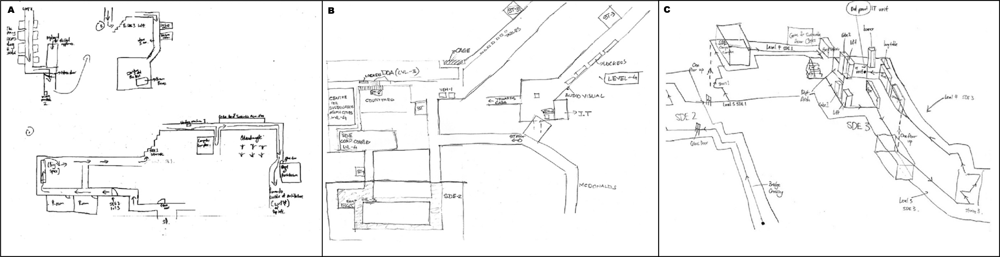
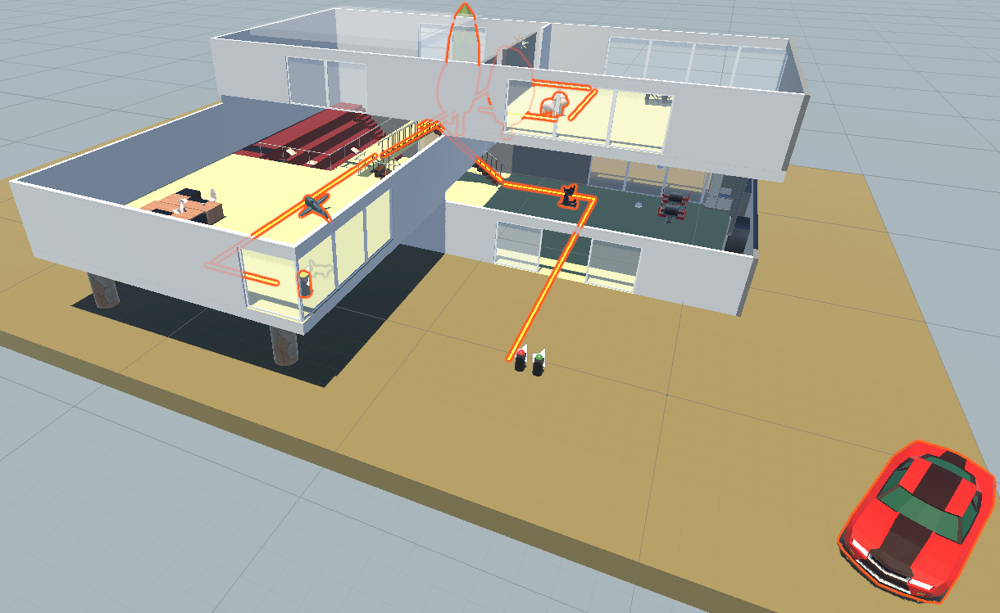
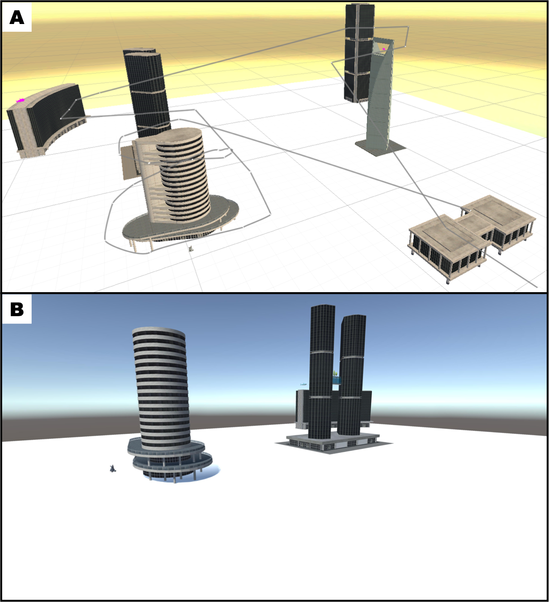
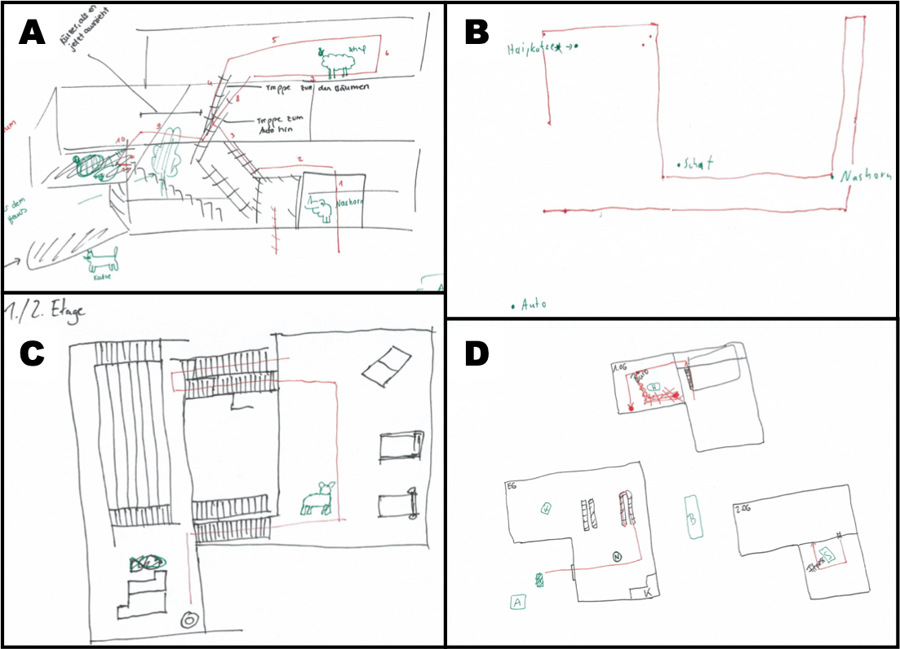
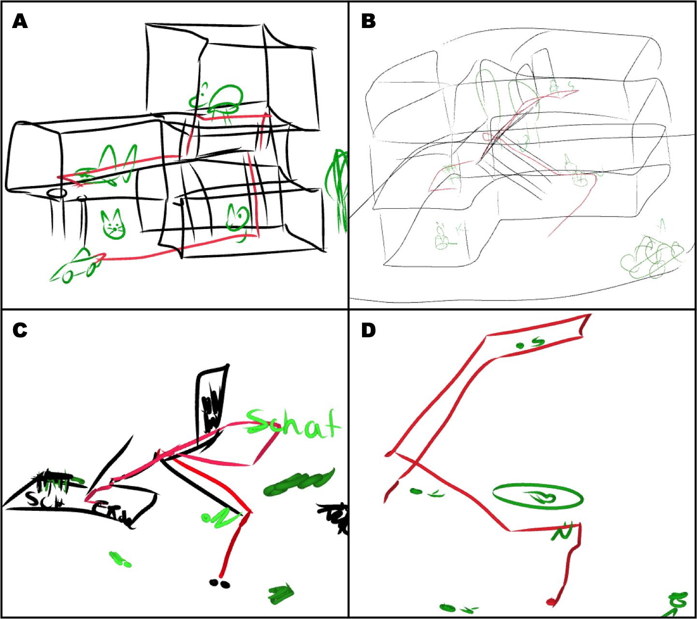
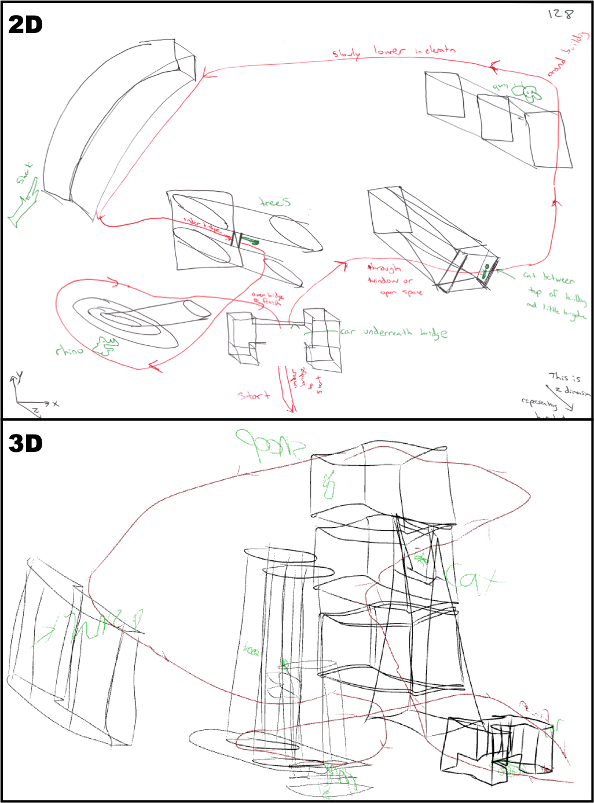

```{r setup, include = FALSE}
library(papaja)
library(tidyverse)
library(readxl)
library(kableExtra)
library(brms)
library(here)
library(hms)
library(ggplot2)
library(easystats)
library(gtsummary)
library(irr)
library(patchwork)
library(gridExtra)
r_refs("r-references.bib")

options(scipen=999)
theme_set(theme_classic(base_size = 20))
```

```{r analysis-preferences}
# Seed for random number generation
set.seed(42)
# dev = c("pdf","tiff") writes both a PDF (used by the LaTeX render) and a
# 300 dpi LZW-compressed TIFF (for journal upload) for every plot chunk.
# 'dev' is included in cache.extra so cached chunks invalidate when the
# device list changes -- otherwise the TIFFs would never be produced for
# already-cached chunks.
.submission_dev <- c("pdf", "tiff")
knitr::opts_chunk$set(
  cache.extra = list(knitr::rand_seed, .submission_dev),
  fig.width   = 15,
  echo        = FALSE,
  warning     = FALSE,
  message     = FALSE,
  cache       = TRUE,
  dev         = .submission_dev,
  dpi         = 300,
  dev.args    = list(tiff = list(compression = "lzw", bg = "white", type = "cairo"))
)
```

```{r submission-figs, include = FALSE, cache = FALSE}
# Build a submission/ folder containing each figure as a separate file in a
# T&F-accepted format (TIFF, LZW-compressed, sRGB, flattened over white).
# Static figures in figs/*.png are converted via magick; chart-chunk TIFFs
# generated by knitr (above) are copied across from manuscript_files/figure-latex/.
if (requireNamespace("magick", quietly = TRUE)) {
  dir.create("submission", showWarnings = FALSE)

  # 1. Static figures: figs/*.png -> submission/*.tiff
  png_sources <- list.files("figs", pattern = "\\.png$", full.names = TRUE)
  for (p in png_sources) {
    out <- file.path("submission", sub("\\.png$", ".tiff", basename(p)))
    if (!file.exists(out) || file.mtime(p) > file.mtime(out)) {
      magick::image_read(p) |>
        magick::image_background("white") |>
        magick::image_flatten() |>
        magick::image_convert(colorspace = "sRGB") |>
        magick::image_write(out, format = "tiff",
                            density = "300x300", compression = "LZW")
    }
  }

  # 2. Chart-chunk TIFFs already produced by knitr in figure-latex/
  tiff_chart_sources <- list.files("manuscript_files/figure-latex",
                                   pattern = "\\.tiff?$", full.names = TRUE)
  for (p in tiff_chart_sources) {
    out <- file.path("submission", basename(p))
    if (!file.exists(out) || file.mtime(p) > file.mtime(out)) {
      file.copy(p, out, overwrite = TRUE)
    }
  }
}
```

# Introduction

A fundamental challenge in geographic information science is understanding how humans mentally represent spatial environments and how these cognitive representations can be accurately externalised and formalised [@mark.1996]. While much progress has been made in understanding how people encode and communicate spatial relations in the horizontal dimension, the vertical dimension remains comparatively understudied [@jeffery.2011]. This is particularly problematic given that the spaces humans navigate are inherently three-dimensional, yet the methods we use to assess spatial knowledge, remain predominantly two-dimensional. The current study investigates whether this methodological reliance on 2D representations creates a bottleneck in capturing human spatial knowledge of vertically-complex environments.

Understanding survey knowledge--how people mentally represent the spatial configuration of objects, including distances and angles between landmarks [@siegel.1975; @montello.1998]--is fundamental to the integration of spatial cognition research and geographic information science. This knowledge type is particularly critical for environmental-scale spaces like buildings and urban districts , where individuals must integrate spatial information from distributed locations into coherent mental representations [@montello.1993]. From a GIS perspective, the challenge is twofold: theoretically, we need to understand how humans encode vertical spatial relations in vertically-complex environments. Methodologically, we require tools that can capture and formalise these cognitive representations in ways that preserve their inherent three-dimensionality.

Sketch maps--simplified drawings of environmental configurations [@lynch.1960]--have emerged as a valuable method for externalising survey knowledge, particularly because they permit relatively unrestricted visualisation of thought [@tversky2002sketches], even when memory is generalised [@manivannan.2022a] or incomplete [@schwering.2022]. This flexibility makes them suitable for capturing imperfect spatial knowledge and has led to their widespread adoption in realistic, real-world research contexts [@simonet.2025]. From a GIS methodological standpoint, sketch maps represent an analytical challenge because they must contain metric information (distances, angles) even though the underlying cognitive representation of space may store it incorrectly [@wang.2017], or in approximation [@ishikawa.2006]. In order to tackle this, researchers have developed systematic approaches to extract and analyse qualitative spatial relations from sketch maps--such as topological (e.g., "inside/outside"), directional (e.g., "right of"), and sequential relations (e.g., "before/after")--enabling the translation of hand-drawn cognitive maps into formal spatial representations that can be computationally processed and compared against ground truth [@schwering.2014].

However, a critical methodological limitation has received insufficient attention: sketch maps are predominantly drawn and analysed in two-dimensional form, despite the three-dimensional nature of the environments they represent [@kim.2022]. Whilst this simplification may be justified for navigation scenarios where vertical dimensions are irrelevant to path choices, it becomes problematic in vertically-complex environments where elevation changes significantly affect wayfinding and spatial understanding. For example, navigational studies of multi-level buildings show that vertical misrepresentations can lead to systematic wayfinding errors, such as underestimating detours between floors or failing to integrate staircases and elevators into a coherent route plan [@holscher.2006]. Understanding the vertical structure of buildings, e.g., whether separate floors have the same layout, and how they are aligned with regard to each other, is a known human factor issue of modern architecture [@dalton.2016]. These examples show that our understanding of how vertical information is perceived and understood might be yet insufficient and potentially lag behind the horizontal dimensions. The current study addresses this limitation by investigating whether extending established qualitative spatial reasoning methods from 2D sketch map analysis into three dimensions can better capture human spatial knowledge of vertically-complex spaces. This represents both a theoretical contribution--examining how humans mentally encode vertical relations in buildings and urban environments--and a methodological advancement in GIS, by demonstrating how qualitative spatial relations can be applied to 3D sketch maps created in virtual reality environments.

## Spatial relations in sketch maps

Drawing a sketch map requires participants to place all queried
environmental features on a single representation of that environment,
forcing them to explicitly define spatial relations between all objects
in the sketch. These spatial relations can be analysed in multiple ways;
the two dominant analyses are quantitative and qualitative. Our analysis method builds on a major contribution of geographical information science — a formal analysis of qualitative spatial relations [@frank.1996] — and the subsequently developed method of aligning sketch maps with metric maps via such relations [@chipofya.2016]. We focus on
analysing qualitative relations between two types of
features depicted in sketch maps: landmarks in the surrounding
environment and the shape of the travelled path.

Unlike quantitative metrics such as bidimensional regression [@friedman.2003; @tobler.2010], qualitative relations emphasize relative order and topology, aligning with how humans encode spatial knowledge and often remaining valid even when metric accuracy is distorted [@wang.2015; @warren.2017]. Thus, analysing sketch maps with regard to qualitative
relations carries relevance to how humans mentally
represent spatial knowledge.

In the current work we distinguish between spatial relations in all three dimensions, and analyse them separately. The reason for this is
twofold. First, 2D sketch maps might be particularly well-suited for
communicating information in a single plane (e.g. only horizontal plane
in top-down drawings) and thus their evaluation should not be based
solely on joint analyses of all dimensions. Second, there is a
well-established horizontal-vertical anisotropy in how people perceive [@krukar.2021a],
store, and communicate [@du.2022] spatial information. This may affect the quality
of 3D sketch maps but would not be captured in analyses that combine all
dimensions.

## Conveying vertical information in sketch maps

There are multiple ways in which one may attempt to convey vertical information in
a 2D sketch. Architects are trained in the technique of multiview
projection - using a set of drawings to depict a single 3-dimensional
object from different views aligned with distinct axes. Most common
views are a *plan* (a drawing from the top-down perspective along the
vertical axis) and a *section* (a drawing from the side along the
horizontal axis). @brandt.2015 showed that non-architects are able to produce these two
conventions.

Other possibilities for 2D sketch maps include: 
(a) drawing multiple plans depicting space at
different levels of the vertical axis (e.g., separate floors), 
(b) producing a single drawing and coding the third dimension with textual or symbolic annotations, or 
(c) producing a perspective drawing, i.e., a sketch that represents all three spatial dimensions within a single view by simulating how objects appear from a given vantage point; this can convey depth and height more intuitively, but necessarily distorts angles and distances (Figure \@ref(fig:lit-3drawings)).

Yet, studies show that few participants spontaneously depict vertical relations: only 11 of 38 maps in @blajenkova.2005 and 16 of 62 in @zhong.2016 included floor alignment. Yet performance on other tasks remained good, suggesting that constraints of 2D sketching, not memory, hinder expression of vertical information. This may reflect participants' inability to draw 3D relations using the pen-and-paper set-up, the affordances of the medium that encourage two-dimensional representations, and the scarcity of consistent 3D map examples in everyday life: unlike top-down plans, 3D cartographic representations lack a standardised design convention that participants could intuitively draw upon [@haberling.2008].

```{r lit-3drawings, out.width = "100%", fig.cap = "Examples of 3 sketch maps obtained by Zhong and Kozhevnikov (2016). (A) Different floors drawn as separate drawings cannot be vertically aligned. (B) A single layout drawing with annotations for different vertical levels. (C) A perspective drawing distorting angles and distances in an inconsistent way across different parts of the drawing. Figure obtained with permission from Zhong and Kozhevnikov (2016) and modified."}


```

Our experiments re-create the procedures used by @blajenkova.2005 and @zhong.2016 in the sense of giving participants a task that requires memorising and communicating information in all three dimensions, but relying on participants' spontaneous choice of sketch mapping convention (i.e., where the exact style of drawing is not predefined by the instruction). This reflects the way in which sketch maps are used in research and in everyday settings: their advantage is that they are intuitive and can be produced spontaneously; i.e., participants can perform the task with minimal instructions and no feedback on their progress. The motivation behind this paper is that the affordances and learned conventions of intuitive 2D sketch mapping restrict participants in expressing their spatial knowledge to its full extent, and that newly available technological possibility of 3D sketch mapping does not.

## 2D vs. 3D in information visualisation

The question of whether 3D information is beneficial over 2D has generated a substantial body of work across multiple domains. Evidence from stereoscopic display research shows that observing 3D visualisations can deliver performance benefits for tasks that require depth judgements or object manipulation, but these benefits are inconsistent and highly task-dependent [@mcintire.2014]. In medicine, for example, clinicians preferred 3D artery visualisations for diagnosing heart disease, yet showed no advantage in diagnostic accuracy over 2D equivalents [@borkin.2011].
The intuition that a more visually realistic display must be a more useful one has been termed *naïve realism* [@smallman.2011]. However, the added visual complexity of 3D displays can impede performance e.g., by introducing occlusion, distorted distance perception, and increased cognitive load [@mcintire.2014]. For geovisualisations, the properties of the task at hand and abilities of the user determine the usefulness of 3D over 2D information visualisation [@coltekin.2016]. Learning from 3D models in educational contexts benefited high-spatial-ability participants but not low-spatial-ability ones, suggesting that 3D may widen rather than close performance gaps between users [@huk.2006]. Spatial ability moderated performance on other VR-based spatial tasks, cautioning against assuming that 3D is uniformly beneficial [@lochhead.2022]. A particular benefit of 3D information visualisations has been shown to come from what is seen on them, as opposed to the possibility of performing interactive manipulations with them [@keehner.2008]. Taken together, this literature established that viewing 3D is often subjectively preferred, although simultaneously it is cognitively demanding, and genuinely beneficial only under specific conditions of task fit, interface design, and user ability.

A key difference to our work is that this entire body of research concerns the *interpretation of visualisations* — how well people read, judge, or reason from displays that others have constructed. Fan [-@fan.2026] argues that drawing tasks are different: being *generative behaviours* they reveal not only whether someone holds a spatial concept but which of its features they can retrieve and successfully convey. These are distinct constraints. A participant may understand vertical structure yet be unable to express it through a 2D medium — not because understanding or memory of the original structure failed, but because the medium of expression did. The usefulness of 3D information for *externalising* spatial knowledge has been studied much less, and this gap in knowledge motivates the present study.

## Individual differences in 3D spatial information processing

Individual spatial abilities may modulate how effectively people encode and retrieve complex three-dimensional spatial information, and thus moderate the effect of drawing interface on output quality. It is unclear, however, which abilities are most predictive for this task. @hegarty.2006 showed that abstract pen-and-paper spatial tests are only partially related to environmental learning. Prior work also suggests that highly-specific skills are better predictors of design-related performance than general visuospatial measures traditionally applied in psychology [@cho.2019; @cho.2022]. This includes processes central to representing survey knowledge of buildings and urban configurations — perspective switching, 3D volume composition, and 2D-to-3D transformation.

## Vertical information in different types of spaces

The differences between 2D and 3D sketch maps might depend on the type
of space that is being depicted. The type of movement a space allows for affects how it is cognitively processed [@jeffery.2011; @holscher.2013]. With
respect to this, we focus on two types of space: *volumetric environmental spaces* and *multi-layered environmental spaces*
[@jeffery.2013]. The former makes it possible to explore the vertical
dimension freely (e.g., through flying), while the latter consists of
vertically-layered discrete spaces that cannot always be freely changed
(e.g., floors of a building can only be changed by using elevators,
escalators, or stairs). These movement constraints might contribute
to participants' choice of depicting separate floors of buildings as
separate 2D plans [@blajenkova.2005; @zhong.2016]. Specifically, floors
lend themselves to easier annotation of qualitative vertical relations
(e.g., one can label separate floor plans with numbers). A volumetric
space cannot be intuitively represented as multiple 2D plans. For this
reason we present two experiments, one in each type of space, and discuss the similarities and differences in their outcomes.

## VR-based drawing interfaces

Laypersons are not trained to represent 3D spatial relations effectively on 2D sketch maps.
A 2D medium necessitates that information from one of the three
dimensions is either ignored, distorted, or represented with a different
convention than the remaining two dimensions. 3D sketch maps allow for the representation of information from all three dimensions within a single, consistent drawing convention. However, an open question is whether 3D sketch
maps can be used to communicate 3D information by laymen [@xiao.2024]. Prior research shows that laypeople struggle with precision when sketching 3D objects in VR, although training improves performance [@deisinger.2000]. These challenges motivate our focus on qualitative rather than precise metric analyses.

# This study

We present two experiments that investigated the difference between 2D and 3D sketch maps in two types of vertically-complex environments: a layered 3D environment (a building; Experiment 1), and a volumetric 3D environment (an urban area; Experiment 2). Our analyses focus on whether participants are able to express qualitative spatial relations between objects in the sketches (e.g., "x is higher than y") in a way that would be interpretable by another human, and whether these spatial relations are expressed correctly, in relation to the environment they have explored.

We state three main hypotheses:

*H1. Participants will exhibit a cognitive bias toward the horizontal plane in 2D sketch maps, resulting in a lower rate of represented vertical (Z-axis) relations in 2D sketch maps.* The common way of thinking about and drawing maps on 2D paper in non-professional contexts is the top-down view [@blajenkova.2005; @zhong.2016]. Although alternative drawing styles are possible (cross-section from the side, perspective drawing), we hypothesised that most participants will prioritise depicting horizontal relations at the expense of vertical information.

*H2. 3D sketch maps will capture vertical (Z-axis) spatial relations between landmarks with higher correctness, compared to 2D sketch maps.* Given that all sketches are selective and generalised [@tversky2002sketches], the fact that drawing in 3D requires activation of a more complex 3D mental representation [@gagnier.2017; @tung.2024] but demand less mental projection [@kim.2022] may mean that that 2D sketch maps (potentially not requiring maintaining such a representation in working memory, especially for vertical information) will result in lower correctness of vertical spatial relations.

*H3. Spatial relations that were left out from participant's 2D sketch map but present on their corresponding 3D sketch map will capture valid spatial knowledge (higher than chance accuracy of elements left out in 2D sketch but present in the 3D sketch).* Our assumption is that participants are able to store complex 3D spatial relations [@lu.2019], and it is the limitation of 2D drawing that does not allow them to express what they know. This is contrary to an alternative possibility that 3D drawing forces participants to draw spatial relations that they have no chance of knowing, because they never stored them.

# Methods

```{r convert raw to clean data exp1, eval=FALSE}
# This block loads raw_data and converts it to clean_data. It is switched off by default.

## 2d scoring sheets
exp1.scores.2d <- tibble()
filelist <- list.files(here("raw_data", "exp1", "scoring_sheets", "2D"))

for (i in 1:length(filelist)){
    x <- read_excel(here("raw_data", "exp1", "scoring_sheets", "2D", filelist[[i]]), range = cell_cols(1:7))
    x$file <- filelist[[i]]
    x$cond <- "2D"
    exp1.scores.2d <- rbind(exp1.scores.2d, x)
}
rm(x, filelist, i)

## 3d scoring sheets
exp1.scores.3d <- tibble()
filelist <- list.files(here("raw_data", "exp1", "scoring_sheets", "3D"))

for (i in 1:length(filelist)){
    x <- read_excel(here("raw_data", "exp1", "scoring_sheets", "3D", filelist[[i]]), range = cell_cols(1:7))
    x$file <- filelist[[i]]
    x$cond <- "3D"
    exp1.scores.3d <- rbind(exp1.scores.3d, x)
}
rm(x, filelist, i)

## merge them
exp1.scores <- rbind(exp1.scores.2d, exp1.scores.3d)
exp1.scores <- exp1.scores %>% 
    rename(
        participant.ID      = file,
        comments.scores     = `...7`
    ) %>% 
    mutate(
        participant.ID = as.numeric(str_extract(participant.ID, "(?<=_)[0-9]+(?=\\.xlsx)")))

exp1.scores.generic.relations <- exp1.scores %>% 
    filter(relation.type == "generic.relations") %>% 
    mutate(participant.ID = as.numeric(participant.ID))

exp1.scores <- exp1.scores %>% 
    rename(occurrence = visibility) %>%
    filter(relation.type != "generic.relations") %>% 
    mutate(across(c(occurrence, correctness), as.numeric),
           across(c(relation.type, cond), as.factor),
           participant.ID = as.numeric(participant.ID))

rm(exp1.scores.2d, exp1.scores.3d)

exp1.notes <- read_excel(here("raw_data", "exp1", "notes.xlsx")) %>%
  pivot_longer(
    cols = `1`:`30`,
    names_to = "participant.ID",
    values_to = "value"
  ) %>%
  pivot_wider(
    names_from = ID,
    values_from = value
  ) %>% mutate(
      outlier = ifelse(participant.ID %in% c(4,6,27), "yes", "no")
  ) %>% 
    mutate(participant.ID = as.numeric(participant.ID))

exp1.ipt <- read_csv(here("raw_data", "exp1", "ipt.csv"), 
                     show_col_types = FALSE, 
                     col_select = !starts_with(".")) %>% 
    mutate(participant.ID = as.numeric(participant.ID))

exp1.nasa_tlx <- read_csv(here("raw_data", "exp1", "nasa_tlx.csv"), 
                          show_col_types = FALSE,
                          col_type = "cdfdddddd",
                          col_select = !starts_with(".")) %>% 
    mutate(RAW.TLX = ((NASA1+NASA2+NASA3+NASA4+NASA5+NASA6) / 6)) %>% 
    mutate(participant.ID = as.numeric(participant.ID))


exp1.part <- left_join(exp1.notes[,c("participant.ID", "outlier")],
                        exp1.ipt[,c("participant.ID", "age", "gender", "IPT.score")],
                       by = "participant.ID") %>% 
    mutate(gender = case_match(gender,
                               1 ~ "male",
                               2 ~ "female",
                               4 ~ "undeclared")) %>% 
    mutate(participant.ID = as.numeric(participant.ID))

exp1.trials <- exp1.nasa_tlx %>% select(!starts_with("NASA"))

rm(exp1.notes, exp1.ipt, exp1.nasa_tlx)

# build tibble for statistical models

exp1.models <- full_join(
    exp1.scores,
    select(
        exp1.part,
        participant.ID,
        age,
        gender,
        IPT.score
    ),
    by = c("participant.ID")
)

exp1.models <- left_join(
    exp1.models,
    select(
        exp1.trials,
        cond,
        participant.ID,
        trial,
        RAW.TLX
    ),
    by = c("participant.ID", "cond")
) %>%
    mutate(
        relation.dim = substr(relation.code, 1, 1),
        relation.code = as.factor(relation.code),
        relation.dim = as.factor(relation.dim),
        cond = as.factor(cond),
        trial = as.factor(trial)
    )

# Transform the column with trial order
exp1.models <- exp1.models %>% 
    mutate(order = case_when(trial == "1" & cond == "2D" ~ "2D_first",
                             trial == "1" & cond == "3D" ~ "3D_first",
                             trial == "2" & cond == "2D" ~ "3D_first",
                             trial == "2" & cond == "3D" ~ "2D_first"))

# a column for conditioning on occurrence
# it omits those relations that were missing (occurrence == 0) 
# in at least one of the sketch maps drawn by a given participant
exp1.models <- exp1.models %>% 
    group_by(participant.ID, relation.code) %>% 
    mutate(relation.occurring.on.both.sketchmaps = ifelse(
        (all(!(cond == "2D" & occurrence == 0)) & all(!(cond == "3D" & occurrence == 0))), 1, 0)) %>% 
    ungroup()


write_csv(exp1.models, here("clean_data", "exp1", "exp1.models.csv"))
write_csv(exp1.part, here("clean_data", "exp1", "exp1.part.csv"))
write_csv(exp1.scores, here("clean_data", "exp1", "exp1.scores.csv"))
write_csv(exp1.scores.generic.relations, 
          here("clean_data", "exp1", "exp1.scores.generic.relations.csv"))
write_csv(exp1.trials, here("clean_data", "exp1", "exp1.trials.csv"))

save.image(here("clean_data", "exp1", "all.data.exp1.RData"))
```

```{r}
load(here("clean_data", "exp1", "all.data.exp1.RData"))
```


```{r convert raw to clean, eval=FALSE}
# This block loads raw_data and converts it to clean_data. It is switched off by default.

## 2d scoring sheets
exp2.scores.2d <- tibble()
filelist <- list.files(here("raw_data", "exp2", "scoring_sheets", "2D"))

for (i in 1:length(filelist)){
    x <- read_excel(here("raw_data", "exp2", "scoring_sheets", "2D", filelist[[i]]), range = cell_cols(1:7))
    x$file <- filelist[[i]]
    x$cond <- "2D"
    exp2.scores.2d <- rbind(exp2.scores.2d, x)
}
rm(x, filelist, i)

## 3d scoring sheets
exp2.scores.3d <- tibble()
filelist <- list.files(here("raw_data", "exp2", "scoring_sheets", "3D"))

for (i in 1:length(filelist)){
    x <- read_excel(here("raw_data", "exp2", "scoring_sheets", "3D", filelist[[i]]), range = cell_cols(1:7))
    x$file <- filelist[[i]]
    x$cond <- "3D"
    exp2.scores.3d <- rbind(exp2.scores.3d, x)
}
rm(x, filelist, i)

## merge them
exp2.scores <- rbind(exp2.scores.2d, exp2.scores.3d)
exp2.scores <- exp2.scores %>% 
    rename(
        participant.ID      = file,
        comments.scores     = `...7`
    ) %>% 
    mutate(
        participant.ID = str_extract(participant.ID, "(?<=_)[0-9]+(?=\\.xlsx)"))

exp2.scores.generic.relations <- exp2.scores %>% filter(relation.type == "generic.relations")

exp2.scores <- exp2.scores %>% 
    rename(occurrence = visibility) %>%
    filter(relation.type != "generic.relations") %>% 
    mutate(across(c(occurrence, correctness), as.numeric),
           across(c(relation.type, cond), as.factor),
           participant.ID = as.numeric(participant.ID))

rm(exp2.scores.2d, exp2.scores.3d)


## NASA-TLX 2d and 3d
exp2.nasa <- tibble()
filelist <- list.files(here("raw_data", "exp2", "NASA-TLX"))

for (i in 1:length(filelist)){
    x <- read_lines(here("raw_data", "exp2", "NASA-TLX", filelist[[i]]))
    x <- enframe(x[c(3,4,5,11:16)])
    x <- separate_wider_delim(x[-1], cols = "value", delim = ",", names = c("left", "right"))
    x <- pivot_wider(x, names_from = "left", values_from = "right")
    exp2.nasa <- rbind(exp2.nasa, x)
}
rm(x, filelist, i)

exp2.nasa <- exp2.nasa %>% 
    rename(
        cond                = "STUDY GROUP:",
        participant.ID      = "SUBJECT ID:",
        trial               = "TRIAL:",
        nasa.mental.demand  = "Mental Demand",
        nasa.physical.demand = "Physical Demand",
        nasa.temporal.demand = "Temporal Demand",
        nasa.performance     = "Performance",
        nasa.effort          = "Effort",
        nasa.frustration     = "Frustration" 
    ) %>% 
    mutate(across(-cond, as.numeric),
           cond = as.factor(cond),
           cond = recode(cond,
                         Hand    = "2D",
                         VR      = "3D"))


## remaining files
exp2.drawing.time <- read_excel(here("raw_data", "exp2", "drawing_timing.xlsx"))
exp2.drawing.time <- exp2.drawing.time %>% rename(
    participant.ID  = ID,
    drawing.time.of.3d    = `VR Time`,
    drawing.time.of.2d    = `Hand Time`,
    comments.drawing.time = Comments
) %>% 
    mutate(drawing.time.of.3d   = na_if(as.numeric(drawing.time.of.3d), NaN),
           drawing.time.of.3d   = as_hms(drawing.time.of.3d),
           drawing.time.of.2d   = as_hms(drawing.time.of.2d)
           )

exp2.unity.time <- read_csv(here("raw_data", "exp2", "unity_timing.csv"), show_col_types = FALSE)
exp2.unity.time <- exp2.unity.time %>% rename(
    participant.ID          = participant,
    time.of.unity.flight    = totalTime,
    comments.unity.time     = Comments
    ) %>% 
    mutate_at(vars(time.of.unity.flight, shark, cat, car, rhinoceros, sheep, tree), as_hms)

exp2.questionnaire <- read_excel(here("raw_data", "exp2", "questionnaire.xlsx"))
exp2.questionnaire <- exp2.questionnaire %>% rename(
    urban.test.score        = Score,
    participant.ID          = `Assigned ID`,
    age                     = Age,
    gender                  = Gender,
    VR.experience           = `Experience with VR headsets`,
    time.of.questionnaire   = `Total Time (minutes)`,
    comments.questionnaire  = Comments
) %>% 
    mutate(
        gender                  = as.factor(gender),
        VR.experience           = as.factor(VR.experience),
        VR.experience           = factor(VR.experience, levels = c("I never used VR",
                                                                   "I used VR <10 times in my life",
                                                                   "I used VR 10 times or more in my life but don't use it regularly",
                                                                   "I use VR regularly")),
        time.of.questionnaire   = as_hms(time.of.questionnaire)
    )


# Keep all the data but in less tibbles: per-trial, per-participant, and per-spatial.relation

exp2.drawing.time <- exp2.drawing.time %>%
    pivot_longer(
        cols = starts_with("drawing.time.of."),
        names_to = c(".value", "cond"),
        names_sep = "\\.of.",
        values_to = "drawing.time"
    ) %>%
    mutate(cond =
           case_match(cond,
               "2d" ~ "2D",
               "3d" ~ "3D")
           )

exp2.nasa <- exp2.nasa %>%
    rowwise() %>%
    mutate(RAW.TLX = mean(c_across(starts_with("nasa.")), na.rm = TRUE) %>% round(.,2)) %>%
    ungroup()

exp2.trials <- left_join(exp2.nasa, exp2.drawing.time, by = c("cond", "participant.ID"))
rm(exp2.drawing.time, exp2.nasa)


exp2.unity.time <- exp2.unity.time %>% 
     rename_with(.fn = ~ paste0("time.of.unity.FOV.", .), .cols = c("shark", "cat", "car", "rhinoceros", "sheep", "tree"))

exp2.part <- left_join(exp2.questionnaire, exp2.unity.time, by="participant.ID") %>% 
    select(-Timestamp, -StartTime)
rm(exp2.questionnaire, exp2.unity.time)


# build tibble for statistical models

exp2.models <- full_join(
    exp2.scores,
    select(
        exp2.part,
        urban.test.score,
        participant.ID,
        age,
        gender,
        VR.experience,
        time.of.questionnaire,
        comments.questionnaire,
        time.of.unity.flight,
        comments.unity.time
    ),
    by = c("participant.ID")
)


exp2.models <- left_join(
    exp2.models,
    select(
        exp2.trials,
        cond,
        participant.ID,
        trial,
        RAW.TLX,
        comments.drawing.time,
        drawing.time
    ),
    by = c("participant.ID", "cond")
) %>%
    mutate(
        relation.dim = substr(relation.code, 1, 1),
        relation.code = as.factor(relation.code),
        relation.dim = as.factor(relation.dim),
        cond = as.factor(cond),
        trial = as.factor(trial)
    )

# Transform the column with trial order
exp2.models <- exp2.models %>% 
    mutate(order = case_when(trial == "1" & cond == "2D" ~ "2D_first",
                             trial == "1" & cond == "3D" ~ "3D_first",
                             trial == "2" & cond == "2D" ~ "3D_first",
                             trial == "2" & cond == "3D" ~ "2D_first"))

# a column for conditioning on occurrence
# it omits those relations that were missing (occurrence == 0) 
# in at least one of the sketch maps drawn by a given participant
exp2.models <- exp2.models %>% 
    group_by(participant.ID, relation.code) %>% 
    mutate(relation.occurring.on.both.sketchmaps = ifelse(
        (all(!(cond == "2D" & occurrence == 0)) & all(!(cond == "3D" & occurrence == 0))), 1, 0)) %>% 
    ungroup()


write_csv(exp2.models, here("clean_data", "exp2", "exp2.models.csv"))
write_csv(exp2.part, here("clean_data", "exp2", "exp2.part.csv"))
write_csv(exp2.scores, here("clean_data", "exp2", "exp2.scores.csv"))
write_csv(exp2.scores.generic.relations, here("clean_data", "exp2", "exp2.scores.generic.relations.csv"))
write_csv(exp2.trials, here("clean_data", "exp2", "exp2.trials.csv"))

save.image(here("clean_data", "exp2", "all.data.exp2.RData"))
```

```{r}
load(here("clean_data", "exp2", "all.data.exp2.RData"))
```


## Participants
### Experiment 1: Vertically layered environment

A total of `r nrow(exp1.part)` participants
(`r exp1.part %>% filter(gender ==  "male") %>% nrow()` men,
`r exp1.part %>% filter(gender ==  "female") %>% nrow()` women,
`r exp1.part %>% filter(gender ==  "undeclared") %>% nrow()` undeclared)
were recruited from the general population and among attendees of the
"Places \_ VR Festival" introducing Virtual Reality applications to
the general population. They had no specifically spatial education, but were predominantly students. 
Data from
`r exp1.part %>% filter(outlier == "yes") %>% nrow()` participants were
excluded due to heavy motion sickness, problems with understanding the
application, or inability to memorise the building model.

```{r filter outliers1}
exp1.outliers <- as.list(exp1.part[exp1.part$outlier=="yes","participant.ID"]) %>% .[[1]]
exp1.models <- exp1.models %>% filter(!participant.ID %in% exp1.outliers)
exp1.part <- exp1.part %>% filter(!participant.ID %in% exp1.outliers) %>% 
    mutate(IPT.score.s = as.numeric(scale(IPT.score)))
exp1.scores <- exp1.scores %>% filter(!participant.ID %in% exp1.outliers) %>% 
    mutate(participant.ID = as.character(participant.ID))
exp1.scores.generic.relations <- exp1.scores.generic.relations %>% 
    filter(!participant.ID %in% exp1.outliers)
exp1.trials <- exp1.trials %>% filter(!participant.ID %in% exp1.outliers) %>% 
    mutate(RAW.TLX.s   = as.numeric(scale(RAW.TLX)))
```

The age of the remaining `r nrow(exp1.part)` participants ranged from
`r min(exp1.part$age)` to `r max(exp1.part$age)` years (M =
`r mean(exp1.part$age) %>% round(2)`, SD =
`r sd(exp1.part$age) %>% round(2)`). All participants provided informed
consent and received 12 euro for their participation. The study was
approved by the institutional ethics committee.

### Experiment 2: Vertically volumetric environment

```{r}
exp2.outliers <- c(118,123,129,131)
```

A total of `r nrow(exp2.part)` participants (`r exp2.part %>% filter(gender ==  "Male") %>% nrow()` men,
`r exp2.part %>% filter(gender ==  "Female") %>% nrow()` women) were
recruited from the general population and via a university newsletter. None of them participated in Experiment 1 and they did not have specifically spatial education. Data from `r length(exp2.outliers)` participants were excluded due to
heavy motion sickness preventing them from completing the study or
because they did not fully follow the instructions.

```{r filter outliers2}
exp2.models <- exp2.models %>% filter(!participant.ID %in% exp2.outliers)
exp2.part <- exp2.part %>% filter(!participant.ID %in% exp2.outliers) %>% 
    mutate(urban.test.score.s = as.numeric(scale(urban.test.score)))
exp2.scores <- exp2.scores %>% filter(!participant.ID %in% exp2.outliers)
exp2.scores.generic.relations <- exp2.scores.generic.relations %>% filter(!participant.ID %in% exp2.outliers)
exp2.trials <- exp2.trials %>% filter(!participant.ID %in% exp2.outliers) %>% 
    mutate(RAW.TLX.s   = as.numeric(scale(RAW.TLX)))
```

The age of the remaining `r nrow(exp2.part)` participants ranged from
`r min(exp2.part$age)` to `r max(exp2.part$age)` years (M =
`r mean(exp2.part$age) %>% round(2)`, SD =
`r sd(exp2.part$age) %>% round(2)`). All participants provided
informed consent and received 12 euro for their participation. The study
was approved by the institutional ethics committee.

Sample size was determined primarily through resource constraints (time, money). Statistical power computed within the framework of @judd.2017 varied between 0.74 and 0.92 for a medium effect size but we use Bayesian statistics appropriate for lower sample sizes.


## Materials

### Experiment 1: Vertically layered environment

The environment that was explored and sketched by the participants was a virtual 3D model of a building consisting of three rectangular-shaped levels, the middle of which was rotated by 90 degrees (Figure \@ref(fig:exp1-env)). The floors were connected by a large open staircase. The interior consisted of furniture that differentiated the spaces by adding functional context (kitchen furniture, office furniture, gym furniture). In addition, there were 6 distinct landmarks: (1) car, (2) cat, and (3) trees located outside the building, and (4) shark, (5) sheep, and (6) rhino located inside. The building also included two vertical pillars with a large button located on top. Pressing the virtual button by the participant initiated the experiment by displaying a line on the floor that participants would follow. The building was designed in Blender 3.4.4 and then imported into experiment environment in Unity version 2021.3.10f1.

```{r exp1-env, out.width = "100%", fig.cap = "The environment that was explored and sketched by the participants in Experiment 1. The orange-red line indicates the route."}


```

Oculus Quest 2 VR headset was used for both exploring the environment and for the 3D drawing task. It has a horizontal field of view of up to 97° and vertical field of view of up to 93° (depending on the user) with two 1832x1920 pixel displays. Movement through the building was controlled with a joystick on the headset's hand controller. Rotation of the head corresponded to the rotation of the field of view in the virtual environment.

Participants were drawing 3D sketch maps using the *Gravity Sketch* v.5.6.2 application[^gs]. When the user presses the button of the controller located under the pointing finger, the application leaves a
trace of "virtual ink" in the air. One can control the perspective by
moving around the 3D sketch. It is also possible to scale and move the
3D sketch by using "pinch and zoom movement" on both controllers.
Participants adhered to pre-configured sketching settings, ensuring consistency across trials, but were allowed to modify colours to improve clarity in their 3D sketches. Gravity Sketch was selected for this study from a large number of available 3D sketching tools, because it relies on freehand sketching and most closely resembles 2D pen-and-paper sketching (e.g., the used tools do not input any objects for participants, and do not correct their shapes). This makes 3D and 2D sketch mapping condition comparable.

2D sketch maps were drawn on A4 paper, using the provided pens. Participants could request an additional sheet of paper at any time.

[^gs]: www.gravitysketch.com

### Experiment 2: Vertically volumetric environment

The environment that was explored and sketched by the participants was a virtual 3D model of an urban area consisting of 6 buildings and 6 landmarks (Figure \@ref(fig:exp2-env)). The landmarks were the same objects as in Experiment 1. Each landmark was located in close proximity to a single building and the vertical location of the landmark was fixed at one of three heights (either standing on the ground or floating in the air). The scenario simulated a drone flight around the area. The Unity version was 2021.3.11f1.

```{r exp2-env, out.width = "100%", fig.cap = "The environment that was explored and sketched by the participants in Experiment 2. The grey line indicates the route."}


```

Oculus Quest 2 VR headset, same as in Experiment 1, was used for both exploring the environment and for the 3D drawing task. Unlike in Experiment 1, participants were not able to navigate the environment freely, but were experiencing the flight from the first-person perspective. They could freely rotate the view (by moving their head) and stop the drone movement at will (by pressing a button on the controller), but they could not deviate from the pre-defined path. The path circumnavigated the buildings, passing nearby each landmark. After reaching the end, the drone followed the same path in the reverse direction, back to the starting position, so the flight was experienced twice, from both directions. Unless paused by the participant, the video lasted 270 seconds. Compared to Experiment 1, this procedure restricted participants' path more (in Experiment 1, exploration included a path-free phase), and changed their control of locomotion (in Experiment 1 they had to operate the controller in order to move, in Experiment 2 in order to stop the movement). The reason for this decision was that controlling locomotion in 3D proven to be overwhelming to unskilled participants in pilot testing. Because the focus of this study is on the difference between 2D and 3D sketch maps, the goal of the procedure was to ensure that participants are able to successfully comprehend the environment. We adjusted the learning method across the two experiments to facilitate this goal.

Participants were drawing 3D sketch maps using the *Gravity Sketch* v.6.1.6 with the same configuration as in Experiment 1. 2D sketch maps were drawn on A4 paper, using the provided pens. Participants could request an additional sheet of paper at any time.


### Questionnaires

Participants completed three questionnaires on a tablet: a short demographic questionnaire (both experiments), NASA-TLX for subjective cognitive load estimation (both experiments) [@hart.2006], Indoor Perspective Test (Experiment 1 only), and Urban Layout Test (Experiment 2 only). Indoor Perspective Test and Urban Layout Test come from a battery of tests created to investigate spatial abilities of architecture students [@berkowitz.2021]. This battery was used previously e.g., to show the positive impact of AR-enhanced training programme on improving spatial abilities among first-year engineering students [@porat.2024]. NASA-TLX is a standard tool for measuring subjective workload in six sub-scales: mental demand, physical demand, temporal demand, user performance, effort, and frustration.

## Procedure

In Experiment 1, participants came into an isolated room, signed an Informed Consent Form, and filled in the Indoor Perspective Test. After a short training in the VR interface they were moved into the virtual study scene and instructed to explore the scene:

> “Please memorize the mentioned landmarks as you will be asked to draw them on a sketch map. The position of the landmarks is crucial. It is important to be able to represent them on your sketch map.”

The learning phase consisted of free exploration and a navigation task. In the free exploration participants first circumnavigated the building model, and then freely walked inside. There was no time limit. The experimenter then visually and verbally verified that participant had memorised the location of landmarks by asking them to (a) point to each of them, and (b) verbally confirm how many floors the building has. Participants who made mistakes or showed uncertainties were asked to further explore the scene before the assessment was repeated. As the final step of the learning phase, participants performed a navigation task by following a line displayed on the floor near all indoor landmarks.

Following the learning phase, participants were asked to draw two sketch maps of the environment (in a counterbalanced order): a 2D pen-and-paper sketch map and a VR-based 3D sketch map in Gravity Sketch. They were asked to use the red colour for drawing the route, green for six landmarks, and black for everything else. At the end the experimenter verified whether the identity of each landmark is identifiable, and asked for a clarification (e.g., adding a label) if necessary. The instruction was:

> "Please draw the route you took and the six objects you should have paied attention to: the
rhino, the shark, the sheep, the trees, the cat, and the car. You can add anything you want
to your drawing, but please stick to the following colors: the route in red, the six objects in
green, and everything else in black. You are free to draw whatever you want but your drawing
should clearly display the location of the objects and the path you walked. You should feel that
your drawing is clearly understandable to others."

Lastly, participants were asked to fill in NASA-TLX questionnaire separately for both conditions (2D and 3D sketching). The time between the exploration of the VR environment and completing the second sketch in the study was approx. 30-60 min, depending on the participant.

In Experiment 2, procedure was similar to Experiment 1. Each participant was tested
individually. After coming into the room they were presented with the
informed consent forms, demographic questionnaire, the Urban Perspective Test, and asked to perform a tutorial on drawing in 3D in Gravity
Sketch. Then, while wearing a VR headset and seated in a
rotating chair, participants watched an immersive 360 video inside a
training environment from the first-person perspective of a drone flying
through an urban environment. They were shown how to pause the drone
(using a button on the controller) and how to look around the
environment (using head movement) and explained that they are not able
to affect the flying path of the drone. After experiencing this sample
environment and confirming no motion sickness they saw the flight in the
main environment with the instruction to remember the layout of
buildings, the path of the drone and the location of landmarks for
future drawing. After flying the same route in both directions they were
asked to point to a selection of objects as a confirmation that they
remember the environment. They were offered a chance to repeat the
flight but no one reported such a need. Participants then drew two
sketch maps (in a counterbalanced order) and filled
the NASA-TLX questionnaire for both drawing tasks on a tablet. Exact instructions are reported in Appendix A.

## Experimental design

Both experiments followed a within-subject design. Each participant drew two sketch maps (2D and 3D). The complexity of the environment was equal for all participants, and the number of landmarks that had to be drawn was pre-determined.

## Data analysis

#### Sketch interpretation
Each sketch map from Experiment 1 contained 6 landmarks and the travelled path, as remembered by the participant. We have manually coded each sketch map to extract the following binary variable of interest: *occurrence* (is the relation occurring in/interpretable from the sketch) and *correctness* (i.e., is the relation true with respect to the ground-truth environment travelled by the participant) of each of the following spatial relation:

* relative horizontal (X-dimension) relation between pairs of landmarks, e.g., "the shark is to the left relative to the sheep";

* relative depth (Y-dimension) relation between pairs of landmarks, e.g., "the car is closer to the front relative to the sheep";

* relative vertical (Z-dimension) relation between pairs of landmarks, e.g., "the shark is lower than the sheep";

* as well as X-, Y-, and Z-dimension relations of each landmark relative to the path, e.g., "the car is to the right of the first path segment".

There were 45 XYZ relations between pairs of landmarks in total (15 pairs * 3 dimensions) and there were 18 relations between landmarks and the path (6 landmarks * 3 dimensions). Thus, there were 63 spatial relations in total. However, any spatial relation that was marked as not *occurring* on a given sketch map, would be automatically marked as *NA* in terms of its *correctness*. So the maximal *correctness* score per participant was capped by their number of *occurring* relations. Note that some relations were correct only if the landmarks overlapped, e.g., the trees are directly behind the cat in Experiment 1, and therefore the X-dimension relation would be correct if their bounding boxes would overlap on the X-dimension. 

The reference viewpoint from which the relations were estimated was the starting view of the journey. This choice is based on existing evidence for the special role of initial views on forming spatial memories [@mcnamara.2003]. We noted that a vast majority of 2D sketch maps were drawn with their top-orientation aligned with that view, which validates the above assumption.

In Experiment 2, sketch map analysis was as similar as possible to the one employed in Experiment 1. Each sketch map contained 6 landmarks, 6 buildings, and the travelled path, as remembered by the participant. We have manually coded each sketch map with respect to *occurrence* and *correctness* of the same spatial relations as in Experiment 1 and one additional type: 

* relative horizontal relation between the path and the nearest building. Due to mixed perspectives of 2D sketch maps (buildings were often drawn in a different perspective than the path) we opted for considering X- and Y-dimension relations jointly (i.e., XY-dimension such as "Correct, if the path makes a left turn behind the building", and separately the Z-dimension such as "Correct, if the path goes under the bridge of the building").

There were 45 spatial relations between landmarks (15 pairs * 3 dimensions), 18 spatial relations between landmarks and the path (6 landmarks * 3 dimensions), and 12 spatial relations between the path and the nearest building (6 buildings * 2 spatial relations). Therefore, there were 75 spatial relations in total that were analysed. As in Experiment 1, the maximal *correctness* score per participant was capped by their number of *occurring* relations.

The reference viewpoint from which the relations were estimated was the starting view of the journey and, as in Experiment 1, the orientation of the majority of 2D sketch maps validated that this orientation was preferred  [@mcnamara.2003].

#### Interrater agreement

```{r}
df_ir_exp1 <- tibble()
sheets <- excel_sheets(here("raw_data", "exp1", "interrater-Ahmed-Exp1_building-2Dand3D.xlsx"))
sheets_to_exclude <- c('Sheet1', 'Evaluation Metrics', 'README')
sheets <- sheets[!sheets %in% sheets_to_exclude]

for (i in 1:length(sheets)){
    x <- read_excel(here("raw_data", "exp1", "interrater-Ahmed-Exp1_building-2Dand3D.xlsx"), 
                                                          sheet = sheets[i])
    x$sheet <- sheets[i]
    df_ir_exp1 <- bind_rows(df_ir_exp1, x)
}

df_ir_exp1_generic <- df_ir_exp1 %>% filter(relation.type == "generic.relations")
df_ir_exp1 <- df_ir_exp1 %>% 
    rename(occurrence = visibility) %>%
    filter(!is.na(relation.code)) %>% filter(relation.type != "generic.relations") %>%
  separate(sheet, into = c("discard", "participant.ID", "cond", "rater"), sep = " |_|_") %>%
  select(-discard) %>%  # Remove the unnecessary column
    mutate(occurrence = as.numeric(occurrence),
           correctness = as.numeric(correctness))

df_ir_exp1_wider <- df_ir_exp1 %>%
    pivot_wider(names_from = rater, values_from = c(occurrence, correctness))

exp1.scores$participant.ID <- as.character(exp1.scores$participant.ID)
exp1.scores$relation.type <- as.character(exp1.scores$relation.type)


df_ir_exp1_wider <- left_join(df_ir_exp1_wider, exp1.scores, by=c("participant.ID", "relation.code", "cond"))
```

```{r interrexp1}
kappa_exp1_vis <- kappa2(select(df_ir_exp1_wider, occurrence_Ahmed, occurrence))$value %>% round(2)

kappa_exp1_cor <- df_ir_exp1_wider %>% 
    filter(occurrence_Ahmed == 1 & occurrence == 1) %>% 
    select(correctness_Ahmed, correctness) %>% 
    kappa2()
kappa_exp1_cor <- kappa_exp1_cor$value %>% round(2)

# kappa2(select(df_ir_exp1_wider, correctness_Ahmed, correctness)) # same result as above, so kappa2() ignores NAs
```

For each experiment, we conducted two interrater agreement analyses, using raters familiar and unfamilar with the procedure design. All analyses yielded kappa values corresponding to 'almost perfect' or 'substantial' agreement making it possible to draw further conclusion from the analysis [@hallgren.2012]. Details are provided in Appendix D.

```{r interrater2-fulldata-exp1}
## 2d scoring sheets by full reviewer 2
exp1.interrater2.2d <- tibble()
filelist <- list.files(here("raw_data", "exp1", "interrater2-fulldata", "2D"))

for (i in 1:length(filelist)){
    x <- read_excel(here("raw_data", "exp1", "interrater2-fulldata", "2D", filelist[[i]]), range = cell_cols(1:7))
    x$file <- filelist[[i]]
    x$cond <- "2D"
    exp1.interrater2.2d <- rbind(exp1.interrater2.2d, x)
}
rm(x, filelist, i)

## 3d scoring sheets by full reviewer 2
exp1.interrater2.3d <- tibble()
filelist <- list.files(here("raw_data", "exp1", "interrater2-fulldata", "3D"))

for (i in 1:length(filelist)){
    x <- read_excel(here("raw_data", "exp1", "interrater2-fulldata", "3D", filelist[[i]]), range = cell_cols(1:7))
    x$file <- filelist[[i]]
    x$cond <- "3D"
    exp1.interrater2.3d <- rbind(exp1.interrater2.2d, x)
}
rm(x, filelist, i)

## merge them
exp1.interrater2 <- rbind(exp1.interrater2.2d, exp1.interrater2.3d)
exp1.interrater2 <- exp1.interrater2 %>% 
    rename(
        participant.ID      = file,
        comments.scores     = `...7`
    ) %>% 
    mutate(
        participant.ID = as.numeric(str_extract(participant.ID, "(?<=_)[0-9]+(?=\\.xlsx)")))

exp1.interrater2.generic.relations <- exp1.interrater2 %>% 
    filter(relation.type == "generic.relations") %>% 
    mutate(participant.ID = as.numeric(participant.ID))

exp1.interrater2 <- exp1.interrater2 %>% 
    rename(occurrence = visibility) %>%
    filter(relation.type != "generic.relations") %>% 
    mutate(across(c(occurrence, correctness), as.numeric),
           across(c(relation.type, cond), as.factor),
           participant.ID = as.numeric(participant.ID))

rm(exp1.interrater2.2d, exp1.interrater2.3d)

exp1.interrater2 <- exp1.interrater2 %>%
    mutate(
    participant.ID = case_when(
      cond == "2D" ~ participant.ID - 100,
      cond == "3D" ~ participant.ID - 200,
      TRUE ~ participant.ID))

exp1.interrater2 <- exp1.interrater2 %>% 
    select(participant.ID, cond, relation.code, occurrence, correctness) %>% 
    mutate(
        relation.code = as.factor(relation.code),
        cond = as.factor(cond)
    )

exp1.interrater2 <- left_join(
    exp1.interrater2,
    exp1.models,
    by = c("participant.ID", "cond", "relation.code")
)

kappa_exp1_vis_interrater2 <- kappa2(select(exp1.interrater2, occurrence.x, occurrence.y))$value %>% round(2)

kappa_exp1_cor_interrater2 <- exp1.interrater2 %>% 
    filter(occurrence.x == 1 & occurrence.y == 1) %>% 
    select(correctness.x, correctness.y) %>% 
    kappa2()
kappa_exp1_cor_interrater2 <- kappa_exp1_cor_interrater2$value %>% round(2)
```


```{r}
df_ir_exp2 <- tibble()
sheets <- excel_sheets(here("raw_data", "exp2", "interrater-Jakub-Exp2.xlsx"))
sheets <- sheets[!sheets %in% 'description']

for (i in 1:length(sheets)){
    x <- read_excel(here("raw_data", "exp2", "interrater-Jakub-Exp2.xlsx"), 
                                                          sheet = sheets[i])
    x$sheet <- sheets[i]
    df_ir_exp2 <- bind_rows(df_ir_exp2, x)
}

df_ir_exp2_generic <- df_ir_exp2 %>% filter(relation.type == "generic.relations")
df_ir_exp2 <- df_ir_exp2 %>% 
    rename(occurrence = visibility) %>%
    filter(!is.na(relation.code)) %>% filter(relation.type != "generic.relations") %>%
  separate(sheet, into = c("discard", "cond", "participant.ID", "rater"), sep = " |_|_") %>%
  select(-discard) %>%  # Remove the unnecessary column
    mutate(occurrence = as.numeric(occurrence),
           correctness = as.numeric(correctness))

df_ir_exp2_wider <- df_ir_exp2 %>%
    pivot_wider(names_from = rater, values_from = c(occurrence, correctness))

exp2.scores$participant.ID <- as.character(exp2.scores$participant.ID)
exp2.scores$relation.type <- as.character(exp2.scores$relation.type)

df_ir_exp2_wider <- left_join(
    select(df_ir_exp2_wider, -relation.short, -relation.long.desc, -relation.type), 
    select(exp2.scores, -relation.short, -relation.long.desc, -relation.type), 
    by=c("participant.ID", "relation.code", "cond"))
```

```{r}
kappa_exp2_vis <- kappa2(select(df_ir_exp2_wider, occurrence_Jakub, occurrence))$value %>% round(2)

kappa_exp2_cor <- df_ir_exp2_wider %>% 
    filter(occurrence_Jakub == 1 & occurrence == 1) %>% 
    select(correctness_Jakub, correctness) %>% 
    kappa2()
kappa_exp2_cor <- kappa_exp2_cor$value %>% round(2)

# kappa2(select(df_ir_exp1_wider, correctness_Ahmed, correctness)) # same result as above, so kappa2() ignores NAs
```

```{r interrater2-fulldata}
## 2d scoring sheets by full reviewer 2
exp2.interrater2.2d <- tibble()
filelist <- list.files(here("raw_data", "exp2", "interrater2-fulldata", "2D"))

for (i in 1:length(filelist)){
    x <- read_excel(here("raw_data", "exp2", "interrater2-fulldata", "2D", filelist[[i]]), range = cell_cols(1:7))
    x$file <- filelist[[i]]
    x$cond <- "2D"
    exp2.interrater2.2d <- rbind(exp2.interrater2.2d, x)
}
rm(x, filelist, i)

## 3d scoring sheets by full reviewer 2
exp2.interrater2.3d <- tibble()
filelist <- list.files(here("raw_data", "exp2", "interrater2-fulldata", "3D"))

for (i in 1:length(filelist)){
    x <- read_excel(here("raw_data", "exp2", "interrater2-fulldata", "3D", filelist[[i]]), range = cell_cols(1:7))
    x$file <- filelist[[i]]
    x$cond <- "3D"
    exp2.interrater2.3d <- rbind(exp2.interrater2.2d, x)
}
rm(x, filelist, i)

## merge them
exp2.interrater2 <- rbind(exp2.interrater2.2d, exp2.interrater2.3d)
exp2.interrater2 <- exp2.interrater2 %>% 
    rename(
        participant.ID      = file,
        comments.scores     = `...7`
    ) %>% 
    mutate(
        participant.ID = as.numeric(str_extract(participant.ID, "(?<=_)[0-9]+(?=\\.xlsx)")))

exp2.interrater2.generic.relations <- exp2.interrater2 %>% 
    filter(relation.type == "generic.relations") %>% 
    mutate(participant.ID = as.numeric(participant.ID))

exp2.interrater2 <- exp2.interrater2 %>% 
    rename(occurrence = visibility) %>%
    filter(relation.type != "generic.relations") %>% 
    mutate(across(c(occurrence, correctness), as.numeric),
           across(c(relation.type, cond), as.factor),
           participant.ID = as.numeric(participant.ID))

rm(exp2.interrater2.2d, exp2.interrater2.3d)


exp2.interrater2 <- left_join(
    exp2.interrater2,
    exp2.models,
    by = c("participant.ID", "cond", "relation.code")
) %>%
    mutate(
        relation.dim = substr(relation.code, 1, 1),
        relation.code = as.factor(relation.code),
        relation.dim = as.factor(relation.dim),
        cond = as.factor(cond),
        trial = as.factor(trial)
    )

kappa_exp2_vis_interrater2 <- kappa2(select(exp2.interrater2, occurrence.x, occurrence.y))$value %>% round(2)

kappa_exp2_cor_interrater2 <- exp2.interrater2 %>% 
    filter(occurrence.x == 1 & occurrence.y == 1) %>% 
    select(correctness.x, correctness.y) %>% 
    kappa2()
kappa_exp2_cor_interrater2 <- kappa_exp2_cor_interrater2$value %>% round(2)
```


# Results

```{r descriptives}
exp1.summary <- exp1.models %>% 
    group_by(participant.ID, cond) %>% 
    summarise(
        percent.occurring = mean(occurrence) * 100,
        percent.correct = mean(correctness, na.rm=TRUE) * 100
    ) %>% 
    pivot_wider(names_from = cond,
                values_from = c(percent.occurring, percent.correct))

exp1.summary.gen <- exp1.scores.generic.relations %>% 
    filter(relation.code %in% c("RouteCorrect", "Routecontinous", "Multiple Parts?", "VerticalAlignment", "HorizontalAlignment")) %>% 
    select(relation.code, participant.ID, cond, correctness) %>% 
    mutate(correctness = as.numeric(correctness)) %>% 
    pivot_wider(names_from = relation.code,
                values_from = correctness) %>% 
    group_by(cond) %>% 
    summarise(
        route.cor.m = round(mean(RouteCorrect) * 100, 0),
        route.cont.m = round(mean(Routecontinous) * 100, 0),
        many.parts.m = round(mean(`Multiple Parts?`) * 100, 0),
        vert.al.m = round(mean(VerticalAlignment) * 100, 0),
        hori.al.m = round(mean(HorizontalAlignment) * 100, 0)
    ) %>% 
    pivot_wider(names_from = cond,
                values_from = everything())
```

In Experiment 1, the percentage of spatial relations that were occurring in 2D sketch maps was *M* = `r exp1.summary$percent.occurring_2D %>% mean() %>% round(0)`% (*SD* = `r exp1.summary$percent.occurring_2D %>% sd() %>% round(0)`%) and ranged from `r exp1.summary$percent.occurring_2D %>% min() %>% round(0)`% to `r exp1.summary$percent.occurring_2D %>% max() %>% round(0)`%. In the 3D sketch map condition all relations were classified as occurring (100%). In the 2D condition, out of relations that were occurring, *M* = `r exp1.summary$percent.correct_2D %>% mean() %>% round(0)`% (*SD* = `r exp1.summary$percent.correct_2D %>% sd() %>% round(0)`%) were correct, ranging from `r exp1.summary$percent.correct_2D %>% min() %>% round(0)`% to `r exp1.summary$percent.correct_2D %>% max() %>% round(0)`%. In the 3D condition, correctness was *M* = `r exp1.summary$percent.correct_3D %>% mean() %>% round(0)`% (*SD* = `r exp1.summary$percent.correct_3D %>% sd() %>% round(0)`%), ranging from `r exp1.summary$percent.correct_3D %>% min() %>% round(0)`% to `r exp1.summary$percent.correct_3D %>% max() %>% round(0)`%. Figures \@ref(fig:exp1-2d-examples) and \@ref(fig:exp1-3d-examples) show selected examples.

```{r exp1-2d-examples, out.width = "100%", fig.cap = "Examples of 2D sketch maps from Experiment 1 demonstrate challenges of drawing a 3D structure on 2D paper. A: Part of the drawing is a cross-section, while the left part is drawn in perspective. Judging some relations becomes impossible (e.g., are trees further to the right or directly behind the cat?). B: A top-down view ignoring vertical information. Two landmarks in the upper left (\"Hai\" - a shark, and \"Katze\" - a cat) are drawn as a single point without indicating which one is higher. C: Two upper floors represented as one, without indicating which is higher. D: Three floors represented separately without indicating how they align vertically. Consequently, relations between landmarks at different floors cannot be interpreted. The location of outside landmarks (e.g., B - \"Baum\" for a tree) is ambiguous."}


```

```{r exp1-3d-examples, out.width = "100%", fig.cap = "Four examples of 3D sketch maps from Experiment 1. Despite various degree of detail and correctness, spatial relations between objects can be interpreted on all three dimensions."}


```


```{r descriptives2}
exp2.summary <- exp2.models %>% 
    group_by(participant.ID, cond) %>% 
    summarise(
        percent.occurring = mean(occurrence) * 100,
        percent.correct = mean(correctness, na.rm=TRUE) * 100
    ) %>% 
    pivot_wider(names_from = cond,
                values_from = c(percent.occurring, percent.correct))

exp2.summary.gen <- exp2.scores.generic.relations %>% 
    mutate(correctness = case_when(
        correctness == "no" ~ "0",
        .default = correctness
    )) %>% 
    filter(relation.code %in% c("RouteOrder", "Routecontinous", "Multiple Parts?")) %>% 
    select(relation.code, participant.ID, cond, correctness) %>% 
    mutate(correctness = as.numeric(correctness)) %>% 
    pivot_wider(names_from = relation.code,
                values_from = correctness) %>% 
    group_by(cond) %>% 
    summarise(
        route.cor.m = round(mean(RouteOrder) * 100, 0),
        route.cont.m = round(mean(Routecontinous) * 100, 0),
        many.parts.m = round(mean(`Multiple Parts?`) * 100, 0)
    ) %>% 
    pivot_wider(names_from = cond,
                values_from = everything())
```

In Experiment 2, the percentage of spatial relations that were occurring in 2D sketch maps equalled *M* = `r exp2.summary$percent.occurring_2D %>% mean() %>% round(0)`% (*SD* = `r exp2.summary$percent.occurring_2D %>% sd() %>% round(0)`%) and ranged from `r exp2.summary$percent.occurring_2D %>% min() %>% round(0)`% to `r exp2.summary$percent.occurring_2D %>% max() %>% round(0)`%. In the 3D sketch map condition, occurrence was *M* = `r exp2.summary$percent.occurring_3D %>% mean() %>% round(0)`% (*SD* = `r exp2.summary$percent.occurring_3D %>% sd() %>% round(0)`%) and ranged from `r exp2.summary$percent.occurring_3D %>% min() %>% round(0)`% to `r exp2.summary$percent.occurring_3D %>% max() %>% round(0)`%. In the 2D condition, out of relations that were occurring, *M* = `r exp2.summary$percent.correct_2D %>% mean() %>% round(0)`% (*SD* = `r exp2.summary$percent.correct_2D %>% sd() %>% round(0)`%) were correct, ranging from `r exp2.summary$percent.correct_2D %>% min() %>% round(0)`% to `r exp2.summary$percent.correct_2D %>% max() %>% round(0)`%. In the 3D condition, correctness was *M* = `r exp2.summary$percent.correct_3D %>% mean() %>% round(0)`% (*SD* = `r exp2.summary$percent.correct_3D %>% sd() %>% round(0)`%), ranging from `r exp2.summary$percent.correct_3D %>% min() %>% round(0)`% to `r exp2.summary$percent.correct_3D %>% max() %>% round(0)`%. Figure \@ref(fig:exp2-examples) shows two examples.

```{r exp2-examples, out.width = "80%", fig.cap = "A good-quality 2D (top) and a corresponding 3D (bottom) sketch map of a single participant from Experiment 2. The 2D sketch map is a mixture of a top-down view and inconsistent perspective, and relies heavily on annotations. Despite that, interpreting some relations between distant landmarks remains impossible (e.g., is the sheep in upper-right corner higher than the shark mid-left?). 3D sketch maps make even distant relations possible to interpret."}


```


### H1: Cognitive bias toward horizontal plane in 2D sketch maps.

```{r}
# Specify priors
prior1 <- c(
  prior(normal(0, 1), class = "b"),  # Weakly informative prior for fixed effects
  prior(cauchy(0, 1), class = "sd")  # Weakly informative prior for standard deviations
)


fit1.1 <- brm(occurrence ~ cond * relation.dim + 
            (1 + cond | participant.ID) + (1 + cond | relation.code),
            data = exp1.models, 
            family = bernoulli(), 
            prior = prior1,
            sample_prior = "yes",
            save_pars = save_pars(all = TRUE),
            iter = 4000, warmup = 500, chains = 4, cores = 4,
            file = here("models", "fit1.1"))

# pp_check(fit1.1)
# Calculate Bayesian R-squared
#bayes_R2(fit1.1)
#plot(estimate_means(fit1.1))
# plot(estimate_expectation(fit1.1))
#report_performance(fit1.1)
```

We validate our hypotheses by checking the posterior probability of data in favour of the hypothesis, and by checking whether the 95% Credible Interval excludes 1 (for odds-ratio parameters) or 0 (for log-scale parameters), which is a conservative approach. The attached code repository and Appendix E contain technical details of each model.

In order to test H1 we implemented a Bernoulli-family mixed-effect model[^1] explaining the probability of a given spatial relation *occurring* on a sketch map, across both conditions (2D vs 3D sketch map) and across three dimensions (X, Y, and Z). A Bayesian hypothesis test was conducted to evaluate whether the occurrence probability in the Z-dimension was lower than in the X-dimension in the 2D condition. The odds of occurrence in the Z-dimension of 2D sketch maps were approximately `r round(1/exp(hypothesis(fit1.1, "relation.dimZ < 0")$hypothesis$Estimate), 2)` times lower than in the X-dimension (OR = `r round(exp(hypothesis(fit1.1, "relation.dimZ < 0")$hypothesis$Estimate), 2)`, 95% CI [`r round(exp(hypothesis(fit1.1, "relation.dimZ < 0")$hypothesis$CI.Lower), 2)`, `r round(exp(hypothesis(fit1.1, "relation.dimZ < 0")$hypothesis$CI.Upper), 2)`]). The posterior probability that the odds are lower was `r round(hypothesis(fit1.1, "relation.dimZ < 0")$hypothesis$Post.Prob * 100, 0)`%, indicating moderate evidence in favour of Hypothesis 1 (Figure \@ref(fig:exp12plot1))

[^1]: Occurrence ~ Condition * Spatial Dimension + (1 + Condition | Participant ID) + (1 + Condition | Spatial Relation)

```{r}
# Specify priors
prior1 <- c(
  prior(normal(0, 1), class = "b"),  # Weakly informative prior for fixed effects
  prior(cauchy(0, 1), class = "sd")  # Weakly informative prior for standard deviations
)


fit2.1 <- brm(occurrence ~ cond * relation.dim + 
            (1 + cond | participant.ID) + (1 + cond | relation.code),
            data = exp2.models, 
            family = bernoulli(), 
            prior = prior1,
            sample_prior = "yes",
            save_pars = save_pars(all = TRUE),
            iter = 4000, warmup = 500, chains = 4, cores = 4,
            file = here("models", "fit2.1"))

# pp_check(fit2.1)
# Calculate Bayesian R-squared
#bayes_R2(fit2.1)
#plot(estimate_means(fit2.1))
# plot(estimate_expectation(fit2.1))
#report_performance(fit2.1)
```

In Experiment 2, the odds of occurrence in the Z-dimension of 2D sketch maps were approximately `r round(1/exp(hypothesis(fit2.1, "relation.dimZ < 0")$hypothesis$Estimate), 2)` times lower than in the X-dimension (OR = `r round(exp(hypothesis(fit2.1, "relation.dimZ < 0")$hypothesis$Estimate), 2)`, 95% CI [`r round(exp(hypothesis(fit2.1, "relation.dimZ < 0")$hypothesis$CI.Lower), 2)`, `r round(exp(hypothesis(fit2.1, "relation.dimZ < 0")$hypothesis$CI.Upper), 2)`]). The posterior probability that the odds are lower was approaching `r round(hypothesis(fit2.1, "relation.dimZ < 0")$hypothesis$Post.Prob * 100, 0)`% indicating very strong evidence in favor of Hypothesis 1 (Figure \@ref(fig:exp12plot1)).


```{r exp12plot1, fig.cap = "Predicted probability of occurrence of each pairwise relation as a function of condition and spatial dimension. 3D sketch maps yield higher occurrence of spatial relations across all dimensions, with the gap most pronounced for vertical (Z) relations.", fig.width = 10, fig.height = 4}

exp1plot1 <- plot(conditional_effects(fit1.1, effects = "cond:relation.dim"), ask = FALSE, plot = FALSE)[[1]] +
  theme_minimal() +
  labs(
    title = "Experiment 1",
    x = "Sketch Map (2D vs 3D)",
    y = "Occurrence",
    color = "Spatial Dimension"
  ) +
  ylim(0, 1) +
  guides(fill = "none", color = "none") +
  theme(
    plot.title = element_text(hjust = 0.5, size = 12),
    axis.title.x = element_text(size = 10),
    axis.title.y = element_text(size = 10),
    axis.text = element_text(size = 9)
  )

exp2plot1 <- plot(conditional_effects(fit2.1, effects = "cond:relation.dim"), ask = FALSE, plot = FALSE)[[1]] +
  theme_minimal() +
  labs(
    title = "Experiment 2",
    x = "Sketch Map (2D vs 3D)",
    y = "Occurrence",
    color = "Spatial Dimension"
  ) +
  ylim(0, 1) +
  guides(fill = "none") +
  theme(
    plot.title = element_text(hjust = 0.5, size = 12),
    axis.title.x = element_text(size = 10),
    axis.title.y = element_text(size = 10),
    axis.text = element_text(size = 9),
    legend.text = element_text(size = 9),
    legend.title = element_text(size = 10),
    legend.position = c(1, 0),
    legend.justification = c(1, 0),
    legend.background = element_rect(colour = "grey70", fill = "white"),
    legend.margin = margin(4, 6, 4, 6)
  )

exp1plot1 + exp2plot1
```


### H2: Vertical relations are easier to represent correctly on 3D sketch maps.

```{r}

fit1.2 <- brm(correctness ~ cond * relation.dim + 
            (1 + cond | participant.ID) + (1 + cond | relation.code),
            data = exp1.models %>% filter(relation.occurring.on.both.sketchmaps == 1), 
            family = bernoulli(), 
            prior = prior1,
            sample_prior = "yes",
            save_pars = save_pars(all = TRUE),
            iter = 4000, warmup = 500, chains = 4, cores = 4,
            file = here("models", "fit1.2"))
```

Since there are more Z-axis relations represented on 3D sketch maps, their correctness on 2D sketch maps might be biased towards those that were easier to represent. We therefore condition this analysis on whether each specific relation was included in both sketch maps of a given participant. Only those spatial relations that were included in both sketch maps are taken into account in this analysis. We implemented a Bernoulli-family mixed-effect model[^2] explaining the probability of a given spatial relation being *correct* on a sketch map, across both conditions and three dimensions. A Bayesian hypothesis test was conducted to evaluate whether the correctness probability in the Z-dimension was higher in the 3D condition, compared to 2D. 

In both experiments, the correctness in the Z-dimension was not higher in the 3D condition. The data from Experiment 1 showed log-scale interaction effect of condition and Z-dimension = `r round(hypothesis(fit1.2, "cond3D:relation.dimZ > 0")$hypothesis$Estimate, 2)`; 95% CI [`r round(hypothesis(fit1.2, "cond3D:relation.dimZ > 0")$hypothesis$CI.Lower, 2)`, `r round(hypothesis(fit1.2, "cond3D:relation.dimZ > 0")$hypothesis$CI.Upper, 2)`]; posterior probability showing that the data is approximately `r round(1/hypothesis(fit1.2, "cond3D:relation.dimZ > 0")$hypothesis$Evid.Ratio, 0)` times more likely under the null, providing moderate evidence against Hypothesis 2 (Figure \@ref(fig:exp12plot2)).

[^2]: Correctness ~ Condition * Spatial Dimension + (1 + Condition | Participant ID) + (1 + Condition | Spatial Relation)


```{r}

fit2.2 <- brm(correctness ~ cond * relation.dim + 
            (1 + cond | participant.ID) + (1 + cond | relation.code),
            data = exp2.models %>% filter(relation.occurring.on.both.sketchmaps == 1), 
            family = bernoulli(), 
            prior = prior1,
            sample_prior = "yes",
            save_pars = save_pars(all = TRUE),
            iter = 4000, warmup = 500, chains = 4, cores = 4,
            file = here("models", "fit2.2"))
```

In Experiment 2, log-scale interaction effect of condition and Z-dimension = `r round(hypothesis(fit2.2, "cond3D:relation.dimZ > 0")$hypothesis$Estimate, 2)`; 95% CI [`r round(hypothesis(fit2.2, "cond3D:relation.dimZ > 0")$hypothesis$CI.Lower, 2)`, `r round(hypothesis(fit2.2, "cond3D:relation.dimZ > 0")$hypothesis$CI.Upper, 2)`]; posterior probability showing that the data is approximately `r round(1/hypothesis(fit2.2, "cond3D:relation.dimZ > 0")$hypothesis$Evid.Ratio, 0)` times more likely under the null, providing moderate evidence against Hypothesis 2 (Figure \@ref(fig:exp12plot2)).


```{r exp12plot2, fig.cap = "Predicted correctness as a function of condition and spatial dimension. Correctness of spatial relations does not differ systematically between 2D and 3D sketch maps, regardless of dimension.", fig.width = 10, fig.height = 4}

exp1plot2 <- plot(conditional_effects(fit1.2, effects = "cond:relation.dim"), ask = FALSE, plot = FALSE)[[1]] +
  theme_minimal() +
  labs(
    title = "Experiment 1",
    x = "Sketch Map (2D vs 3D)",
    y = "Correctness",
    color = "Spatial Dimension"
  ) +
  ylim(0, 1) +
  guides(fill = "none", color = "none") +
  theme(
    plot.title = element_text(hjust = 0.5, size = 12),
    axis.title.x = element_text(size = 10),
    axis.title.y = element_text(size = 10),
    axis.text = element_text(size = 9)
  )

exp2plot2 <- plot(conditional_effects(fit2.2, effects = "cond:relation.dim"), ask = FALSE, plot = FALSE)[[1]] +
  theme_minimal() +
  labs(
    title = "Experiment 2",
    x = "Sketch Map (2D vs 3D)",
    y = "Correctness",
    color = "Spatial Dimension"
  ) +
  ylim(0, 1) +
  guides(fill = "none") +
  theme(
    plot.title = element_text(hjust = 0.5, size = 12),
    axis.title.x = element_text(size = 10),
    axis.title.y = element_text(size = 10),
    axis.text = element_text(size = 9),
    legend.text = element_text(size = 9),
    legend.title = element_text(size = 10),
    legend.position = c(1, 0),
    legend.justification = c(1, 0),
    legend.background = element_rect(colour = "grey70", fill = "white"),
    legend.margin = margin(4, 6, 4, 6)
  )

exp1plot2 + exp2plot2
```

### H3: Relations left out in 2D are mostly correct when they appear in the 3D sketch.


```{r}
# extract these relations that were occurring on the 3d sketch map but not occurring on the 2d sketch map of a given participant
exp1.what.do.we.lose <- select(exp1.models, participant.ID, relation.code, relation.dim, cond, correctness, occurrence) %>% 
    pivot_wider(names_from = cond, values_from = c(correctness, occurrence)) %>% 
    filter(occurrence_2D == 0, occurrence_3D == 1)

# XYZ left out in similar proportions (unlike in Exp2):
#table(exp1.what.do.we.lose$relation.dim)
#table(exp1.what.do.we.lose$relation.code)

#mean(exp1.what.do.we.lose$correctness_3D)
```

```{r}
fit1.3 <- brm(
  correctness_3D ~ 1 + (1 | participant.ID),  # This is an intercept-only model (basically a binomial test)
  family = bernoulli(),  # Specify the Bernoulli likelihood for binary data
  data = exp1.what.do.we.lose,
  prior = prior(normal(0, 1), class = "Intercept"),  # Prior for the intercept (log-odds scale)
  iter = 2000,
  chains = 4,
  sample_prior = "yes",
  save_pars = save_pars(all = TRUE),
  file = here("models", "fit1.3")
)

# To check if the posterior probability for the intercept is greater than log(0.5) (i.e., 0):
#hypothesis(fit1.3, "Intercept > 0")
```

```{r}
exp1.what.do.we.lose.sum <- exp1.what.do.we.lose %>% 
    group_by(participant.ID) %>% 
    summarise(how.many.lost = n())

exp1.part <- full_join(exp1.part, exp1.what.do.we.lose.sum, by = "participant.ID")

```

Spatial relations that were missing from participants' 2D Sketch Map but present in their corresponding 3D Sketch Map covered all three dimensions in similar proportions. In Experiment 1, there were `r table(exp1.what.do.we.lose$relation.dim)["X"][[1]]` such relations in the X dimension, `r table(exp1.what.do.we.lose$relation.dim)["Y"][[1]]` in the Y dimension, and `r table(exp1.what.do.we.lose$relation.dim)["Z"][[1]]` in the Z dimension. This shows that vertical relations were not left out disproportionally often. Overall, the correctness of these relations in the 3D Sketch Map was `r round(mean(exp1.what.do.we.lose$correctness_3D), 2) * 100`%. To test this statistically, we have implemented an intercept-only Bernoulli-family model. The results showed that the odds of correctness of these relations are `r round(exp(hypothesis(fit1.3, "Intercept > 0")$hypothesis$Estimate), 2)` times greater than chance; 95% CI [`r round(exp(hypothesis(fit1.3, "Intercept > 0")$hypothesis$CI.Lower), 2)`, `r round(exp(hypothesis(fit1.3, "Intercept > 0")$hypothesis$CI.Upper), 2)`], with posterior probability for this hypothesis approaching `r round(hypothesis(fit1.3, "Intercept > 0")$hypothesis$Post.Prob * 100, 0)`%. This provides strong evidence in favour of Hypothesis 3.


```{r}
# extract these relations that were occurring on the 3d sketch map but not occurring on the 2d sketch map of a given participant
exp2.what.do.we.lose <- select(exp2.models, participant.ID, relation.code, relation.dim, cond, correctness, occurrence) %>% 
    pivot_wider(names_from = cond, values_from = c(correctness, occurrence)) %>% 
    filter(occurrence_2D == 0, occurrence_3D == 1)

# mostly the vertical that is left out (unlike in Exp1):
#table(exp2.what.do.we.lose$relation.dim)
#table(exp2.what.do.we.lose$relation.code)

#mean(exp2.what.do.we.lose$correctness_3D)
```

```{r}
fit2.3 <- brm(
  correctness_3D ~ 1 + (1 | participant.ID),  # This is an intercept-only model (basically a binomial test)
  family = bernoulli(),  # Specify the Bernoulli likelihood for binary data
  data = exp2.what.do.we.lose,
  prior = prior(normal(0, 1), class = "Intercept"),  # Prior for the intercept (log-odds scale)
  iter = 2000,
  chains = 4,
  sample_prior = "yes",
  save_pars = save_pars(all = TRUE),
  file = here("models", "fit2.3")
)


# To check if the posterior probability for the intercept is greater than chance:
#hypothesis(fit2.3, "Intercept > 0")
```

```{r}
exp2.what.do.we.lose.sum <- exp2.what.do.we.lose %>% 
    group_by(participant.ID) %>% 
    summarise(how.many.lost = n())

exp2.part <- full_join(exp2.part, exp2.what.do.we.lose.sum, by = "participant.ID")
```

In Experiment 2, it was also mostly the Z-dimension relations that were missing from participants' 2D Sketch Map (`r table(exp2.what.do.we.lose$relation.dim)["X"][[1]]` in the X dimension, `r table(exp2.what.do.we.lose$relation.dim)["Y"][[1]]` in the Y dimension, and `r table(exp2.what.do.we.lose$relation.dim)["Z"][[1]]` in the Z dimension). This shows that vertical relations were left out disproportionally often. Overall, the correctness of these relations in the 3D Sketch Map was `r round(mean(exp2.what.do.we.lose$correctness_3D), 2) * 100`%. The odds of correctness of these relations are `r round(exp(hypothesis(fit2.3, "Intercept > 0")$hypothesis$Estimate), 2)` times greater than chance; 95% CI [`r round(exp(hypothesis(fit2.3, "Intercept > 0")$hypothesis$CI.Lower), 2)`, `r round(exp(hypothesis(fit2.3, "Intercept > 0")$hypothesis$CI.Upper), 2)`], with posterior probability for this hypothesis approaching `r round(hypothesis(fit2.3, "Intercept > 0")$hypothesis$Post.Prob * 100, 0)`%, providing evidence in favour of Hypothesis 3.


# Discussion

Across both experiments, 2D sketch maps systematically under-represented spatial relations, particularly vertical ones, limiting their utility for studying vertically-complex environments. This effect was stronger in the volumetric environment of Experiment 2. The information left out is not something participants failed to remember — it is knowledge they do hold correctly, as demonstrated by its accurate externalisation in the corresponding 3D sketch maps. This pattern was consistent across the layered building environment and the volumetric urban environment, confirming that 2D pen-and-paper sketch maps act as a bottleneck for externalising spatial knowledge of vertically-complex spaces.

This finding stands in contrast to the broader 3D visualisation literature, where 3D displays are often more cognitively demanding in interpretation tasks compared to their 2D counterparts, without delivering accuracy benefits [@smallman.2011; @mcintire.2014]. That 3D proves more expressive in a knowledge externalisation task (i.e., drawing a sketch map) suggests that the complexity-benefit trade-offs are different in generative-behaviour situations [@fan.2026]. It bears noting however, that a small number of participants was excluded from our analysis due to motion sickness, which shows that VR-based sketch mapping is not universally accessible, which is consistent with findings on immersive 3D displays more broadly [@coltekin.2016; @mcintire.2014].

The bottleneck predominantly concerns vertical relations, though its severity differed between experiments. In Experiment 2, vertical relations were left out more often than in Experiment 1. Two factors may contribute to this difference. Volumetric environments with objects at varying elevations are less familiar than multi-storey buildings, which people navigate daily — and familiarity shapes what spatial features people prioritise encoding and communicating [@lokka.2020]. Additionally, urban environments are overwhelmingly represented as top-down 2D maps in everyday life, which may reinforce a horizontal-plane bias more strongly for urban than for architectural settings. In the layered environment, some participants worked around the 2D bottleneck by using textual labels to communicate floor membership. No equivalent workaround emerged in the volumetric environment. For tasks where the vertical dimension is irrelevant, 2D sketch maps remain adequate: X- and Y-dimension relations were communicated at comparable levels of occurrence across both media. This pattern aligns with the well-established horizontal-vertical anisotropy in spatial perception and communication [@krukar.2021a; @du.2022], and 2D sketch maps appear to amplify this asymmetry.

This has direct implications for wayfinding research: studies relying on 2D sketch maps to assess spatial knowledge of multi-storey buildings and urban environments likely underestimate how much vertical structure participants encode. Since vertical misrepresentation is already linked to wayfinding errors in multi-level buildings [@holscher.2006; @dalton.2016], disentangling the actual poor understanding of vertical structure from poor performance in other wayfinding tasks has been methodologically difficult. 3D sketch maps offer a way to separate the two.

One notable difference between experiments concerns the occurrence of relations in 3D sketch maps, which was perfect in Experiment 1 but averaged `r exp2.summary$percent.occurring_3D %>% mean() %>% round(0)`% in Experiment 2. In the volumetric environment of Experiment 2, inconsistent scaling across distant parts of the drawing made vertical relations between far-apart landmarks uninterpretable (more often for 2D, but even for some 3D sketch maps). This issue is in line with prior evidence that laypeople struggle with geometric precision when sketching in VR [@deisinger.2000]. As our results show, even interpretability — a lower bar than precision — broke down for distant landmark pairs in the volumetric environment. Beyond scaling, freehand 3D sketching introduces additional difficulties that 2D drawing does not: occlusion of background elements by foreground strokes, the absence of a stable drawing surface, and the unfamiliarity of operating in an egocentric 3D canvas. These interface-level difficulties are distinct from participants' spatial knowledge, but they constrain what knowledge can be externalised. They seem to be more pronounced for representing larger-scale environments.

This problem was not present in Experiment 1, where the floor structure of the layered environment provided a natural scaffold for consistency of a 3D sketch that volumetric environments lack. A visual analysis of 2D sketch maps from Experiment 1 illustrates the bottleneck of pen-and-paper medium: many participants correctly labelled landmarks by floor number, yet merged the floor surfaces, suggesting they understood the vertical structure but could not externalise it geometrically. This points to the need for drawing tools that scaffold correct floor depiction [@xiao.2024] and shows that volumetric spaces require different tools than those developed for layered environments [@xiao.2025]. 

One approach that is particularly promising is constraint-based 3D sketching: allowing participant to draw only such structures that would be physicaly possible. An inspiring precedent exists in geological modelling, where sketch-based interface and modelling (SBIM) tools enforce spatial operators that prevent geometrically inconsistent outputs — for instance, ensuring that sketched surfaces remain bounded by previously established reference structures [@jacquemyn.2021; @banaeizadeh.2024]. Analogous mechanisms applied to 3D sketch mapping could reduce the interpretability failures observed here in volumetric environments: allowing participants to snap landmarks to defined elevation levels, enforcing consistent scale across the canvas, or constraining spatial relations to those consistent with the explored path. Such tools could decouple participants' spatial knowledge from the motor and interface difficulties of freehand 3D sketching.

Two limitations of the experimental design warrant consideration. First, the two environments differed not only in their spatial structure but also in their familiarity. Buildings are spaces people navigate daily, whereas a drone flythrough with landmarks floating at varying heights is an unusual experience. Environmental realism in VR had been shown to affect spatial knowledge acquisition differently across user groups [@lokka.2020]. For example, participants may have encoded vertical information in Experiment 2 with less confidence compared to vertical information in Experiment 1, which may partly account for the lower proportion of correct vertical relations in 3D sketch maps of Experiment 2. The cognitive-processing account (layered vs. volumetric) and the familiarity account are not mutually exclusive, and disentangling them would require a follow-up study varying familiarity independently of spatial structure. A group that might be familiar with navigating volumetric environments, and encountering relevant objects at various elevations are plane pilots [@wang.2024b; @kim.2024].

Second, our instructions mentioned the term "sketch map" which might in itself create a bias towards drawing a more map-like representations. Keeping the instructions more ambivalent might not be enough to control this bias, because assuming a top-down perspective is likely the most intuitive for drawing both architectural and urban environments for navigational purposes - we use such representations for our own navigation every day. Future work could therefore provide participants with exposure to different kinds of drawings, or training in multiple drawing conventions, before participants are asked to decide which of them they want to use for their final drawing.


# Conclusion

This research addresses a fundamental methodological limitation in geographic information science: the reliance on 2D methods to assess spatial knowledge of inherently 3D environments. Our findings demonstrate that 2D sketch maps systematically under-represent participants' knowledge of vertically-complex spaces, creating a methodological bottleneck. Across both layered (building interiors) and volumetric (urban terrain) environments, participants externalised substantially more vertical spatial relations in 3D sketch maps whilst maintaining comparable correctness. This indicates that the limitation lies in the capacity of 2D pen-and-paper methods rather than in participants' spatial knowledge itself, directly addressing the challenge of how cognitive representations can be accurately externalised and formalised [@mark.1996].

The intellectual contribution to advancing GI science are multiple. First, we provide empirical validation for distinctions between layered and volumetric spatial environments [@jeffery.2021]. This suggests that information about such environments should be treated differently in GIS interfaces, e.g. in Virtual Reality and digital twin contexts [@verbree.1999]. Second, we introduce and validate a VR-based 3D sketch mapping methodology, extending analysis of qualitative relations in sketch maps [@chipofya.2016] to 3D. Most fundamentally, our findings challenge the assumption that 2D representations suffice for capturing spatial knowledge simply because environments can be projected onto two dimensions. Instead, we show that assessment method must match the dimensionality of the spatial knowledge being investigated. This principle has broad implications for spatial cognition studies, wayfinding technologies, and built environment assessment.

For researchers studying navigation or spatial memory in vertically-complex environments, our work demonstrates that 2D sketch maps may systematically underestimate what participants know. For urban planners and architects, this shows that the importance of the vertical information might be under-represent in existing evidence base used for decision making. For software developers of 3D design support systems and GIS analyses, it highlights the need to support vertical information processing and representation explicitly, rather than assuming users can always communicate about 3D structures through 2D interfaces. For example, the scale inconsistencies observed in 3D sketch maps of volumetric environments highlight the need for computational tools that support consistent scaling or can quantify and trace distortions.

# Funding

This work was supported by Schweizerischer Nationalfonds zur Förderung der Wissenschaftlichen Forschung [grant number Sinergia 202284].

# Data and Software Availability Statement

An interactive landing page with a browsable side-by-side viewer for every 2D and 3D sketch map, alongside video demonstrations of the experimental procedure, is available at: https://kubakrukar.github.io/3dsmpaper/

The versioned data and code repository, containing all raw data, cleaned data, the R Markdown source of this manuscript, and the Bayesian analysis scripts, is archived on Zenodo with the DOI: https://doi.org/10.5281/zenodo.20187706

# References
 
::: {#refs custom-style="Bibliography"}
:::

\newpage

# (APPENDIX) Appendix {-}

```{r child = "Appendix.Rmd"}
```

